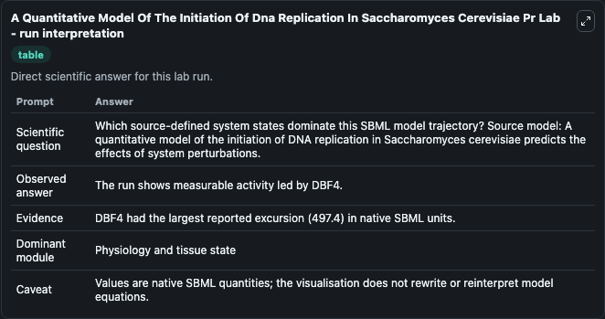
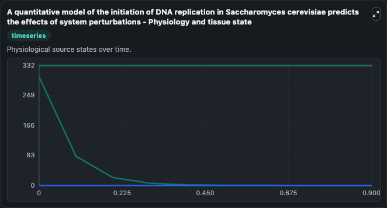
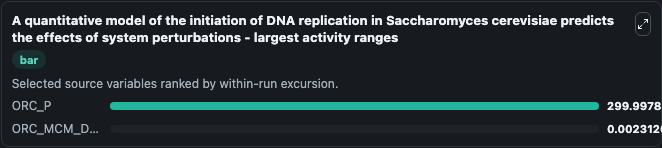
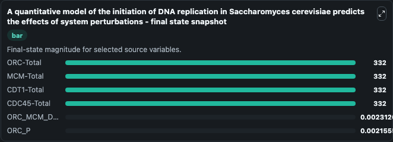
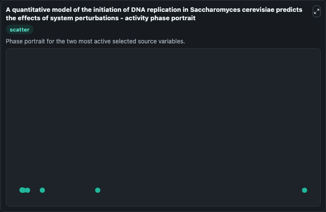

# A Quantitative Model Of The Initiation Of Dna Replication In Saccharomyces Cerevisiae Pr

This Biosimulant lab wraps `A Quantitative Model Of The Initiation Of Dna Replication In Saccharomyces Cerevisiae Pr` as a runnable systems biology model with a companion visualization module.
Requires input from Chen2004(BIOMD0000000056) model but did not work correctly even after integrating both models. It can be used to explore the configured dynamics and compare scenario outcomes across configurations.

## What You'll See

The lab asks: Which source-defined system states dominate this SBML model trajectory? Source model: A quantitative model of the initiation of DNA replication in Saccharomyces cerevisiae predicts the effects of system perturbations. It runs for 1.0 time units with a communication step of 0.1. The run uses the model defaults declared by the curated SBML wrapper. The generated visualizations focus on ORC-Total, MCM-Total, CDT1-Total, CDC45-Total, ORC_P, and ORC_MCM_DBF4_CDC45, combining trajectory, endpoint-comparison, and summary-table views from one completed dark-mode run.

In this captured run, **ORC_P** moved from 300.0 to 0.00216 across 1.0 simulation windows.


### Output Visualizations



*Summary table for A Quantitative Model Of The Initiation Of Dna Replication In Saccharomyces Cerevisiae Pr, reporting the scientific question, observed answer, dominant module, and caveat.*



*Trajectories of ORC_P, ORC_MCM_DBF4_CDC45, ORC-Total, MCM-Total, CDT1-Total, and CDC45-Total across the 1.0 simulation. In this run **ORC_MCM_DBF4_CDC45** climbed from 0 to 0.00231 and **ORC_P** fell from 300.0 to 0.00216 — the largest movements among the focused observables.*



*Largest-excursion ranking of the focused observables — the absolute movement magnitude during the run. Top 2: **ORC_P** = 300.0, **ORC_MCM_DBF4_CDC45** = 0.00231.*



*Endpoint snapshot of the focused observables — final values from the captured run. Top 3 by value: **ORC-Total** = 332.0, **MCM-Total** = 332.0, **CDT1-Total** = 332.0, with 3 more observables below.*



*Visualization card from the A Quantitative Model Of The Initiation Of Dna Replication In Saccharomyces Cerevisiae Pr dark-mode run.*


## Model Context

- Core model: `models/core`
- Visualization model: `models/visualisation`
- Standard: `other`
- Upstream source: `biomodels_ebi:MODEL1812050001`
- License: `CC0`

## Inputs

| Input | Maps To | Default | Notes |
|---|---|---|---|
| Initial Orc Total | `systemsbiology_sbml_a_quantitative_model_of_the_initiation_of_dna_re_model1812050001_model.initial_orc_total` | | Source state initial condition exposed as a model-specific control because no explicit intervention parameter is identifiable. Maps to SBML symbol `ORC_Total`. |
| Initial Mcm Total | `systemsbiology_sbml_a_quantitative_model_of_the_initiation_of_dna_re_model1812050001_model.initial_mcm_total` | | Source state initial condition exposed as a model-specific control because no explicit intervention parameter is identifiable. Maps to SBML symbol `MCM_Total`. |
| Initial Cdt1 Total | `systemsbiology_sbml_a_quantitative_model_of_the_initiation_of_dna_re_model1812050001_model.initial_cdt1_total` | | Source state initial condition exposed as a model-specific control because no explicit intervention parameter is identifiable. Maps to SBML symbol `CDT1_Total`. |
| Initial Cdc45 Total | `systemsbiology_sbml_a_quantitative_model_of_the_initiation_of_dna_re_model1812050001_model.initial_cdc45_total` | | Source state initial condition exposed as a model-specific control because no explicit intervention parameter is identifiable. Maps to SBML symbol `CDC45_Total`. |
| Initial Orc P | `systemsbiology_sbml_a_quantitative_model_of_the_initiation_of_dna_re_model1812050001_model.initial_orc_p` | | Source state initial condition exposed as a model-specific control because no explicit intervention parameter is identifiable. Maps to SBML symbol `ORC_P`. |
| Initial Orc Mcm Dbf4 Cdc45 | `systemsbiology_sbml_a_quantitative_model_of_the_initiation_of_dna_re_model1812050001_model.initial_orc_mcm_dbf4_cdc45` | | Source state initial condition exposed as a model-specific control because no explicit intervention parameter is identifiable. Maps to SBML symbol `ORC_MCM_DBF4_CDC45`. |

## Outputs

| Output | Maps To | Role |
|---|---|---|
| `state` | `systemsbiology_sbml_a_quantitative_model_of_the_initiation_of_dna_re_model1812050001_model.state` | Available to the visualization model and downstream workflows. |
| `summary` | `systemsbiology_sbml_a_quantitative_model_of_the_initiation_of_dna_re_model1812050001_model.summary` | Available to the visualization model and downstream workflows. |
| `species_labels` | `systemsbiology_sbml_a_quantitative_model_of_the_initiation_of_dna_re_model1812050001_model.species_labels` | Available to the visualization model and downstream workflows. |
| `orc_total` | `systemsbiology_sbml_a_quantitative_model_of_the_initiation_of_dna_re_model1812050001_model.orc_total` | Available to the visualization model and downstream workflows. |
| `mcm_total` | `systemsbiology_sbml_a_quantitative_model_of_the_initiation_of_dna_re_model1812050001_model.mcm_total` | Available to the visualization model and downstream workflows. |
| `cdt1_total` | `systemsbiology_sbml_a_quantitative_model_of_the_initiation_of_dna_re_model1812050001_model.cdt1_total` | Available to the visualization model and downstream workflows. |
| `cdc45_total` | `systemsbiology_sbml_a_quantitative_model_of_the_initiation_of_dna_re_model1812050001_model.cdc45_total` | Available to the visualization model and downstream workflows. |
| `orc_p` | `systemsbiology_sbml_a_quantitative_model_of_the_initiation_of_dna_re_model1812050001_model.orc_p` | Available to the visualization model and downstream workflows. |
| `orc_mcm_dbf4_cdc45` | `systemsbiology_sbml_a_quantitative_model_of_the_initiation_of_dna_re_model1812050001_model.orc_mcm_dbf4_cdc45` | Available to the visualization model and downstream workflows. |

## Runtime

- Duration: `1.0`
- Communication step: `0.1`

## Running Locally

```bash
biosimulant labs serve
```
