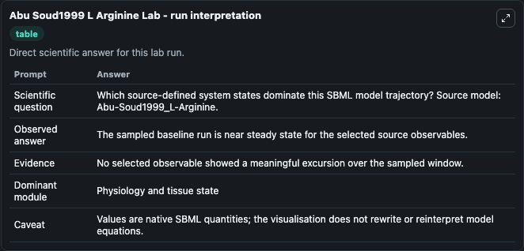
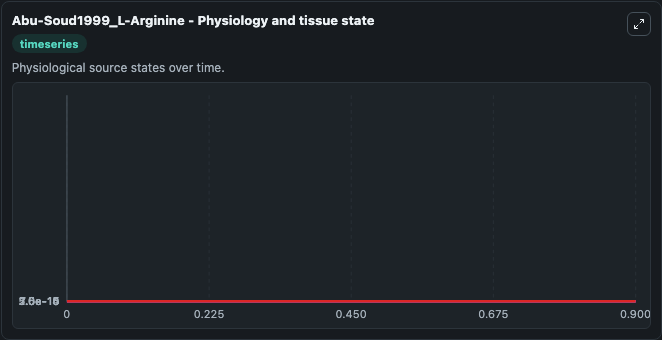
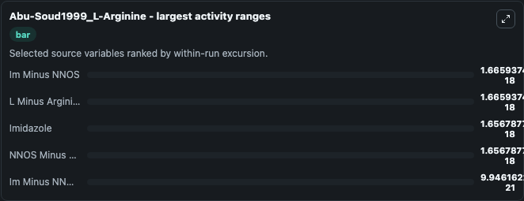
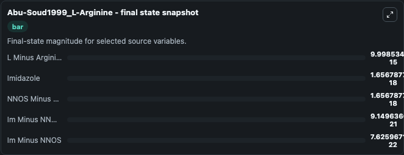
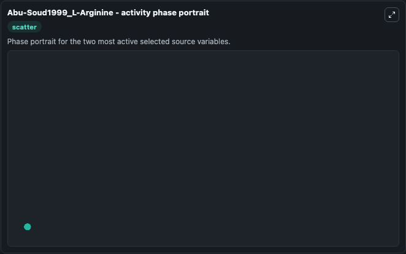

# Abu Soud1999 L Arginine

This Biosimulant lab wraps `Abu Soud1999 L Arginine` as a runnable systems biology model with a companion visualization module.
This model is taken from the referenced publication. It can be used to explore the configured dynamics and compare scenario outcomes across configurations.

## What You'll See

The lab asks: Which source-defined system states dominate this SBML model trajectory? Source model: Abu-Soud1999_L-Arginine. It runs for 1.0 time units with a communication step of 0.1. The run uses the model defaults declared by the curated SBML wrapper. The generated visualizations focus on L Minus Arginine, Im Minus NNOS, Imidazole, NNOS Minus L Minus Arginine, and Im Minus NNOS Minus L Minus Arginine, combining trajectory, endpoint-comparison, and summary-table views from one completed dark-mode run.

In this captured run, **Im Minus NNOS** moved from 1.67e-18 to 7.63e-22 across 1.0 simulation windows.


### Output Visualizations



*Summary table for Abu Soud1999 L Arginine, reporting the scientific question, observed answer, dominant module, and caveat.*



*Trajectories of Im Minus NNOS, L Minus Arginine, Imidazole, NNOS Minus L Minus Arginine, and Im Minus NNOS Minus L Minus Arginine across the 1.0 simulation. In this run **Imidazole** climbed from 0 to 1.66e-18 and **Im Minus NNOS** fell from 1.67e-18 to 7.63e-22 — the largest movements among the focused observables.*



*Largest-excursion ranking of the focused observables — the absolute movement magnitude during the run. Top 3: **Im Minus NNOS** = 1.67e-18, **L Minus Arginine** = 1.67e-18, **Imidazole** = 1.66e-18, with 2 more observables below.*



*Endpoint snapshot of the focused observables — final values from the captured run. Top 3 by value: **L Minus Arginine** = 1e-14, **Imidazole** = 1.66e-18, **NNOS Minus L Minus Arginine** = 1.66e-18, with 2 more observables below.*



*Visualization card from the Abu Soud1999 L Arginine dark-mode run.*


## Model Context

- Core model: `models/core`
- Visualization model: `models/visualisation`
- Standard: `other`
- Upstream source: `biomodels_ebi:MODEL9087766308`
- License: `CC0`

## Inputs

| Input | Maps To | Default | Notes |
|---|---|---|---|
| Initial L Minus Arginine | `systemsbiology_sbml_abu_soud1999_l_arginine_model9087766308_model.initial_l_minus_arginine` | | Source state initial condition exposed as a model-specific control because no explicit intervention parameter is identifiable. Maps to SBML symbol `L_minus_Arginine`. |
| Initial Im Minus Nnos | `systemsbiology_sbml_abu_soud1999_l_arginine_model9087766308_model.initial_im_minus_nnos` | | Source state initial condition exposed as a model-specific control because no explicit intervention parameter is identifiable. Maps to SBML symbol `Im_minus_nNOS`. |
| Initial Imidazole | `systemsbiology_sbml_abu_soud1999_l_arginine_model9087766308_model.initial_imidazole` | | Source state initial condition exposed as a model-specific control because no explicit intervention parameter is identifiable. Maps to SBML symbol `Imidazole`. |
| Initial Nnos Minus L Minus Arginine | `systemsbiology_sbml_abu_soud1999_l_arginine_model9087766308_model.initial_nnos_minus_l_minus_arginine` | | Source state initial condition exposed as a model-specific control because no explicit intervention parameter is identifiable. Maps to SBML symbol `nNOS_minus_L_minus_Arginine`. |
| Initial Im Minus Nnos Minus L Minus Arginine | `systemsbiology_sbml_abu_soud1999_l_arginine_model9087766308_model.initial_im_minus_nnos_minus_l_minus_arginine` | | Source state initial condition exposed as a model-specific control because no explicit intervention parameter is identifiable. Maps to SBML symbol `Im_minus_nNOS_minus_L_minus_Arginine`. |

## Outputs

| Output | Maps To | Role |
|---|---|---|
| `state` | `systemsbiology_sbml_abu_soud1999_l_arginine_model9087766308_model.state` | Available to the visualization model and downstream workflows. |
| `summary` | `systemsbiology_sbml_abu_soud1999_l_arginine_model9087766308_model.summary` | Available to the visualization model and downstream workflows. |
| `species_labels` | `systemsbiology_sbml_abu_soud1999_l_arginine_model9087766308_model.species_labels` | Available to the visualization model and downstream workflows. |
| `l_minus_arginine` | `systemsbiology_sbml_abu_soud1999_l_arginine_model9087766308_model.l_minus_arginine` | Available to the visualization model and downstream workflows. |
| `im_minus_nnos` | `systemsbiology_sbml_abu_soud1999_l_arginine_model9087766308_model.im_minus_nnos` | Available to the visualization model and downstream workflows. |
| `imidazole` | `systemsbiology_sbml_abu_soud1999_l_arginine_model9087766308_model.imidazole` | Available to the visualization model and downstream workflows. |
| `nnos_minus_l_minus_arginine` | `systemsbiology_sbml_abu_soud1999_l_arginine_model9087766308_model.nnos_minus_l_minus_arginine` | Available to the visualization model and downstream workflows. |
| `im_minus_nnos_minus_l_minus_arginine` | `systemsbiology_sbml_abu_soud1999_l_arginine_model9087766308_model.im_minus_nnos_minus_l_minus_arginine` | Available to the visualization model and downstream workflows. |

## Runtime

- Duration: `1.0`
- Communication step: `0.1`

## Running Locally

```bash
biosimulant labs serve
```
