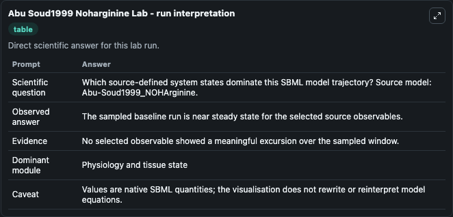
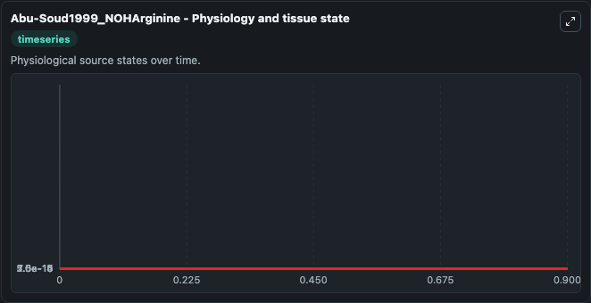
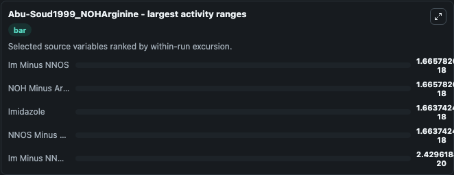
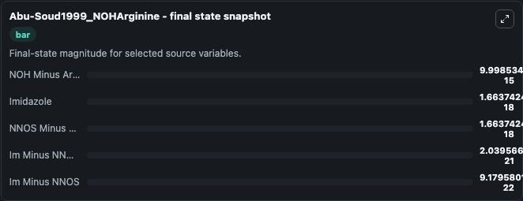
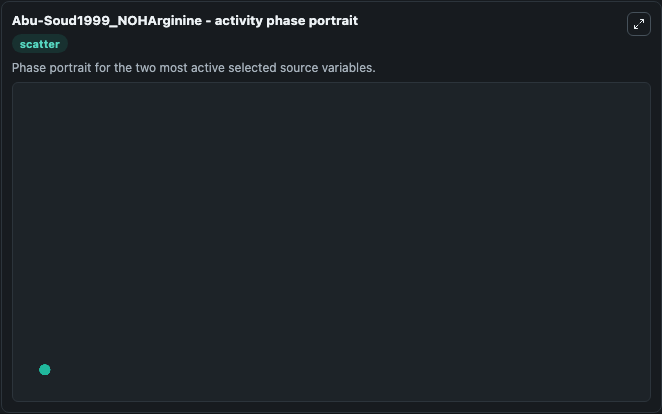

# Abu Soud1999 Noharginine

This Biosimulant lab wraps `Abu Soud1999 Noharginine` as a runnable systems biology model with a companion visualization module.
This model is taken from the referenced publication. It can be used to explore the configured dynamics and compare scenario outcomes across configurations.

## What You'll See

The lab asks: Which source-defined system states dominate this SBML model trajectory? Source model: Abu-Soud1999_NOHArginine. It runs for 1.0 time units with a communication step of 0.1. The run uses the model defaults declared by the curated SBML wrapper. The generated visualizations focus on NOH Minus Arginine, Im Minus NNOS, Imidazole, NNOS Minus NOH Minus Arginine, and Im Minus NNOS Minus NOH Minus Arginine, combining trajectory, endpoint-comparison, and summary-table views from one completed dark-mode run.

In this captured run, **Im Minus NNOS** moved from 1.67e-18 to 9.18e-22 across 1.0 simulation windows.


### Output Visualizations



*Summary table for Abu Soud1999 Noharginine, reporting the scientific question, observed answer, dominant module, and caveat.*



*Trajectories of Im Minus NNOS, NOH Minus Arginine, Imidazole, NNOS Minus NOH Minus Arginine, and Im Minus NNOS Minus NOH Minus Arginine across the 1.0 simulation. In this run **Imidazole** climbed from 0 to 1.66e-18 and **Im Minus NNOS** fell from 1.67e-18 to 9.18e-22 — the largest movements among the focused observables.*



*Largest-excursion ranking of the focused observables — the absolute movement magnitude during the run. Top 3: **Im Minus NNOS** = 1.67e-18, **NOH Minus Arginine** = 1.67e-18, **Imidazole** = 1.66e-18, with 2 more observables below.*



*Endpoint snapshot of the focused observables — final values from the captured run. Top 3 by value: **NOH Minus Arginine** = 1e-14, **Imidazole** = 1.66e-18, **NNOS Minus NOH Minus Arginine** = 1.66e-18, with 2 more observables below.*



*Visualization card from the Abu Soud1999 Noharginine dark-mode run.*


## Model Context

- Core model: `models/core`
- Visualization model: `models/visualisation`
- Standard: `other`
- Upstream source: `biomodels_ebi:MODEL9088294310`
- License: `CC0`

## Inputs

| Input | Maps To | Default | Notes |
|---|---|---|---|
| Initial Noh Minus Arginine | `systemsbiology_sbml_abu_soud1999_noharginine_model9088294310_model.initial_noh_minus_arginine` | | Source state initial condition exposed as a model-specific control because no explicit intervention parameter is identifiable. Maps to SBML symbol `NOH_minus_Arginine`. |
| Initial Im Minus Nnos | `systemsbiology_sbml_abu_soud1999_noharginine_model9088294310_model.initial_im_minus_nnos` | | Source state initial condition exposed as a model-specific control because no explicit intervention parameter is identifiable. Maps to SBML symbol `Im_minus_nNOS`. |
| Initial Imidazole | `systemsbiology_sbml_abu_soud1999_noharginine_model9088294310_model.initial_imidazole` | | Source state initial condition exposed as a model-specific control because no explicit intervention parameter is identifiable. Maps to SBML symbol `Imidazole`. |
| Initial Nnos Minus Noh Minus Arginine | `systemsbiology_sbml_abu_soud1999_noharginine_model9088294310_model.initial_nnos_minus_noh_minus_arginine` | | Source state initial condition exposed as a model-specific control because no explicit intervention parameter is identifiable. Maps to SBML symbol `nNOS_minus_NOH_minus_Arginine`. |
| Initial Im Minus Nnos Minus Noh Minus Arginine | `systemsbiology_sbml_abu_soud1999_noharginine_model9088294310_model.initial_im_minus_nnos_minus_noh_minus_arginine` | | Source state initial condition exposed as a model-specific control because no explicit intervention parameter is identifiable. Maps to SBML symbol `Im_minus_nNOS_minus_NOH_minus_Arginine`. |

## Outputs

| Output | Maps To | Role |
|---|---|---|
| `state` | `systemsbiology_sbml_abu_soud1999_noharginine_model9088294310_model.state` | Available to the visualization model and downstream workflows. |
| `summary` | `systemsbiology_sbml_abu_soud1999_noharginine_model9088294310_model.summary` | Available to the visualization model and downstream workflows. |
| `species_labels` | `systemsbiology_sbml_abu_soud1999_noharginine_model9088294310_model.species_labels` | Available to the visualization model and downstream workflows. |
| `noh_minus_arginine` | `systemsbiology_sbml_abu_soud1999_noharginine_model9088294310_model.noh_minus_arginine` | Available to the visualization model and downstream workflows. |
| `im_minus_nnos` | `systemsbiology_sbml_abu_soud1999_noharginine_model9088294310_model.im_minus_nnos` | Available to the visualization model and downstream workflows. |
| `imidazole` | `systemsbiology_sbml_abu_soud1999_noharginine_model9088294310_model.imidazole` | Available to the visualization model and downstream workflows. |
| `nnos_minus_noh_minus_arginine` | `systemsbiology_sbml_abu_soud1999_noharginine_model9088294310_model.nnos_minus_noh_minus_arginine` | Available to the visualization model and downstream workflows. |
| `im_minus_nnos_minus_noh_minus_arginine` | `systemsbiology_sbml_abu_soud1999_noharginine_model9088294310_model.im_minus_nnos_minus_noh_minus_arginine` | Available to the visualization model and downstream workflows. |

## Runtime

- Duration: `1.0`
- Communication step: `0.1`

## Running Locally

```bash
biosimulant labs serve
```
