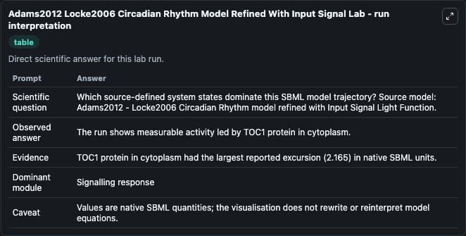
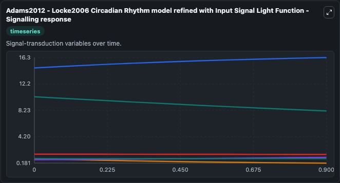
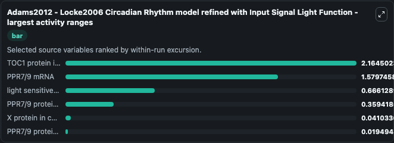
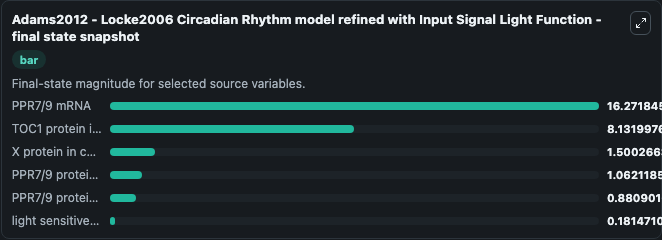
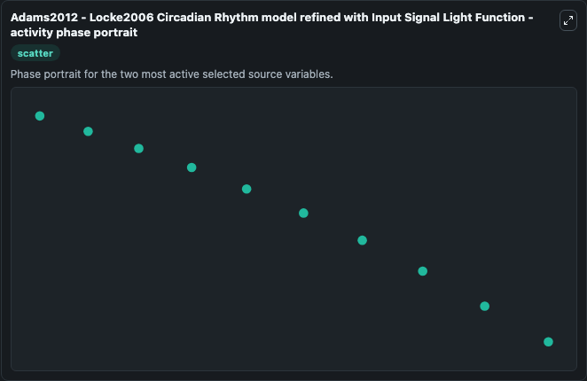

# Adams2012 Locke2006 Circadian Rhythm Model Refined With Input Signal

This Biosimulant lab wraps `Adams2012 Locke2006 Circadian Rhythm Model Refined With Input Signal` as a runnable systems biology model with a companion visualization module.
As per BIO0000000089.xml but including a functional light. It can be used to explore the configured dynamics and compare scenario outcomes across configurations.

## What You'll See

The lab asks: Which source-defined system states dominate this SBML model trajectory? Source model: Adams2012 - Locke2006 Circadian Rhythm model refined with Input Signal Light Function. It runs for 1.0 time units with a communication step of 0.1. The run uses the model defaults declared by the curated SBML wrapper. The generated visualizations focus on PPR7/9 mRNA, TOC1 protein in cytoplasm, X protein in cytoplasm, PPR7/9 protein in nucleus, light sensitive protein P, and PPR7/9 protein in cytoplasm, combining trajectory, endpoint-comparison, and summary-table views from one completed dark-mode run.

In this captured run, **TOC1 protein in cytoplasm** moved from 10.296 to 8.132 across 1.0 simulation windows.


### Output Visualizations



*Summary table for Adams2012 Locke2006 Circadian Rhythm Model Refined With Input Signal, reporting the scientific question, observed answer, dominant module, and caveat.*



*Trajectories of TOC1 protein in cytoplasm, PPR7/9 mRNA, light sensitive protein P, PPR7/9 protein in cytoplasm, X protein in cytoplasm, and PPR7/9 protein in nucleus across the 1.0 simulation. In this run **PPR7/9 mRNA** climbed from 14.692 to 16.272 and **TOC1 protein in cytoplasm** fell from 10.296 to 8.132 — the largest movements among the focused observables.*



*Largest-excursion ranking of the focused observables — the absolute movement magnitude during the run. Top 3: **TOC1 protein in cytoplasm** = 2.165, **PPR7/9 mRNA** = 1.580, **light sensitive protein P** = 0.6661, with 3 more observables below.*



*Endpoint snapshot of the focused observables — final values from the captured run. Top 3 by value: **PPR7/9 mRNA** = 16.272, **TOC1 protein in cytoplasm** = 8.132, **X protein in cytoplasm** = 1.500, with 3 more observables below.*



*Visualization card from the Adams2012 Locke2006 Circadian Rhythm Model Refined With Input Signal dark-mode run.*


## Model Context

- Core model: `models/core`
- Visualization model: `models/visualisation`
- Standard: `other`
- Upstream source: `biomodels_ebi:BIOMD0000000476`
- License: `CC0`

## Inputs

| Input | Maps To | Default | Notes |
|---|---|---|---|
| Light Amplitude | `systemsbiology_sbml_adams2012_locke2006_circadian_rhythm_model_refin_biomd0000000476_model.light_amplitude` | | Source parameter exposed because its SBML label indicates a boundary, stimulus, dose, ligand, protocol, substrate, or environmental control. Maps to SBML symbol `lightAmplitude`. |
| Light Offset | `systemsbiology_sbml_adams2012_locke2006_circadian_rhythm_model_refin_biomd0000000476_model.light_offset` | | Source parameter exposed because its SBML label indicates a boundary, stimulus, dose, ligand, protocol, substrate, or environmental control. Maps to SBML symbol `lightOffset`. |
| Twilight Period | `systemsbiology_sbml_adams2012_locke2006_circadian_rhythm_model_refin_biomd0000000476_model.twilight_period` | | Source parameter exposed because its SBML label indicates a boundary, stimulus, dose, ligand, protocol, substrate, or environmental control. Maps to SBML symbol `twilightPeriod`. |

## Outputs

| Output | Maps To | Role |
|---|---|---|
| `state` | `systemsbiology_sbml_adams2012_locke2006_circadian_rhythm_model_refin_biomd0000000476_model.state` | Available to the visualization model and downstream workflows. |
| `summary` | `systemsbiology_sbml_adams2012_locke2006_circadian_rhythm_model_refin_biomd0000000476_model.summary` | Available to the visualization model and downstream workflows. |
| `species_labels` | `systemsbiology_sbml_adams2012_locke2006_circadian_rhythm_model_refin_biomd0000000476_model.species_labels` | Available to the visualization model and downstream workflows. |
| `ppr7_9_mrna` | `systemsbiology_sbml_adams2012_locke2006_circadian_rhythm_model_refin_biomd0000000476_model.ppr7_9_mrna` | Available to the visualization model and downstream workflows. |
| `toc1_protein_in_cytoplasm` | `systemsbiology_sbml_adams2012_locke2006_circadian_rhythm_model_refin_biomd0000000476_model.toc1_protein_in_cytoplasm` | Available to the visualization model and downstream workflows. |
| `x_protein_in_cytoplasm` | `systemsbiology_sbml_adams2012_locke2006_circadian_rhythm_model_refin_biomd0000000476_model.x_protein_in_cytoplasm` | Available to the visualization model and downstream workflows. |
| `ppr7_9_protein_in_nucleus` | `systemsbiology_sbml_adams2012_locke2006_circadian_rhythm_model_refin_biomd0000000476_model.ppr7_9_protein_in_nucleus` | Available to the visualization model and downstream workflows. |
| `light_sensitive_protein_p` | `systemsbiology_sbml_adams2012_locke2006_circadian_rhythm_model_refin_biomd0000000476_model.light_sensitive_protein_p` | Available to the visualization model and downstream workflows. |
| `ppr7_9_protein_in_cytoplasm` | `systemsbiology_sbml_adams2012_locke2006_circadian_rhythm_model_refin_biomd0000000476_model.ppr7_9_protein_in_cytoplasm` | Available to the visualization model and downstream workflows. |

## Runtime

- Duration: `1.0`
- Communication step: `0.1`

## Running Locally

```bash
biosimulant labs serve
```
