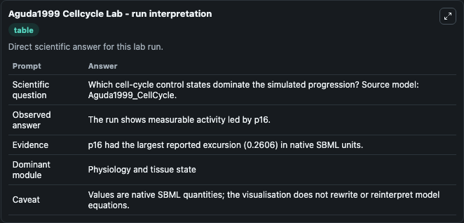
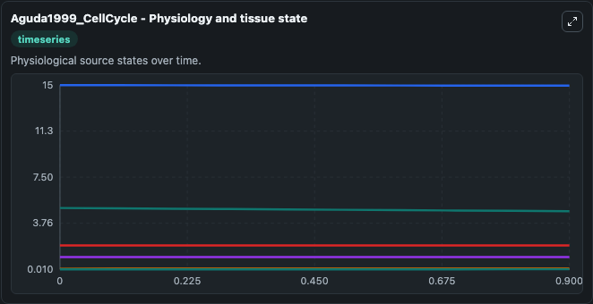
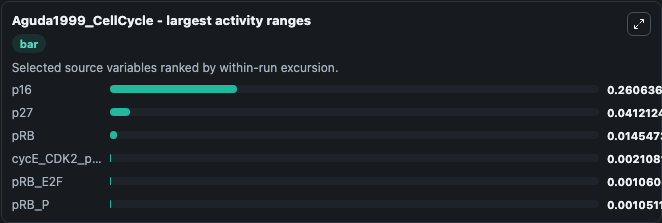
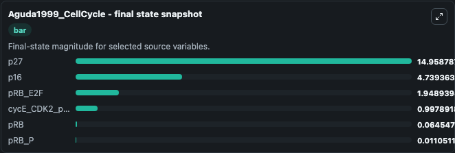
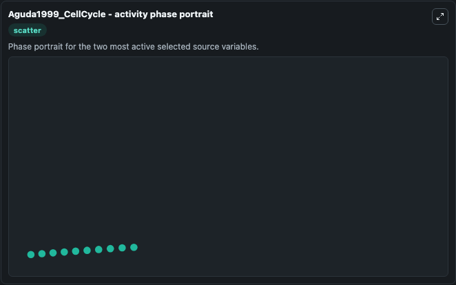

# Aguda1999 Cellcycle

This Biosimulant lab wraps `Aguda1999 Cellcycle` as a runnable systems biology model with a companion visualization module.
The model reproduces the time profiles of p27, E2F and aE/cdk2 as depicted in Figure 5 c of the paper. It can be used to explore the configured dynamics and compare scenario outcomes across configurations.

## What You'll See

The lab asks: Which cell-cycle control states dominate the simulated progression? Source model: Aguda1999_CellCycle. It runs for 1.0 time units with a communication step of 0.1. The run uses the model defaults declared by the curated SBML wrapper. The generated visualizations focus on p27, p16, pRB_E2F, cycE_CDK2_p27, pRB, and pRB_P, combining trajectory, endpoint-comparison, and summary-table views from one completed dark-mode run.

In this captured run, **p16** moved from 5.000 to 4.739 across 1.0 simulation windows.


### Output Visualizations



*Summary table for Aguda1999 Cellcycle, reporting the scientific question, observed answer, dominant module, and caveat.*



*Trajectories of p16, p27, pRB, cycE_CDK2_p27, pRB_E2F, and pRB_P across the 1.0 simulation. In this run **pRB** climbed from 0.0500 to 0.0645 and **p16** fell from 5.000 to 4.739 — the largest movements among the focused observables.*



*Largest-excursion ranking of the focused observables — the absolute movement magnitude during the run. Top 3: **p16** = 0.2606, **p27** = 0.0412, **pRB** = 0.0145, with 3 more observables below.*



*Endpoint snapshot of the focused observables — final values from the captured run. Top 3 by value: **p27** = 14.959, **p16** = 4.739, **pRB_E2F** = 1.949, with 3 more observables below.*



*Visualization card from the Aguda1999 Cellcycle dark-mode run.*


## Model Context

- Core model: `models/core`
- Visualization model: `models/visualisation`
- Standard: `other`
- Upstream source: `biomodels_ebi:BIOMD0000000169`
- License: `CC0`

## Inputs

| Input | Maps To | Default | Notes |
|---|---|---|---|
| Initial Model State P27 | `systemsbiology_sbml_aguda1999_cellcycle_biomd0000000169_model.initial_model_state_p27` | | Source state initial condition exposed as a model-specific control because no explicit intervention parameter is identifiable. Maps to SBML symbol `Y7_1`. |
| Initial Model State P16 | `systemsbiology_sbml_aguda1999_cellcycle_biomd0000000169_model.initial_model_state_p16` | | Source state initial condition exposed as a model-specific control because no explicit intervention parameter is identifiable. Maps to SBML symbol `Y10_1`. |
| Initial P Rb E2 F | `systemsbiology_sbml_aguda1999_cellcycle_biomd0000000169_model.initial_p_rb_e2_f` | | Source state initial condition exposed as a model-specific control because no explicit intervention parameter is identifiable. Maps to SBML symbol `Y3_1`. |
| Initial Cyc E Cdk2 P27 | `systemsbiology_sbml_aguda1999_cellcycle_biomd0000000169_model.initial_cyc_e_cdk2_p27` | | Source state initial condition exposed as a model-specific control because no explicit intervention parameter is identifiable. Maps to SBML symbol `Y8_1`. |
| Initial P Rb | `systemsbiology_sbml_aguda1999_cellcycle_biomd0000000169_model.initial_p_rb` | | Source state initial condition exposed as a model-specific control because no explicit intervention parameter is identifiable. Maps to SBML symbol `Y5_1`. |
| Initial P Rb P | `systemsbiology_sbml_aguda1999_cellcycle_biomd0000000169_model.initial_p_rb_p` | | Source state initial condition exposed as a model-specific control because no explicit intervention parameter is identifiable. Maps to SBML symbol `Y11_1`. |

## Outputs

| Output | Maps To | Role |
|---|---|---|
| `state` | `systemsbiology_sbml_aguda1999_cellcycle_biomd0000000169_model.state` | Available to the visualization model and downstream workflows. |
| `summary` | `systemsbiology_sbml_aguda1999_cellcycle_biomd0000000169_model.summary` | Available to the visualization model and downstream workflows. |
| `species_labels` | `systemsbiology_sbml_aguda1999_cellcycle_biomd0000000169_model.species_labels` | Available to the visualization model and downstream workflows. |
| `p27` | `systemsbiology_sbml_aguda1999_cellcycle_biomd0000000169_model.p27` | Available to the visualization model and downstream workflows. |
| `p16` | `systemsbiology_sbml_aguda1999_cellcycle_biomd0000000169_model.p16` | Available to the visualization model and downstream workflows. |
| `p_rb_e2_f` | `systemsbiology_sbml_aguda1999_cellcycle_biomd0000000169_model.p_rb_e2_f` | Available to the visualization model and downstream workflows. |
| `cyc_e_cdk2_p27` | `systemsbiology_sbml_aguda1999_cellcycle_biomd0000000169_model.cyc_e_cdk2_p27` | Available to the visualization model and downstream workflows. |
| `p_rb` | `systemsbiology_sbml_aguda1999_cellcycle_biomd0000000169_model.p_rb` | Available to the visualization model and downstream workflows. |
| `p_rb_p` | `systemsbiology_sbml_aguda1999_cellcycle_biomd0000000169_model.p_rb_p` | Available to the visualization model and downstream workflows. |

## Runtime

- Duration: `1.0`
- Communication step: `0.1`

## Running Locally

```bash
biosimulant labs serve
```
