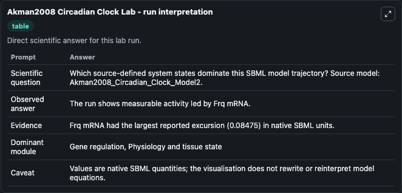
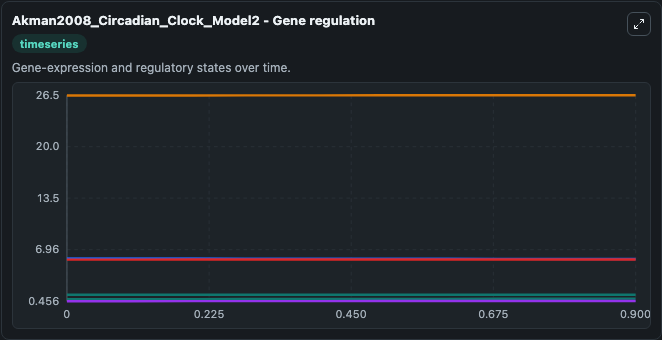
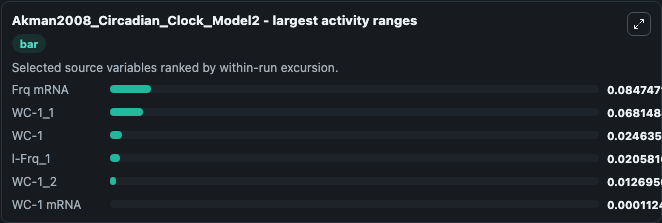
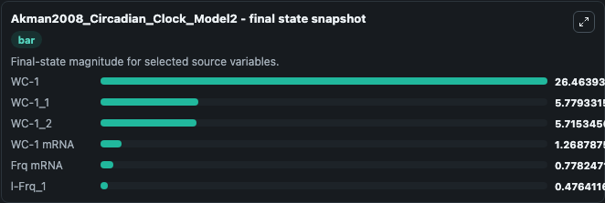
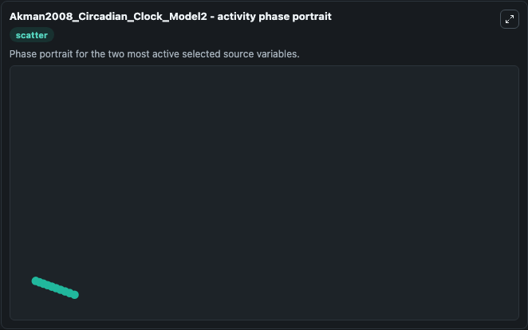

# Akman2008 Circadian Clock

This Biosimulant lab wraps `Akman2008 Circadian Clock` as a runnable systems biology model with a companion visualization module.
This model 2 described in the supplement of the article below. It can be used to explore the configured dynamics and compare scenario outcomes across configurations.

## What You'll See

The lab asks: Which source-defined system states dominate this SBML model trajectory? Source model: Akman2008_Circadian_Clock_Model2. It runs for 1.0 time units with a communication step of 0.1. The run uses the model defaults declared by the curated SBML wrapper. The generated visualizations focus on WC-1 mRNA, Frq mRNA, WC-1, WC-1_1, WC-1_2, and l-Frq_1, combining trajectory, endpoint-comparison, and summary-table views from one completed dark-mode run.

In this captured run, **Frq mRNA** moved from 0.6935 to 0.7782 across 1.0 simulation windows.


### Output Visualizations



*Summary table for Akman2008 Circadian Clock, reporting the scientific question, observed answer, dominant module, and caveat.*



*Trajectories of Frq mRNA, WC-1_1, WC-1, l-Frq_1, WC-1_2, and WC-1 mRNA across the 1.0 simulation. In this run **Frq mRNA** climbed from 0.6935 to 0.7782 and **WC-1_1** fell from 5.847 to 5.779 — the largest movements among the focused observables.*



*Largest-excursion ranking of the focused observables — the absolute movement magnitude during the run. Top 3: **Frq mRNA** = 0.0847, **WC-1_1** = 0.0681, **WC-1** = 0.0246, with 3 more observables below.*



*Endpoint snapshot of the focused observables — final values from the captured run. Top 3 by value: **WC-1** = 26.464, **WC-1_1** = 5.779, **WC-1_2** = 5.715, with 3 more observables below.*



*Visualization card from the Akman2008 Circadian Clock dark-mode run.*


## Model Context

- Core model: `models/core`
- Visualization model: `models/visualisation`
- Standard: `other`
- Upstream source: `biomodels_ebi:BIOMD0000000214`
- License: `CC0`

## Inputs

| Input | Maps To | Default | Notes |
|---|---|---|---|
| Initial Wc 1 MRNA | `systemsbiology_sbml_akman2008_circadian_clock_model2_biomd0000000214_model.initial_wc_1_mrna` | | Source state initial condition exposed as a model-specific control because no explicit intervention parameter is identifiable. Maps to SBML symbol `MW`. |
| Initial Frq MRNA | `systemsbiology_sbml_akman2008_circadian_clock_model2_biomd0000000214_model.initial_frq_mrna` | | Source state initial condition exposed as a model-specific control because no explicit intervention parameter is identifiable. Maps to SBML symbol `MF`. |
| Initial Wc 1 | `systemsbiology_sbml_akman2008_circadian_clock_model2_biomd0000000214_model.initial_wc_1` | | Source state initial condition exposed as a model-specific control because no explicit intervention parameter is identifiable. Maps to SBML symbol `PW`. |
| Initial Wc 1 1 | `systemsbiology_sbml_akman2008_circadian_clock_model2_biomd0000000214_model.initial_wc_1_1` | | Source state initial condition exposed as a model-specific control because no explicit intervention parameter is identifiable. Maps to SBML symbol `E1W`. |
| Initial Wc 1 2 | `systemsbiology_sbml_akman2008_circadian_clock_model2_biomd0000000214_model.initial_wc_1_2` | | Source state initial condition exposed as a model-specific control because no explicit intervention parameter is identifiable. Maps to SBML symbol `E2W`. |
| Initial L Frq 1 | `systemsbiology_sbml_akman2008_circadian_clock_model2_biomd0000000214_model.initial_l_frq_1` | | Source state initial condition exposed as a model-specific control because no explicit intervention parameter is identifiable. Maps to SBML symbol `E1Fp`. |

## Outputs

| Output | Maps To | Role |
|---|---|---|
| `state` | `systemsbiology_sbml_akman2008_circadian_clock_model2_biomd0000000214_model.state` | Available to the visualization model and downstream workflows. |
| `summary` | `systemsbiology_sbml_akman2008_circadian_clock_model2_biomd0000000214_model.summary` | Available to the visualization model and downstream workflows. |
| `species_labels` | `systemsbiology_sbml_akman2008_circadian_clock_model2_biomd0000000214_model.species_labels` | Available to the visualization model and downstream workflows. |
| `wc_1_mrna` | `systemsbiology_sbml_akman2008_circadian_clock_model2_biomd0000000214_model.wc_1_mrna` | Available to the visualization model and downstream workflows. |
| `frq_mrna` | `systemsbiology_sbml_akman2008_circadian_clock_model2_biomd0000000214_model.frq_mrna` | Available to the visualization model and downstream workflows. |
| `wc_1` | `systemsbiology_sbml_akman2008_circadian_clock_model2_biomd0000000214_model.wc_1` | Available to the visualization model and downstream workflows. |
| `wc_1_1` | `systemsbiology_sbml_akman2008_circadian_clock_model2_biomd0000000214_model.wc_1_1` | Available to the visualization model and downstream workflows. |
| `wc_1_2` | `systemsbiology_sbml_akman2008_circadian_clock_model2_biomd0000000214_model.wc_1_2` | Available to the visualization model and downstream workflows. |
| `l_frq_1` | `systemsbiology_sbml_akman2008_circadian_clock_model2_biomd0000000214_model.l_frq_1` | Available to the visualization model and downstream workflows. |

## Runtime

- Duration: `1.0`
- Communication step: `0.1`

## Running Locally

```bash
biosimulant labs serve
```
