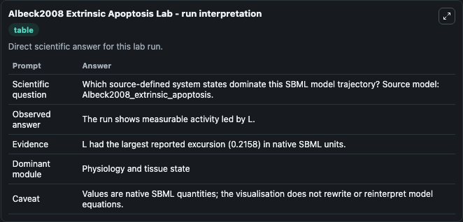
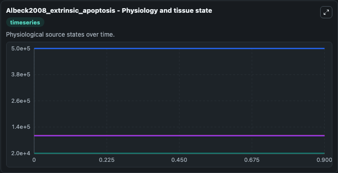
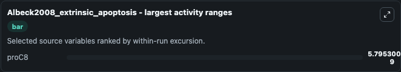
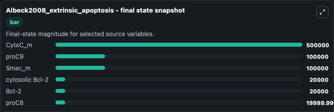

# Albeck2008 Extrinsic Apoptosis

This Biosimulant lab wraps `Albeck2008 Extrinsic Apoptosis` as a runnable systems biology model with a companion visualization module.
This the model used in the article: Quantitative analysis of pathways controlling extrinsic apoptosis in single cells. It can be used to explore the configured dynamics and compare scenario outcomes across configurations.

## What You'll See

The lab asks: Which source-defined system states dominate this SBML model trajectory? Source model: Albeck2008_extrinsic_apoptosis. It runs for 1.0 time units with a communication step of 0.1. The run uses the model defaults declared by the curated SBML wrapper. The generated visualizations focus on CytoC_m, proC9, Smac_m, proC8, cytosolic Bcl-2, and Bcl-2, combining trajectory, endpoint-comparison, and summary-table views from one completed dark-mode run.

In this captured run, **proC8** moved from 2e+04 to 2e+04 across 1.0 simulation windows.


### Output Visualizations



*Summary table for Albeck2008 Extrinsic Apoptosis, reporting the scientific question, observed answer, dominant module, and caveat.*



*Trajectories of proC8, CytoC_m, proC9, Smac_m, cytosolic Bcl-2, and Bcl-2 across the 1.0 simulation. In this run **proC8** fell from 2e+04 to 2e+04 — the largest movements among the focused observables.*



*Largest-excursion ranking of the focused observables — the absolute movement magnitude during the run. Top 1: **proC8** = 5.8e-09.*



*Endpoint snapshot of the focused observables — final values from the captured run. Top 3 by value: **CytoC_m** = 5e+05, **proC9** = 1e+05, **Smac_m** = 1e+05, with 3 more observables below.*


## Model Context

- Core model: `models/core`
- Visualization model: `models/visualisation`
- Standard: `other`
- Upstream source: `biomodels_ebi:BIOMD0000000220`
- License: `CC0`

## Inputs

| Input | Maps To | Default | Notes |
|---|---|---|---|
| Initial Cyto C M | `systemsbiology_sbml_albeck2008_extrinsic_apoptosis_biomd0000000220_model.initial_cyto_c_m` | | Source state initial condition exposed as a model-specific control because no explicit intervention parameter is identifiable. Maps to SBML symbol `CytoCm`. |
| Initial Pro C9 | `systemsbiology_sbml_albeck2008_extrinsic_apoptosis_biomd0000000220_model.initial_pro_c9` | | Source state initial condition exposed as a model-specific control because no explicit intervention parameter is identifiable. Maps to SBML symbol `pC9`. |
| Initial Smac M | `systemsbiology_sbml_albeck2008_extrinsic_apoptosis_biomd0000000220_model.initial_smac_m` | | Source state initial condition exposed as a model-specific control because no explicit intervention parameter is identifiable. Maps to SBML symbol `Smacm`. |
| Initial Pro C8 | `systemsbiology_sbml_albeck2008_extrinsic_apoptosis_biomd0000000220_model.initial_pro_c8` | | Source state initial condition exposed as a model-specific control because no explicit intervention parameter is identifiable. Maps to SBML symbol `pC8`. |
| Initial Cytosolic Bcl 2 | `systemsbiology_sbml_albeck2008_extrinsic_apoptosis_biomd0000000220_model.initial_cytosolic_bcl_2` | | Source state initial condition exposed as a model-specific control because no explicit intervention parameter is identifiable. Maps to SBML symbol `Bcl2c`. |
| Initial Bcl 2 | `systemsbiology_sbml_albeck2008_extrinsic_apoptosis_biomd0000000220_model.initial_bcl_2` | | Source state initial condition exposed as a model-specific control because no explicit intervention parameter is identifiable. Maps to SBML symbol `Bcl2`. |

## Outputs

| Output | Maps To | Role |
|---|---|---|
| `state` | `systemsbiology_sbml_albeck2008_extrinsic_apoptosis_biomd0000000220_model.state` | Available to the visualization model and downstream workflows. |
| `summary` | `systemsbiology_sbml_albeck2008_extrinsic_apoptosis_biomd0000000220_model.summary` | Available to the visualization model and downstream workflows. |
| `species_labels` | `systemsbiology_sbml_albeck2008_extrinsic_apoptosis_biomd0000000220_model.species_labels` | Available to the visualization model and downstream workflows. |
| `cyto_c_m` | `systemsbiology_sbml_albeck2008_extrinsic_apoptosis_biomd0000000220_model.cyto_c_m` | Available to the visualization model and downstream workflows. |
| `pro_c9` | `systemsbiology_sbml_albeck2008_extrinsic_apoptosis_biomd0000000220_model.pro_c9` | Available to the visualization model and downstream workflows. |
| `smac_m` | `systemsbiology_sbml_albeck2008_extrinsic_apoptosis_biomd0000000220_model.smac_m` | Available to the visualization model and downstream workflows. |
| `pro_c8` | `systemsbiology_sbml_albeck2008_extrinsic_apoptosis_biomd0000000220_model.pro_c8` | Available to the visualization model and downstream workflows. |
| `cytosolic_bcl_2` | `systemsbiology_sbml_albeck2008_extrinsic_apoptosis_biomd0000000220_model.cytosolic_bcl_2` | Available to the visualization model and downstream workflows. |
| `bcl_2` | `systemsbiology_sbml_albeck2008_extrinsic_apoptosis_biomd0000000220_model.bcl_2` | Available to the visualization model and downstream workflows. |

## Runtime

- Duration: `1.0`
- Communication step: `0.1`

## Running Locally

```bash
biosimulant labs serve
```
