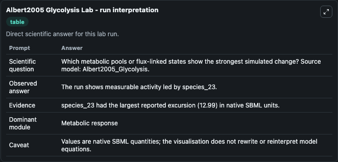
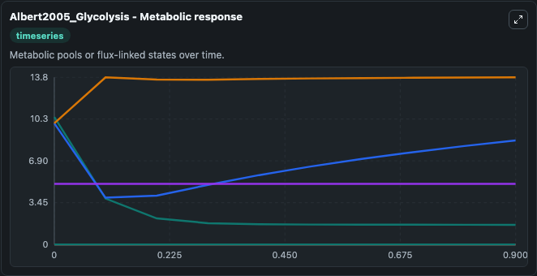
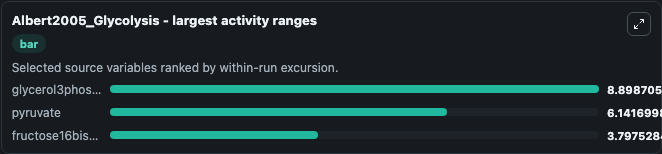
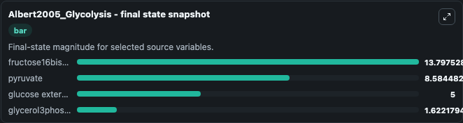
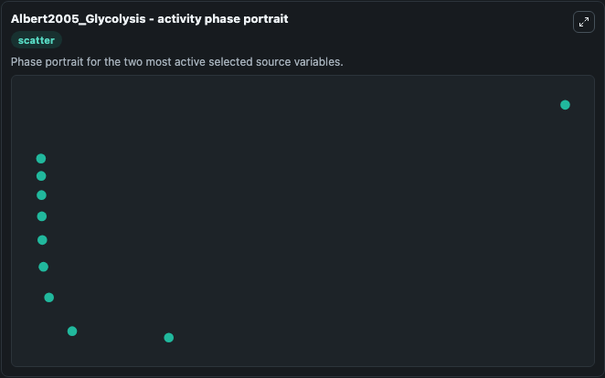

# Albert2005 Glycolysis

This Biosimulant lab wraps `Albert2005 Glycolysis` as a runnable systems biology model with a companion visualization module.
This model is from the article: Experimental and in silico analyses of glycolytic flux control in bloodstream form Trypanosoma brucei. It can be used to explore the configured dynamics and compare scenario outcomes across configurations.

## What You'll See

The lab asks: Which metabolic pools or flux-linked states show the strongest simulated change? Source model: Albert2005_Glycolysis. It runs for 1.0 time units with a communication step of 0.1. The run uses the model defaults declared by the curated SBML wrapper. The generated visualizations focus on glucose external, pyruvate external, glycerol external, glycerol3phosphate, pyruvate, and fructose16bisphosphate, combining trajectory, endpoint-comparison, and summary-table views from one completed dark-mode run.

In this captured run, **glycerol3phosphate** moved from 10.521 to 1.622 across 1.0 simulation windows.


### Output Visualizations



*Summary table for Albert2005 Glycolysis, reporting the scientific question, observed answer, dominant module, and caveat.*



*Trajectories of glycerol3phosphate, pyruvate, fructose16bisphosphate, glucose external, pyruvate external, and glycerol external across the 1.0 simulation. In this run **fructose16bisphosphate** climbed from 10.000 to 13.798 and **glycerol3phosphate** fell from 10.521 to 1.622 — the largest movements among the focused observables.*



*Largest-excursion ranking of the focused observables — the absolute movement magnitude during the run. Top 3: **glycerol3phosphate** = 8.899, **pyruvate** = 6.142, **fructose16bisphosphate** = 3.798.*



*Endpoint snapshot of the focused observables — final values from the captured run. Top 3 by value: **fructose16bisphosphate** = 13.798, **pyruvate** = 8.584, **glucose external** = 5.000, with 1 more observable below.*



*Visualization card from the Albert2005 Glycolysis dark-mode run.*


## Model Context

- Core model: `models/core`
- Visualization model: `models/visualisation`
- Standard: `other`
- Upstream source: `biomodels_ebi:BIOMD0000000211`
- License: `CC0`

## Inputs

| Input | Maps To | Default | Notes |
|---|---|---|---|
| Initial Glucose External | `systemsbiology_sbml_albert2005_glycolysis_biomd0000000211_model.initial_glucose_external` | | Source state initial condition exposed as a model-specific control because no explicit intervention parameter is identifiable. Maps to SBML symbol `species_25`. |
| Initial Pyruvate External | `systemsbiology_sbml_albert2005_glycolysis_biomd0000000211_model.initial_pyruvate_external` | | Source state initial condition exposed as a model-specific control because no explicit intervention parameter is identifiable. Maps to SBML symbol `species_26`. |
| Initial Glycerol External | `systemsbiology_sbml_albert2005_glycolysis_biomd0000000211_model.initial_glycerol_external` | | Source state initial condition exposed as a model-specific control because no explicit intervention parameter is identifiable. Maps to SBML symbol `species_27`. |
| Initial Glycerol3phosphate | `systemsbiology_sbml_albert2005_glycolysis_biomd0000000211_model.initial_glycerol3phosphate` | | Source state initial condition exposed as a model-specific control because no explicit intervention parameter is identifiable. Maps to SBML symbol `species_22`. |
| Initial Pyruvate | `systemsbiology_sbml_albert2005_glycolysis_biomd0000000211_model.initial_pyruvate` | | Source state initial condition exposed as a model-specific control because no explicit intervention parameter is identifiable. Maps to SBML symbol `species_1`. |
| Initial Fructose16bisphosphate | `systemsbiology_sbml_albert2005_glycolysis_biomd0000000211_model.initial_fructose16bisphosphate` | | Source state initial condition exposed as a model-specific control because no explicit intervention parameter is identifiable. Maps to SBML symbol `species_16`. |

## Outputs

| Output | Maps To | Role |
|---|---|---|
| `state` | `systemsbiology_sbml_albert2005_glycolysis_biomd0000000211_model.state` | Available to the visualization model and downstream workflows. |
| `summary` | `systemsbiology_sbml_albert2005_glycolysis_biomd0000000211_model.summary` | Available to the visualization model and downstream workflows. |
| `species_labels` | `systemsbiology_sbml_albert2005_glycolysis_biomd0000000211_model.species_labels` | Available to the visualization model and downstream workflows. |
| `glucose_external` | `systemsbiology_sbml_albert2005_glycolysis_biomd0000000211_model.glucose_external` | Available to the visualization model and downstream workflows. |
| `pyruvate_external` | `systemsbiology_sbml_albert2005_glycolysis_biomd0000000211_model.pyruvate_external` | Available to the visualization model and downstream workflows. |
| `glycerol_external` | `systemsbiology_sbml_albert2005_glycolysis_biomd0000000211_model.glycerol_external` | Available to the visualization model and downstream workflows. |
| `glycerol3phosphate` | `systemsbiology_sbml_albert2005_glycolysis_biomd0000000211_model.glycerol3phosphate` | Available to the visualization model and downstream workflows. |
| `pyruvate` | `systemsbiology_sbml_albert2005_glycolysis_biomd0000000211_model.pyruvate` | Available to the visualization model and downstream workflows. |
| `fructose16bisphosphate` | `systemsbiology_sbml_albert2005_glycolysis_biomd0000000211_model.fructose16bisphosphate` | Available to the visualization model and downstream workflows. |

## Runtime

- Duration: `1.0`
- Communication step: `0.1`

## Running Locally

```bash
biosimulant labs serve
```
