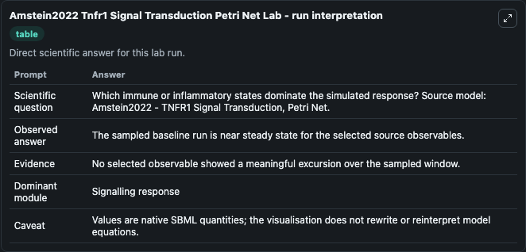
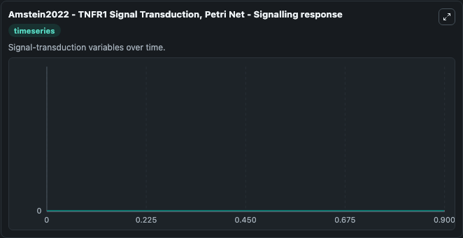

# Amstein2022 Tnfr1 Signal Transduction Petri Net

This Biosimulant lab wraps `Amstein2022 Tnfr1 Signal Transduction Petri Net` as a runnable systems biology model with a companion visualization module.
Systems Biology Amstein2022Tnfr1Signal Transduction Petri Net Model2210170001Model captures core biological behavior in the context of systemsbiology, sbml, biomodels_ebi using a biomodels_ebi-sourced OTHER mod. It can be used to explore the configured dynamics and compare scenario outcomes across configurations.

## What You'll See

The lab asks: Which immune or inflammatory states dominate the simulated response? Source model: Amstein2022 - TNFR1 Signal Transduction, Petri Net. It runs for 1.0 time units with a communication step of 0.1. The run uses the model defaults declared by the curated SBML wrapper. The generated visualizations focus on cFLIPL_mRNA, XIAP_mRNA, IkB_mRNA, BCL-2_mRNA, A20_mRNA, and tBid_MOM, combining trajectory, endpoint-comparison, and summary-table views from one completed dark-mode run.

In this captured run, **cFLIPL_mRNA** moved from 0 to 0 across 1.0 simulation windows.


### Output Visualizations



*Summary table for Amstein2022 Tnfr1 Signal Transduction Petri Net, reporting the scientific question, observed answer, dominant module, and caveat.*



*Trajectories of cFLIPL_mRNA, XIAP_mRNA, IkB_mRNA, BCL-2_mRNA, A20_mRNA, and tBid_MOM across the 1.0 simulation. In this run cFLIPL_mRNA, XIAP_mRNA, IkB_mRNA, BCL-2_mRNA stayed near their initial values — no observable moved appreciably.*


## Model Context

- Core model: `models/core`
- Visualization model: `models/visualisation`
- Standard: `other`
- Upstream source: `biomodels_ebi:MODEL2210170001`
- License: `CC0`

## Inputs

| Input | Maps To | Default | Notes |
|---|---|---|---|
| Initial C Flipl MRNA | `systemsbiology_sbml_amstein2022_tnfr1_signal_transduction_petri_net_model2210170001_model.initial_c_flipl_mrna` | | Source state initial condition exposed as a model-specific control because no explicit intervention parameter is identifiable. Maps to SBML symbol `P95`. |
| Initial Xiap MRNA | `systemsbiology_sbml_amstein2022_tnfr1_signal_transduction_petri_net_model2210170001_model.initial_xiap_mrna` | | Source state initial condition exposed as a model-specific control because no explicit intervention parameter is identifiable. Maps to SBML symbol `P93`. |
| Initial Ik B MRNA | `systemsbiology_sbml_amstein2022_tnfr1_signal_transduction_petri_net_model2210170001_model.initial_ik_b_mrna` | | Source state initial condition exposed as a model-specific control because no explicit intervention parameter is identifiable. Maps to SBML symbol `P79`. |
| Initial Bcl 2 MRNA | `systemsbiology_sbml_amstein2022_tnfr1_signal_transduction_petri_net_model2210170001_model.initial_bcl_2_mrna` | | Source state initial condition exposed as a model-specific control because no explicit intervention parameter is identifiable. Maps to SBML symbol `P96`. |
| Initial A20 MRNA | `systemsbiology_sbml_amstein2022_tnfr1_signal_transduction_petri_net_model2210170001_model.initial_a20_mrna` | | Source state initial condition exposed as a model-specific control because no explicit intervention parameter is identifiable. Maps to SBML symbol `P92`. |
| Initial T Bid Mom | `systemsbiology_sbml_amstein2022_tnfr1_signal_transduction_petri_net_model2210170001_model.initial_t_bid_mom` | | Source state initial condition exposed as a model-specific control because no explicit intervention parameter is identifiable. Maps to SBML symbol `P105`. |

## Outputs

| Output | Maps To | Role |
|---|---|---|
| `state` | `systemsbiology_sbml_amstein2022_tnfr1_signal_transduction_petri_net_model2210170001_model.state` | Available to the visualization model and downstream workflows. |
| `summary` | `systemsbiology_sbml_amstein2022_tnfr1_signal_transduction_petri_net_model2210170001_model.summary` | Available to the visualization model and downstream workflows. |
| `species_labels` | `systemsbiology_sbml_amstein2022_tnfr1_signal_transduction_petri_net_model2210170001_model.species_labels` | Available to the visualization model and downstream workflows. |
| `c_flipl_mrna` | `systemsbiology_sbml_amstein2022_tnfr1_signal_transduction_petri_net_model2210170001_model.c_flipl_mrna` | Available to the visualization model and downstream workflows. |
| `xiap_mrna` | `systemsbiology_sbml_amstein2022_tnfr1_signal_transduction_petri_net_model2210170001_model.xiap_mrna` | Available to the visualization model and downstream workflows. |
| `ik_b_mrna` | `systemsbiology_sbml_amstein2022_tnfr1_signal_transduction_petri_net_model2210170001_model.ik_b_mrna` | Available to the visualization model and downstream workflows. |
| `bcl_2_mrna` | `systemsbiology_sbml_amstein2022_tnfr1_signal_transduction_petri_net_model2210170001_model.bcl_2_mrna` | Available to the visualization model and downstream workflows. |
| `a20_mrna` | `systemsbiology_sbml_amstein2022_tnfr1_signal_transduction_petri_net_model2210170001_model.a20_mrna` | Available to the visualization model and downstream workflows. |
| `t_bid_mom` | `systemsbiology_sbml_amstein2022_tnfr1_signal_transduction_petri_net_model2210170001_model.t_bid_mom` | Available to the visualization model and downstream workflows. |

## Runtime

- Duration: `1.0`
- Communication step: `0.1`

## Running Locally

```bash
biosimulant labs serve
```
