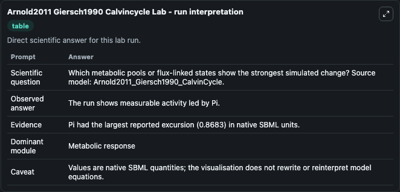
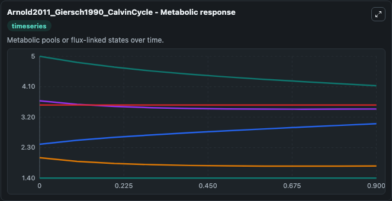
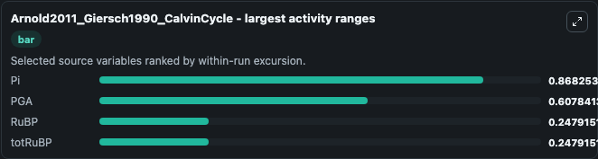
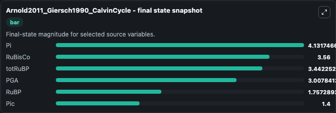
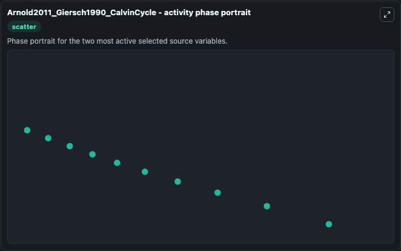

# Arnold2011 Giersch1990 Calvincycle

This Biosimulant lab wraps `Arnold2011 Giersch1990 Calvincycle` as a runnable systems biology model with a companion visualization module.
This model is from the article: A quantitative comparison of Calvin–Benson cycle models Anne Arnold, Zoran Nikoloski Trends in Plant Science 2011 Oct 14. It can be used to explore the configured dynamics and compare scenario outcomes across configurations.

## What You'll See

The lab asks: Which metabolic pools or flux-linked states show the strongest simulated change? Source model: Arnold2011_Giersch1990_CalvinCycle. It runs for 1.0 time units with a communication step of 0.1. The run uses the model defaults declared by the curated SBML wrapper. The generated visualizations focus on totRuBP, RuBisCo, Pi, PGA, RuBP, and Pic, combining trajectory, endpoint-comparison, and summary-table views from one completed dark-mode run.

In this captured run, **Pi** moved from 5.000 to 4.132 across 1.0 simulation windows.


### Output Visualizations



*Summary table for Arnold2011 Giersch1990 Calvincycle, reporting the scientific question, observed answer, dominant module, and caveat.*



*Trajectories of Pi, PGA, RuBP, totRuBP, RuBisCo, and Pic across the 1.0 simulation. In this run **PGA** climbed from 2.400 to 3.008 and **Pi** fell from 5.000 to 4.132 — the largest movements among the focused observables.*



*Largest-excursion ranking of the focused observables — the absolute movement magnitude during the run. Top 3: **Pi** = 0.8683, **PGA** = 0.6078, **RuBP** = 0.2479, with 1 more observable below.*



*Endpoint snapshot of the focused observables — final values from the captured run. Top 3 by value: **Pi** = 4.132, **RuBisCo** = 3.560, **totRuBP** = 3.442, with 3 more observables below.*



*Visualization card from the Arnold2011 Giersch1990 Calvincycle dark-mode run.*


## Model Context

- Core model: `models/core`
- Visualization model: `models/visualisation`
- Standard: `other`
- Upstream source: `biomodels_ebi:BIOMD0000000390`
- License: `CC0`

## Inputs

| Input | Maps To | Default | Notes |
|---|---|---|---|
| Initial Tot Ru Bp | `systemsbiology_sbml_arnold2011_giersch1990_calvincycle_biomd0000000390_model.initial_tot_ru_bp` | | Source state initial condition exposed as a model-specific control because no explicit intervention parameter is identifiable. Maps to SBML symbol `totRuBP`. |
| Initial Ru Bis Co | `systemsbiology_sbml_arnold2011_giersch1990_calvincycle_biomd0000000390_model.initial_ru_bis_co` | | Source state initial condition exposed as a model-specific control because no explicit intervention parameter is identifiable. Maps to SBML symbol `E_RuBisCO`. |
| Initial Model State Pi | `systemsbiology_sbml_arnold2011_giersch1990_calvincycle_biomd0000000390_model.initial_model_state_pi` | | Source state initial condition exposed as a model-specific control because no explicit intervention parameter is identifiable. Maps to SBML symbol `Pi`. |
| Initial Model State Pga | `systemsbiology_sbml_arnold2011_giersch1990_calvincycle_biomd0000000390_model.initial_model_state_pga` | | Source state initial condition exposed as a model-specific control because no explicit intervention parameter is identifiable. Maps to SBML symbol `PGA`. |
| Initial Ru Bp | `systemsbiology_sbml_arnold2011_giersch1990_calvincycle_biomd0000000390_model.initial_ru_bp` | | Source state initial condition exposed as a model-specific control because no explicit intervention parameter is identifiable. Maps to SBML symbol `RuBP`. |
| Initial Model State Pic | `systemsbiology_sbml_arnold2011_giersch1990_calvincycle_biomd0000000390_model.initial_model_state_pic` | | Source state initial condition exposed as a model-specific control because no explicit intervention parameter is identifiable. Maps to SBML symbol `Pic`. |

## Outputs

| Output | Maps To | Role |
|---|---|---|
| `state` | `systemsbiology_sbml_arnold2011_giersch1990_calvincycle_biomd0000000390_model.state` | Available to the visualization model and downstream workflows. |
| `summary` | `systemsbiology_sbml_arnold2011_giersch1990_calvincycle_biomd0000000390_model.summary` | Available to the visualization model and downstream workflows. |
| `species_labels` | `systemsbiology_sbml_arnold2011_giersch1990_calvincycle_biomd0000000390_model.species_labels` | Available to the visualization model and downstream workflows. |
| `tot_ru_bp` | `systemsbiology_sbml_arnold2011_giersch1990_calvincycle_biomd0000000390_model.tot_ru_bp` | Available to the visualization model and downstream workflows. |
| `ru_bis_co` | `systemsbiology_sbml_arnold2011_giersch1990_calvincycle_biomd0000000390_model.ru_bis_co` | Available to the visualization model and downstream workflows. |
| `model_state_pi` | `systemsbiology_sbml_arnold2011_giersch1990_calvincycle_biomd0000000390_model.model_state_pi` | Available to the visualization model and downstream workflows. |
| `pga` | `systemsbiology_sbml_arnold2011_giersch1990_calvincycle_biomd0000000390_model.pga` | Available to the visualization model and downstream workflows. |
| `ru_bp` | `systemsbiology_sbml_arnold2011_giersch1990_calvincycle_biomd0000000390_model.ru_bp` | Available to the visualization model and downstream workflows. |
| `pic` | `systemsbiology_sbml_arnold2011_giersch1990_calvincycle_biomd0000000390_model.pic` | Available to the visualization model and downstream workflows. |

## Runtime

- Duration: `1.0`
- Communication step: `0.1`

## Running Locally

```bash
biosimulant labs serve
```
