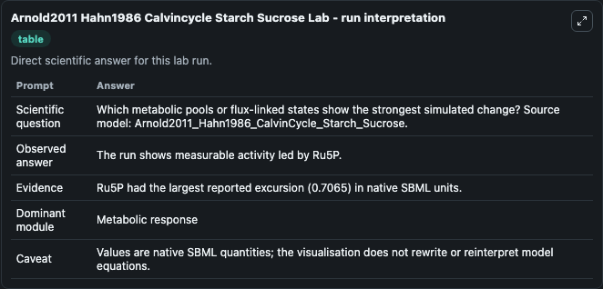
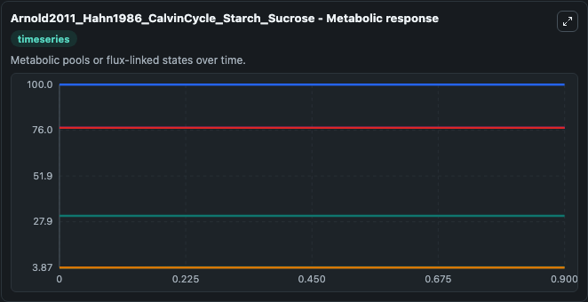
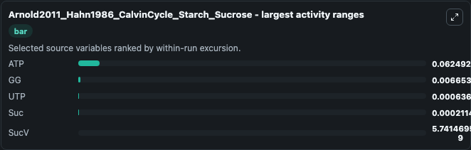
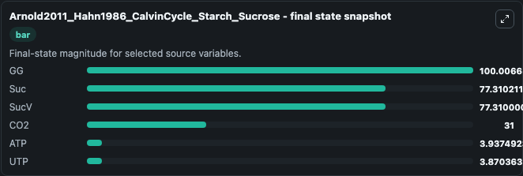
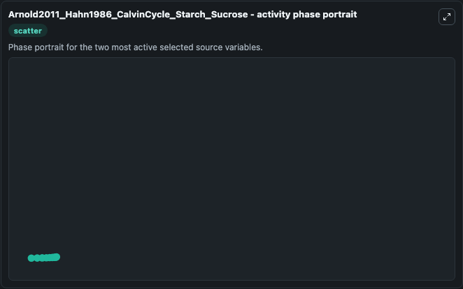

# Arnold2011 Hahn1986 Calvincycle Starch Sucrose

This Biosimulant lab wraps `Arnold2011 Hahn1986 Calvincycle Starch Sucrose` as a runnable systems biology model with a companion visualization module.
This model is from the article: A quantitative comparison of Calvin–Benson cycle models Anne Arnold, Zoran Nikoloski Trends in Plant Science 2011 Oct 14. It can be used to explore the configured dynamics and compare scenario outcomes across configurations.

## What You'll See

The lab asks: Which metabolic pools or flux-linked states show the strongest simulated change? Source model: Arnold2011_Hahn1986_CalvinCycle_Starch_Sucrose. It runs for 1.0 time units with a communication step of 0.1. The run uses the model defaults declared by the curated SBML wrapper. The generated visualizations focus on GG, SucV, Suc, CO2, ATP, and UTP, combining trajectory, endpoint-comparison, and summary-table views from one completed dark-mode run.

In this captured run, **ATP** moved from 3.875 to 3.937 across 1.0 simulation windows.


### Output Visualizations



*Summary table for Arnold2011 Hahn1986 Calvincycle Starch Sucrose, reporting the scientific question, observed answer, dominant module, and caveat.*



*Trajectories of ATP, GG, UTP, Suc, SucV, and CO2 across the 1.0 simulation. In this run **ATP** climbed from 3.875 to 3.937 and **UTP** fell from 3.871 to 3.870 — the largest movements among the focused observables.*



*Largest-excursion ranking of the focused observables — the absolute movement magnitude during the run. Top 3: **ATP** = 0.0625, **GG** = 0.00665, **UTP** = 0.000636, with 2 more observables below.*



*Endpoint snapshot of the focused observables — final values from the captured run. Top 3 by value: **GG** = 100.0, **Suc** = 77.310, **SucV** = 77.310, with 3 more observables below.*



*Visualization card from the Arnold2011 Hahn1986 Calvincycle Starch Sucrose dark-mode run.*


## Model Context

- Core model: `models/core`
- Visualization model: `models/visualisation`
- Standard: `other`
- Upstream source: `biomodels_ebi:BIOMD0000000389`
- License: `CC0`

## Inputs

| Input | Maps To | Default | Notes |
|---|---|---|---|
| Initial Model State Gg | `systemsbiology_sbml_arnold2011_hahn1986_calvincycle_starch_sucrose_biomd0000000389_model.initial_model_state_gg` | | Source state initial condition exposed as a model-specific control because no explicit intervention parameter is identifiable. Maps to SBML symbol `GG`. |
| Initial Suc V | `systemsbiology_sbml_arnold2011_hahn1986_calvincycle_starch_sucrose_biomd0000000389_model.initial_suc_v` | | Source state initial condition exposed as a model-specific control because no explicit intervention parameter is identifiable. Maps to SBML symbol `SucV`. |
| Initial Model State Suc | `systemsbiology_sbml_arnold2011_hahn1986_calvincycle_starch_sucrose_biomd0000000389_model.initial_model_state_suc` | | Source state initial condition exposed as a model-specific control because no explicit intervention parameter is identifiable. Maps to SBML symbol `Suc`. |
| Initial Model State CO2 | `systemsbiology_sbml_arnold2011_hahn1986_calvincycle_starch_sucrose_biomd0000000389_model.initial_model_state_co2` | | Source state initial condition exposed as a model-specific control because no explicit intervention parameter is identifiable. Maps to SBML symbol `CO2`. |
| Initial Model State ATP | `systemsbiology_sbml_arnold2011_hahn1986_calvincycle_starch_sucrose_biomd0000000389_model.initial_model_state_atp` | | Source state initial condition exposed as a model-specific control because no explicit intervention parameter is identifiable. Maps to SBML symbol `ATP`. |
| Initial Model State Utp | `systemsbiology_sbml_arnold2011_hahn1986_calvincycle_starch_sucrose_biomd0000000389_model.initial_model_state_utp` | | Source state initial condition exposed as a model-specific control because no explicit intervention parameter is identifiable. Maps to SBML symbol `UTP`. |

## Outputs

| Output | Maps To | Role |
|---|---|---|
| `state` | `systemsbiology_sbml_arnold2011_hahn1986_calvincycle_starch_sucrose_biomd0000000389_model.state` | Available to the visualization model and downstream workflows. |
| `summary` | `systemsbiology_sbml_arnold2011_hahn1986_calvincycle_starch_sucrose_biomd0000000389_model.summary` | Available to the visualization model and downstream workflows. |
| `species_labels` | `systemsbiology_sbml_arnold2011_hahn1986_calvincycle_starch_sucrose_biomd0000000389_model.species_labels` | Available to the visualization model and downstream workflows. |
| `model_state_gg` | `systemsbiology_sbml_arnold2011_hahn1986_calvincycle_starch_sucrose_biomd0000000389_model.model_state_gg` | Available to the visualization model and downstream workflows. |
| `suc_v` | `systemsbiology_sbml_arnold2011_hahn1986_calvincycle_starch_sucrose_biomd0000000389_model.suc_v` | Available to the visualization model and downstream workflows. |
| `suc` | `systemsbiology_sbml_arnold2011_hahn1986_calvincycle_starch_sucrose_biomd0000000389_model.suc` | Available to the visualization model and downstream workflows. |
| `co2` | `systemsbiology_sbml_arnold2011_hahn1986_calvincycle_starch_sucrose_biomd0000000389_model.co2` | Available to the visualization model and downstream workflows. |
| `atp` | `systemsbiology_sbml_arnold2011_hahn1986_calvincycle_starch_sucrose_biomd0000000389_model.atp` | Available to the visualization model and downstream workflows. |
| `utp` | `systemsbiology_sbml_arnold2011_hahn1986_calvincycle_starch_sucrose_biomd0000000389_model.utp` | Available to the visualization model and downstream workflows. |

## Runtime

- Duration: `1.0`
- Communication step: `0.1`

## Running Locally

```bash
biosimulant labs serve
```
