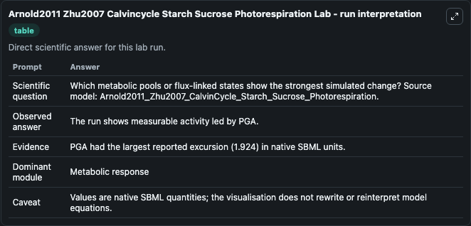
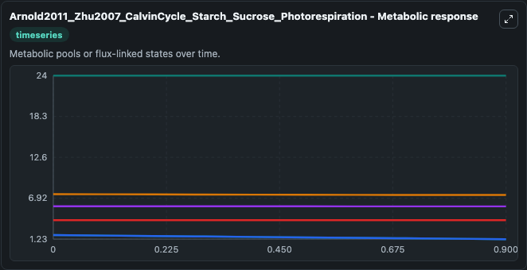
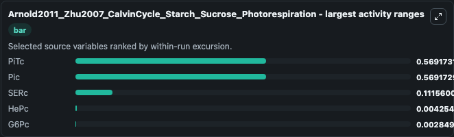
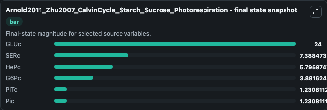
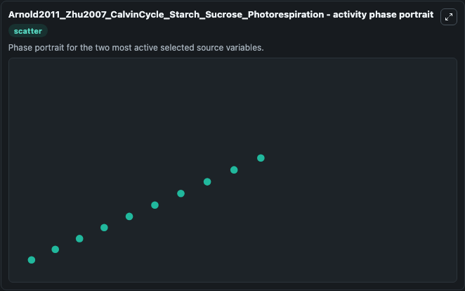

# Arnold2011 Zhu2007 Calvincycle Starch Sucrose Photorespiration

This Biosimulant lab wraps `Arnold2011 Zhu2007 Calvincycle Starch Sucrose Photorespiration` as a runnable systems biology model with a companion visualization module.
This model is from the article: A quantitative comparison of Calvin–Benson cycle models Anne Arnold, Zoran Nikoloski Trends in Plant Science 2011 Oct 14. It can be used to explore the configured dynamics and compare scenario outcomes across configurations.

## What You'll See

The lab asks: Which metabolic pools or flux-linked states show the strongest simulated change? Source model: Arnold2011_Zhu2007_CalvinCycle_Starch_Sucrose_Photorespiration. It runs for 1.0 time units with a communication step of 0.1. The run uses the model defaults declared by the curated SBML wrapper. The generated visualizations focus on GLUc, SERc, HePc, PiTc, Pic, and G6Pc, combining trajectory, endpoint-comparison, and summary-table views from one completed dark-mode run.

In this captured run, **PiTc** moved from 1.800 to 1.231 across 1.0 simulation windows.


### Output Visualizations



*Summary table for Arnold2011 Zhu2007 Calvincycle Starch Sucrose Photorespiration, reporting the scientific question, observed answer, dominant module, and caveat.*



*Trajectories of PiTc, Pic, SERc, HePc, G6Pc, and GLUc across the 1.0 simulation. In this run **PiTc** fell from 1.800 to 1.231 — the largest movements among the focused observables.*



*Largest-excursion ranking of the focused observables — the absolute movement magnitude during the run. Top 3: **PiTc** = 0.5692, **Pic** = 0.5692, **SERc** = 0.1116, with 2 more observables below.*



*Trajectories of PiTc, Pic, SERc, HePc, G6Pc, and GLUc across the 1.0 simulation. In this run **PiTc** fell from 1.800 to 1.231 — the largest movements among the focused observables.*



*Visualization card from the Arnold2011 Zhu2007 Calvincycle Starch Sucrose Photorespiration dark-mode run.*


## Model Context

- Core model: `models/core`
- Visualization model: `models/visualisation`
- Standard: `other`
- Upstream source: `biomodels_ebi:BIOMD0000000393`
- License: `CC0`

## Inputs

| Input | Maps To | Default | Notes |
|---|---|---|---|
| Initial Gl Uc | `systemsbiology_sbml_arnold2011_zhu2007_calvincycle_starch_sucrose_ph_biomd0000000393_model.initial_gl_uc` | | Source state initial condition exposed as a model-specific control because no explicit intervention parameter is identifiable. Maps to SBML symbol `GLUc`. |
| Initial Se Rc | `systemsbiology_sbml_arnold2011_zhu2007_calvincycle_starch_sucrose_ph_biomd0000000393_model.initial_se_rc` | | Source state initial condition exposed as a model-specific control because no explicit intervention parameter is identifiable. Maps to SBML symbol `SERc`. |
| Initial He Pc | `systemsbiology_sbml_arnold2011_zhu2007_calvincycle_starch_sucrose_ph_biomd0000000393_model.initial_he_pc` | | Source state initial condition exposed as a model-specific control because no explicit intervention parameter is identifiable. Maps to SBML symbol `HePc`. |
| Initial Pi Tc | `systemsbiology_sbml_arnold2011_zhu2007_calvincycle_starch_sucrose_ph_biomd0000000393_model.initial_pi_tc` | | Source state initial condition exposed as a model-specific control because no explicit intervention parameter is identifiable. Maps to SBML symbol `PiTc`. |
| Initial Model State Pic | `systemsbiology_sbml_arnold2011_zhu2007_calvincycle_starch_sucrose_ph_biomd0000000393_model.initial_model_state_pic` | | Source state initial condition exposed as a model-specific control because no explicit intervention parameter is identifiable. Maps to SBML symbol `Pic`. |
| Initial G6 Pc | `systemsbiology_sbml_arnold2011_zhu2007_calvincycle_starch_sucrose_ph_biomd0000000393_model.initial_g6_pc` | | Source state initial condition exposed as a model-specific control because no explicit intervention parameter is identifiable. Maps to SBML symbol `G6Pc`. |

## Outputs

| Output | Maps To | Role |
|---|---|---|
| `state` | `systemsbiology_sbml_arnold2011_zhu2007_calvincycle_starch_sucrose_ph_biomd0000000393_model.state` | Available to the visualization model and downstream workflows. |
| `summary` | `systemsbiology_sbml_arnold2011_zhu2007_calvincycle_starch_sucrose_ph_biomd0000000393_model.summary` | Available to the visualization model and downstream workflows. |
| `species_labels` | `systemsbiology_sbml_arnold2011_zhu2007_calvincycle_starch_sucrose_ph_biomd0000000393_model.species_labels` | Available to the visualization model and downstream workflows. |
| `gl_uc` | `systemsbiology_sbml_arnold2011_zhu2007_calvincycle_starch_sucrose_ph_biomd0000000393_model.gl_uc` | Available to the visualization model and downstream workflows. |
| `se_rc` | `systemsbiology_sbml_arnold2011_zhu2007_calvincycle_starch_sucrose_ph_biomd0000000393_model.se_rc` | Available to the visualization model and downstream workflows. |
| `he_pc` | `systemsbiology_sbml_arnold2011_zhu2007_calvincycle_starch_sucrose_ph_biomd0000000393_model.he_pc` | Available to the visualization model and downstream workflows. |
| `pi_tc` | `systemsbiology_sbml_arnold2011_zhu2007_calvincycle_starch_sucrose_ph_biomd0000000393_model.pi_tc` | Available to the visualization model and downstream workflows. |
| `pic` | `systemsbiology_sbml_arnold2011_zhu2007_calvincycle_starch_sucrose_ph_biomd0000000393_model.pic` | Available to the visualization model and downstream workflows. |
| `g6_pc` | `systemsbiology_sbml_arnold2011_zhu2007_calvincycle_starch_sucrose_ph_biomd0000000393_model.g6_pc` | Available to the visualization model and downstream workflows. |

## Runtime

- Duration: `1.0`
- Communication step: `0.1`

## Running Locally

```bash
biosimulant labs serve
```
