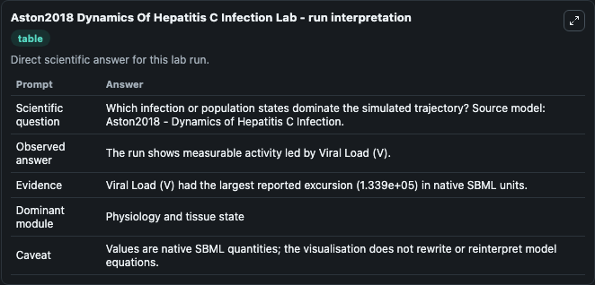
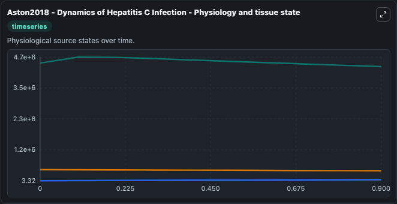
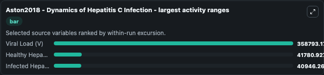
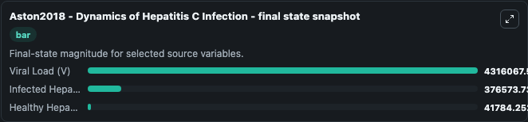
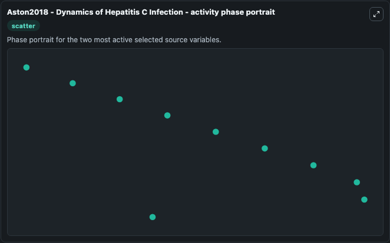

# Aston2018 Dynamics Of Hepatitis C Infection

This Biosimulant lab wraps `Aston2018 Dynamics Of Hepatitis C Infection` as a runnable systems biology model with a companion visualization module.
Philip Aston. It can be used to explore the configured dynamics and compare scenario outcomes across configurations.

## What You'll See

The lab asks: Which infection or population states dominate the simulated trajectory? Source model: Aston2018 - Dynamics of Hepatitis C Infection. It runs for 1.0 time units with a communication step of 0.1. The run uses the model defaults declared by the curated SBML wrapper. The generated visualizations focus on Viral Load (V), Infected Hepatocytes (I), and Healthy Hepatocytes (T), combining trajectory, endpoint-comparison, and summary-table views from one completed dark-mode run.

In this captured run, **Viral Load (V)** moved from 4.45e+06 to 4.32e+06 across 1.0 simulation windows.


### Output Visualizations



*Summary table for Aston2018 Dynamics Of Hepatitis C Infection, reporting the scientific question, observed answer, dominant module, and caveat.*



*Trajectories of Viral Load (V), Healthy Hepatocytes (T), and Infected Hepatocytes (I) across the 1.0 simulation. In this run **Healthy Hepatocytes (T)** climbed from 3.325 to 4.18e+04 and **Viral Load (V)** fell from 4.45e+06 to 4.32e+06 — the largest movements among the focused observables.*



*Largest-excursion ranking of the focused observables — the absolute movement magnitude during the run. Top 3: **Viral Load (V)** = 3.59e+05, **Healthy Hepatocytes (T)** = 4.18e+04, **Infected Hepatocytes (I)** = 4.09e+04.*



*Endpoint snapshot of the focused observables — final values from the captured run. Top 3 by value: **Viral Load (V)** = 4.32e+06, **Infected Hepatocytes (I)** = 3.77e+05, **Healthy Hepatocytes (T)** = 4.18e+04.*



*Visualization card from the Aston2018 Dynamics Of Hepatitis C Infection dark-mode run.*


## Model Context

- Core model: `models/core`
- Visualization model: `models/visualisation`
- Standard: `other`
- Upstream source: `biomodels_ebi:BIOMD0000000713`
- License: `CC0`

## Inputs

| Input | Maps To | Default | Notes |
|---|---|---|---|
| Initial Viral Load V | `systemsbiology_sbml_aston2018_dynamics_of_hepatitis_c_infection_biomd0000000713_model.initial_viral_load_v` | | Source state initial condition exposed as a model-specific control because no explicit intervention parameter is identifiable. Maps to SBML symbol `V`. |
| Initial Infected Hepatocytes I | `systemsbiology_sbml_aston2018_dynamics_of_hepatitis_c_infection_biomd0000000713_model.initial_infected_hepatocytes_i` | | Source state initial condition exposed as a model-specific control because no explicit intervention parameter is identifiable. Maps to SBML symbol `I`. |
| Initial Healthy Hepatocytes T | `systemsbiology_sbml_aston2018_dynamics_of_hepatitis_c_infection_biomd0000000713_model.initial_healthy_hepatocytes_t` | | Source state initial condition exposed as a model-specific control because no explicit intervention parameter is identifiable. Maps to SBML symbol `T`. |

## Outputs

| Output | Maps To | Role |
|---|---|---|
| `state` | `systemsbiology_sbml_aston2018_dynamics_of_hepatitis_c_infection_biomd0000000713_model.state` | Available to the visualization model and downstream workflows. |
| `summary` | `systemsbiology_sbml_aston2018_dynamics_of_hepatitis_c_infection_biomd0000000713_model.summary` | Available to the visualization model and downstream workflows. |
| `species_labels` | `systemsbiology_sbml_aston2018_dynamics_of_hepatitis_c_infection_biomd0000000713_model.species_labels` | Available to the visualization model and downstream workflows. |
| `viral_load_v` | `systemsbiology_sbml_aston2018_dynamics_of_hepatitis_c_infection_biomd0000000713_model.viral_load_v` | Available to the visualization model and downstream workflows. |
| `infected_hepatocytes_i` | `systemsbiology_sbml_aston2018_dynamics_of_hepatitis_c_infection_biomd0000000713_model.infected_hepatocytes_i` | Available to the visualization model and downstream workflows. |
| `healthy_hepatocytes_t` | `systemsbiology_sbml_aston2018_dynamics_of_hepatitis_c_infection_biomd0000000713_model.healthy_hepatocytes_t` | Available to the visualization model and downstream workflows. |

## Runtime

- Duration: `1.0`
- Communication step: `0.1`

## Running Locally

```bash
biosimulant labs serve
```
