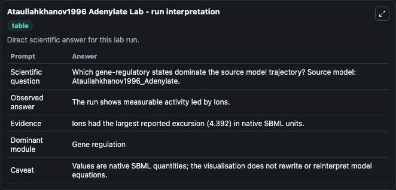
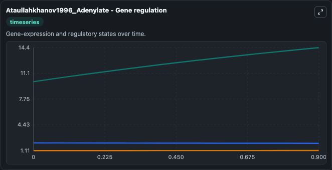
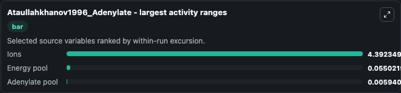
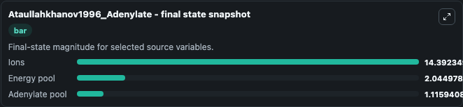
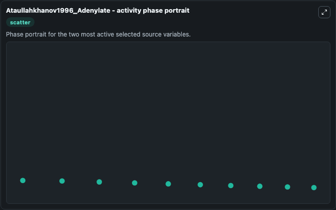

# Ataullahkhanov1996 Adenylate

This Biosimulant lab wraps `Ataullahkhanov1996 Adenylate` as a runnable systems biology model with a companion visualization module.
The model reproduces ion and adenylate pool concentration corresponding to line 2 of Fig 3 of the publication. It can be used to explore the configured dynamics and compare scenario outcomes across configurations.

## What You'll See

The lab asks: Which gene-regulatory states dominate the source model trajectory? Source model: Ataullahkhanov1996_Adenylate. It runs for 1.0 time units with a communication step of 0.1. The run uses the model defaults declared by the curated SBML wrapper. The generated visualizations focus on Ions, Energy pool, and Adenylate pool, combining trajectory, endpoint-comparison, and summary-table views from one completed dark-mode run.

In this captured run, **Ions** moved from 10.000 to 14.392 across 1.0 simulation windows.


### Output Visualizations



*Summary table for Ataullahkhanov1996 Adenylate, reporting the scientific question, observed answer, dominant module, and caveat.*



*Trajectories of Ions, Energy pool, and Adenylate pool across the 1.0 simulation. In this run **Ions** climbed from 10.000 to 14.392 and **Energy pool** fell from 2.100 to 2.045 — the largest movements among the focused observables.*



*Largest-excursion ranking of the focused observables — the absolute movement magnitude during the run. Top 3: **Ions** = 4.392, **Energy pool** = 0.0550, **Adenylate pool** = 0.00594.*



*Endpoint snapshot of the focused observables — final values from the captured run. Top 3 by value: **Ions** = 14.392, **Energy pool** = 2.045, **Adenylate pool** = 1.116.*



*Visualization card from the Ataullahkhanov1996 Adenylate dark-mode run.*


## Model Context

- Core model: `models/core`
- Visualization model: `models/visualisation`
- Standard: `other`
- Upstream source: `biomodels_ebi:BIOMD0000000054`
- License: `CC0`

## Inputs

| Input | Maps To | Default | Notes |
|---|---|---|---|
| Extracellular Ion Concentration | `systemsbiology_sbml_ataullahkhanov1996_adenylate_biomd0000000054_model.extracellular_ion_concentration` | | Source parameter exposed because its SBML label indicates a boundary, stimulus, dose, ligand, protocol, substrate, or environmental control. Maps to SBML symbol `J`. |

## Outputs

| Output | Maps To | Role |
|---|---|---|
| `state` | `systemsbiology_sbml_ataullahkhanov1996_adenylate_biomd0000000054_model.state` | Available to the visualization model and downstream workflows. |
| `summary` | `systemsbiology_sbml_ataullahkhanov1996_adenylate_biomd0000000054_model.summary` | Available to the visualization model and downstream workflows. |
| `species_labels` | `systemsbiology_sbml_ataullahkhanov1996_adenylate_biomd0000000054_model.species_labels` | Available to the visualization model and downstream workflows. |
| `ions` | `systemsbiology_sbml_ataullahkhanov1996_adenylate_biomd0000000054_model.ions` | Available to the visualization model and downstream workflows. |
| `energy_pool` | `systemsbiology_sbml_ataullahkhanov1996_adenylate_biomd0000000054_model.energy_pool` | Available to the visualization model and downstream workflows. |
| `adenylate_pool` | `systemsbiology_sbml_ataullahkhanov1996_adenylate_biomd0000000054_model.adenylate_pool` | Available to the visualization model and downstream workflows. |

## Runtime

- Duration: `1.0`
- Communication step: `0.1`

## Running Locally

```bash
biosimulant labs serve
```
