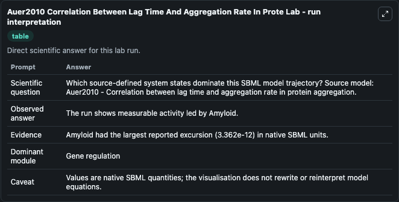
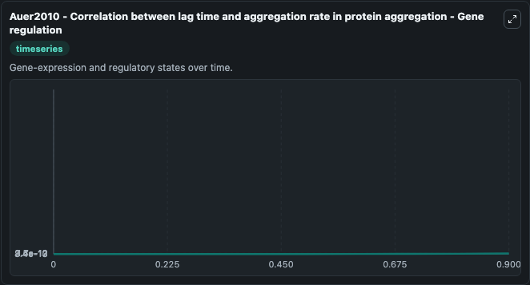
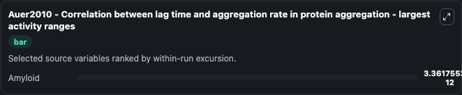
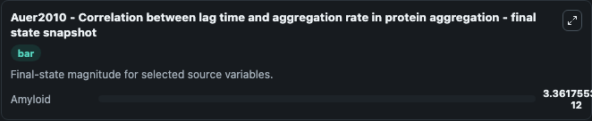

# Auer2010 Correlation Between Lag Time And Aggregation Rate In Prote

This Biosimulant lab wraps `Auer2010 Correlation Between Lag Time And Aggregation Rate In Prote` as a runnable systems biology model with a companion visualization module.
Auer2010 - Correlation between lag time andaggregation rate in protein aggregation This model is described in the article: Insight into the correlation between lag time and aggregation rate in the kin. It can be used to explore the configured dynamics and compare scenario outcomes across configurations.

## What You'll See

The lab asks: Which source-defined system states dominate this SBML model trajectory? Source model: Auer2010 - Correlation between lag time and aggregation rate in protein aggregation. It runs for 1.0 time units with a communication step of 0.1. The run uses the model defaults declared by the curated SBML wrapper. The generated visualizations focus on Amyloid, combining trajectory, endpoint-comparison, and summary-table views from one completed dark-mode run.

In this captured run, **Amyloid** moved from 0 to 3.36e-12 across 1.0 simulation windows.


### Output Visualizations



*Summary table for Auer2010 Correlation Between Lag Time And Aggregation Rate In Prote, reporting the scientific question, observed answer, dominant module, and caveat.*



*Trajectories of Amyloid across the 1.0 simulation. In this run **Amyloid** climbed from 0 to 3.36e-12 — the largest movements among the focused observables.*



*Largest-excursion ranking of the focused observables — the absolute movement magnitude during the run. Top 1: **Amyloid** = 3.36e-12.*



*Endpoint snapshot of the focused observables — final values from the captured run. Top 1 by value: **Amyloid** = 3.36e-12.*


## Model Context

- Core model: `models/core`
- Visualization model: `models/visualisation`
- Standard: `other`
- Upstream source: `biomodels_ebi:BIOMD0000000555`
- License: `CC0`

## Inputs

| Input | Maps To | Default | Notes |
|---|---|---|---|
| Initial Amyloid | `systemsbiology_sbml_auer2010_correlation_between_lag_time_and_aggreg_biomd0000000555_model.initial_amyloid` | | Source state initial condition exposed as a model-specific control because no explicit intervention parameter is identifiable. Maps to SBML symbol `Amyloid`. |

## Outputs

| Output | Maps To | Role |
|---|---|---|
| `state` | `systemsbiology_sbml_auer2010_correlation_between_lag_time_and_aggreg_biomd0000000555_model.state` | Available to the visualization model and downstream workflows. |
| `summary` | `systemsbiology_sbml_auer2010_correlation_between_lag_time_and_aggreg_biomd0000000555_model.summary` | Available to the visualization model and downstream workflows. |
| `species_labels` | `systemsbiology_sbml_auer2010_correlation_between_lag_time_and_aggreg_biomd0000000555_model.species_labels` | Available to the visualization model and downstream workflows. |
| `amyloid` | `systemsbiology_sbml_auer2010_correlation_between_lag_time_and_aggreg_biomd0000000555_model.amyloid` | Available to the visualization model and downstream workflows. |

## Runtime

- Duration: `1.0`
- Communication step: `0.1`

## Running Locally

```bash
biosimulant labs serve
```
