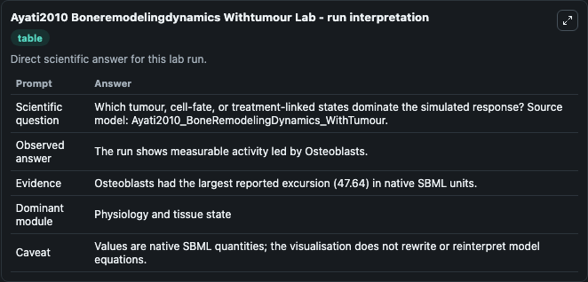
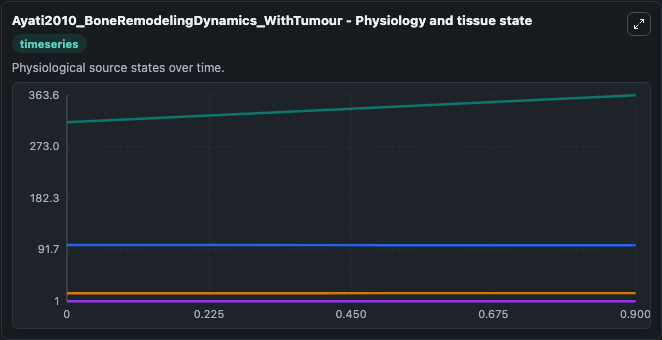
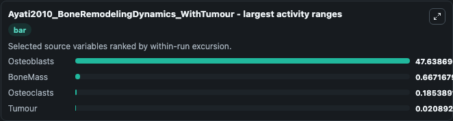
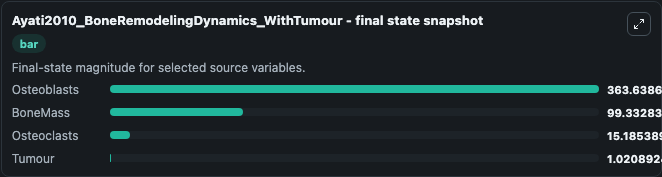
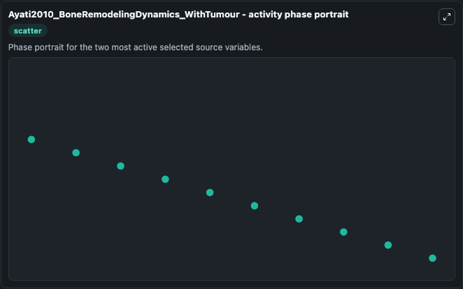

# Ayati2010 Boneremodelingdynamics Withtumour

This Biosimulant lab wraps `Ayati2010 Boneremodelingdynamics Withtumour` as a runnable systems biology model with a companion visualization module.
This a model from the article: A mathematical model of bone remodeling dynamics for normal bone cell populations and myeloma bone disease Bruce P Ayati, Claire M Edwards, Glenn F Webb and John P Wiksw. It can be used to explore the configured dynamics and compare scenario outcomes across configurations.

## What You'll See

The lab asks: Which tumour, cell-fate, or treatment-linked states dominate the simulated response? Source model: Ayati2010_BoneRemodelingDynamics_WithTumour. It runs for 1.0 time units with a communication step of 0.1. The run uses the model defaults declared by the curated SBML wrapper. The generated visualizations focus on Osteoblasts, BoneMass, Osteoclasts, and Tumour, combining trajectory, endpoint-comparison, and summary-table views from one completed dark-mode run.

In this captured run, **Osteoblasts** moved from 316.0 to 363.6 across 1.0 simulation windows.


### Output Visualizations



*Summary table for Ayati2010 Boneremodelingdynamics Withtumour, reporting the scientific question, observed answer, dominant module, and caveat.*



*Trajectories of Osteoblasts, BoneMass, Osteoclasts, and Tumour across the 1.0 simulation. In this run **Osteoblasts** climbed from 316.0 to 363.6 and **BoneMass** fell from 100.0 to 99.333 — the largest movements among the focused observables.*



*Largest-excursion ranking of the focused observables — the absolute movement magnitude during the run. Top 3: **Osteoblasts** = 47.639, **BoneMass** = 0.6672, **Osteoclasts** = 0.1854, with 1 more observable below.*



*Endpoint snapshot of the focused observables — final values from the captured run. Top 3 by value: **Osteoblasts** = 363.6, **BoneMass** = 99.333, **Osteoclasts** = 15.185, with 1 more observable below.*



*Visualization card from the Ayati2010 Boneremodelingdynamics Withtumour dark-mode run.*


## Model Context

- Core model: `models/core`
- Visualization model: `models/visualisation`
- Standard: `other`
- Upstream source: `biomodels_ebi:BIOMD0000000402`
- License: `CC0`

## Inputs

| Input | Maps To | Default | Notes |
|---|---|---|---|
| Initial Osteoblasts | `systemsbiology_sbml_ayati2010_boneremodelingdynamics_withtumour_biomd0000000402_model.initial_osteoblasts` | | Source state initial condition exposed as a model-specific control because no explicit intervention parameter is identifiable. Maps to SBML symbol `B`. |
| Initial Bone Mass | `systemsbiology_sbml_ayati2010_boneremodelingdynamics_withtumour_biomd0000000402_model.initial_bone_mass` | | Source state initial condition exposed as a model-specific control because no explicit intervention parameter is identifiable. Maps to SBML symbol `z`. |
| Initial Osteoclasts | `systemsbiology_sbml_ayati2010_boneremodelingdynamics_withtumour_biomd0000000402_model.initial_osteoclasts` | | Source state initial condition exposed as a model-specific control because no explicit intervention parameter is identifiable. Maps to SBML symbol `C`. |
| Initial Tumour | `systemsbiology_sbml_ayati2010_boneremodelingdynamics_withtumour_biomd0000000402_model.initial_tumour` | | Source state initial condition exposed as a model-specific control because no explicit intervention parameter is identifiable. Maps to SBML symbol `Tumour`. |

## Outputs

| Output | Maps To | Role |
|---|---|---|
| `state` | `systemsbiology_sbml_ayati2010_boneremodelingdynamics_withtumour_biomd0000000402_model.state` | Available to the visualization model and downstream workflows. |
| `summary` | `systemsbiology_sbml_ayati2010_boneremodelingdynamics_withtumour_biomd0000000402_model.summary` | Available to the visualization model and downstream workflows. |
| `species_labels` | `systemsbiology_sbml_ayati2010_boneremodelingdynamics_withtumour_biomd0000000402_model.species_labels` | Available to the visualization model and downstream workflows. |
| `osteoblasts` | `systemsbiology_sbml_ayati2010_boneremodelingdynamics_withtumour_biomd0000000402_model.osteoblasts` | Available to the visualization model and downstream workflows. |
| `bone_mass` | `systemsbiology_sbml_ayati2010_boneremodelingdynamics_withtumour_biomd0000000402_model.bone_mass` | Available to the visualization model and downstream workflows. |
| `osteoclasts` | `systemsbiology_sbml_ayati2010_boneremodelingdynamics_withtumour_biomd0000000402_model.osteoclasts` | Available to the visualization model and downstream workflows. |
| `tumour` | `systemsbiology_sbml_ayati2010_boneremodelingdynamics_withtumour_biomd0000000402_model.tumour` | Available to the visualization model and downstream workflows. |

## Runtime

- Duration: `1.0`
- Communication step: `0.1`

## Running Locally

```bash
biosimulant labs serve
```
