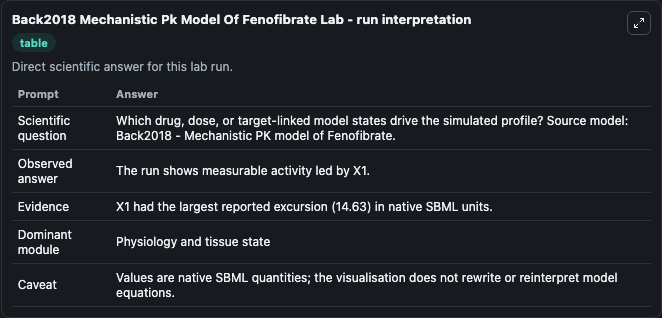
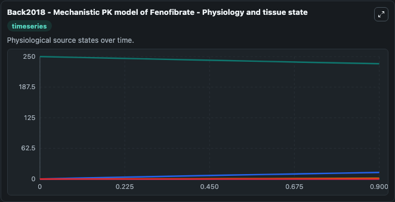
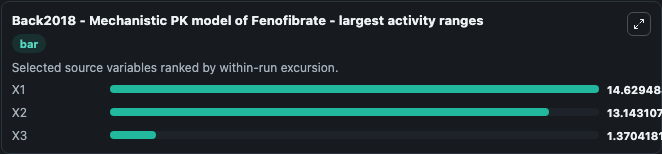
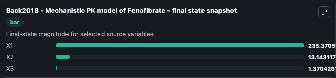
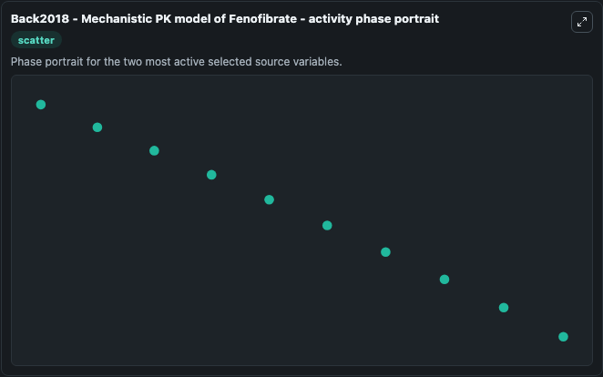

# Back2018 Mechanistic Pk Model Of Fenofibrate

This Biosimulant lab wraps `Back2018 Mechanistic Pk Model Of Fenofibrate` as a runnable systems biology model with a companion visualization module.
A mechanistic GI absorption model for quantitatively evaluating the effects of food on fenofibrate absorption was successfully developed, and acceptable parameters were obtained. It can be used to explore the configured dynamics and compare scenario outcomes across configurations.

## What You'll See

The lab asks: Which drug, dose, or target-linked model states drive the simulated profile? Source model: Back2018 - Mechanistic PK model of Fenofibrate. It runs for 1.0 time units with a communication step of 0.1. The run uses the model defaults declared by the curated SBML wrapper. The generated visualizations focus on X1, X3, X2, X5, and X4, combining trajectory, endpoint-comparison, and summary-table views from one completed dark-mode run.

In this captured run, **X1** moved from 250.0 to 235.4 across 1.0 simulation windows.


### Output Visualizations



*Summary table for Back2018 Mechanistic Pk Model Of Fenofibrate, reporting the scientific question, observed answer, dominant module, and caveat.*



*Trajectories of X1, X2, X3, X5, and X4 across the 1.0 simulation. In this run **X2** climbed from 1e-05 to 13.143 and **X1** fell from 250.0 to 235.4 — the largest movements among the focused observables.*



*Largest-excursion ranking of the focused observables — the absolute movement magnitude during the run. Top 3: **X1** = 14.629, **X2** = 13.143, **X3** = 1.370.*



*Endpoint snapshot of the focused observables — final values from the captured run. Top 3 by value: **X1** = 235.4, **X2** = 13.143, **X3** = 1.370.*



*Visualization card from the Back2018 Mechanistic Pk Model Of Fenofibrate dark-mode run.*


## Model Context

- Core model: `models/core`
- Visualization model: `models/visualisation`
- Standard: `other`
- Upstream source: `biomodels_ebi:MODEL2003030002`
- License: `CC0`

## Inputs

| Input | Maps To | Default | Notes |
|---|---|---|---|
| Initial Model State X1 | `systemsbiology_sbml_back2018_mechanistic_pk_model_of_fenofibrate_model2003030002_model.initial_model_state_x1` | | Source state initial condition exposed as a model-specific control because no explicit intervention parameter is identifiable. Maps to SBML symbol `X1`. |
| Initial Model State X3 | `systemsbiology_sbml_back2018_mechanistic_pk_model_of_fenofibrate_model2003030002_model.initial_model_state_x3` | | Source state initial condition exposed as a model-specific control because no explicit intervention parameter is identifiable. Maps to SBML symbol `X3`. |
| Initial Model State X2 | `systemsbiology_sbml_back2018_mechanistic_pk_model_of_fenofibrate_model2003030002_model.initial_model_state_x2` | | Source state initial condition exposed as a model-specific control because no explicit intervention parameter is identifiable. Maps to SBML symbol `X2`. |
| Initial Model State X5 | `systemsbiology_sbml_back2018_mechanistic_pk_model_of_fenofibrate_model2003030002_model.initial_model_state_x5` | | Source state initial condition exposed as a model-specific control because no explicit intervention parameter is identifiable. Maps to SBML symbol `X5`. |
| Initial Model State X4 | `systemsbiology_sbml_back2018_mechanistic_pk_model_of_fenofibrate_model2003030002_model.initial_model_state_x4` | | Source state initial condition exposed as a model-specific control because no explicit intervention parameter is identifiable. Maps to SBML symbol `X4`. |

## Outputs

| Output | Maps To | Role |
|---|---|---|
| `state` | `systemsbiology_sbml_back2018_mechanistic_pk_model_of_fenofibrate_model2003030002_model.state` | Available to the visualization model and downstream workflows. |
| `summary` | `systemsbiology_sbml_back2018_mechanistic_pk_model_of_fenofibrate_model2003030002_model.summary` | Available to the visualization model and downstream workflows. |
| `species_labels` | `systemsbiology_sbml_back2018_mechanistic_pk_model_of_fenofibrate_model2003030002_model.species_labels` | Available to the visualization model and downstream workflows. |
| `model_state_x1` | `systemsbiology_sbml_back2018_mechanistic_pk_model_of_fenofibrate_model2003030002_model.model_state_x1` | Available to the visualization model and downstream workflows. |
| `model_state_x3` | `systemsbiology_sbml_back2018_mechanistic_pk_model_of_fenofibrate_model2003030002_model.model_state_x3` | Available to the visualization model and downstream workflows. |
| `model_state_x2` | `systemsbiology_sbml_back2018_mechanistic_pk_model_of_fenofibrate_model2003030002_model.model_state_x2` | Available to the visualization model and downstream workflows. |
| `model_state_x5` | `systemsbiology_sbml_back2018_mechanistic_pk_model_of_fenofibrate_model2003030002_model.model_state_x5` | Available to the visualization model and downstream workflows. |
| `model_state_x4` | `systemsbiology_sbml_back2018_mechanistic_pk_model_of_fenofibrate_model2003030002_model.model_state_x4` | Available to the visualization model and downstream workflows. |

## Runtime

- Duration: `1.0`
- Communication step: `0.1`

## Running Locally

```bash
biosimulant labs serve
```
