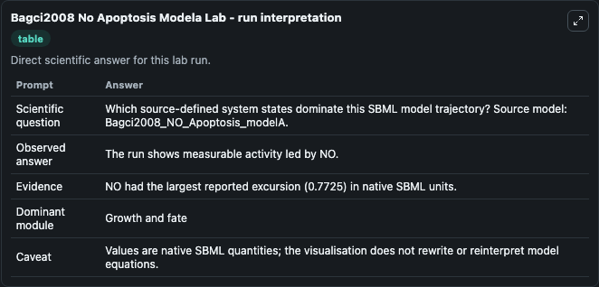
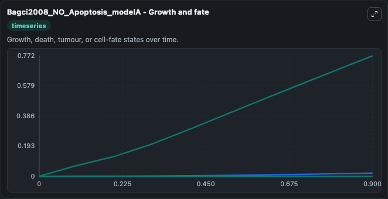
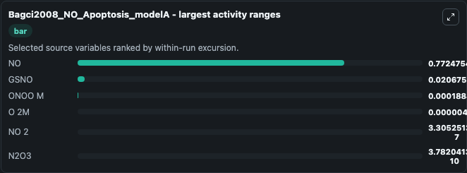
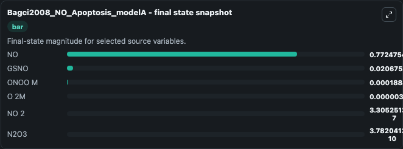
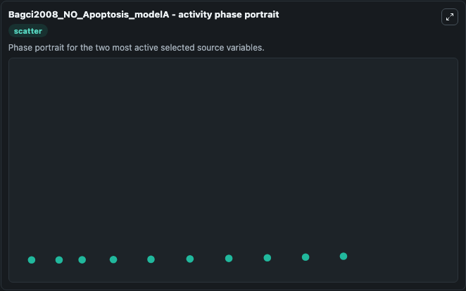

# Bagci2008 No Apoptosis Modela

This Biosimulant lab wraps `Bagci2008 No Apoptosis Modela` as a runnable systems biology model with a companion visualization module.
This a model from the article: Computational insights on the competing effects of nitric oxide in regulatingapoptosis. It can be used to explore the configured dynamics and compare scenario outcomes across configurations.

## What You'll See

The lab asks: Which source-defined system states dominate this SBML model trajectory? Source model: Bagci2008_NO_Apoptosis_modelA. It runs for 1.0 time units with a communication step of 0.1. The run uses the model defaults declared by the curated SBML wrapper. The generated visualizations focus on ONOO M, O 2M, NO 2, NO, N2O3, and GSNO, combining trajectory, endpoint-comparison, and summary-table views from one completed dark-mode run.

In this captured run, **NO** moved from 0 to 0.7725 across 1.0 simulation windows.


### Output Visualizations



*Summary table for Bagci2008 No Apoptosis Modela, reporting the scientific question, observed answer, dominant module, and caveat.*



*Trajectories of NO, GSNO, ONOO M, O 2M, NO 2, and N2O3 across the 1.0 simulation. In this run **NO** climbed from 0 to 0.7725 — the largest movements among the focused observables.*



*Largest-excursion ranking of the focused observables — the absolute movement magnitude during the run. Top 3: **NO** = 0.7725, **GSNO** = 0.0207, **ONOO M** = 0.000188, with 3 more observables below.*



*Endpoint snapshot of the focused observables — final values from the captured run. Top 3 by value: **NO** = 0.7725, **GSNO** = 0.0207, **ONOO M** = 0.000188, with 3 more observables below.*



*Visualization card from the Bagci2008 No Apoptosis Modela dark-mode run.*


## Model Context

- Core model: `models/core`
- Visualization model: `models/visualisation`
- Standard: `other`
- Upstream source: `biomodels_ebi:MODEL1006230064`
- License: `CC0`

## Inputs

| Input | Maps To | Default | Notes |
|---|---|---|---|
| Initial Onoo M | `systemsbiology_sbml_bagci2008_no_apoptosis_modela_model1006230064_model.initial_onoo_m` | | Source state initial condition exposed as a model-specific control because no explicit intervention parameter is identifiable. Maps to SBML symbol `ONOO_m`. |
| Initial O 2 M | `systemsbiology_sbml_bagci2008_no_apoptosis_modela_model1006230064_model.initial_o_2_m` | | Source state initial condition exposed as a model-specific control because no explicit intervention parameter is identifiable. Maps to SBML symbol `O_2m`. |
| Initial No 2 | `systemsbiology_sbml_bagci2008_no_apoptosis_modela_model1006230064_model.initial_no_2` | | Source state initial condition exposed as a model-specific control because no explicit intervention parameter is identifiable. Maps to SBML symbol `NO_2`. |
| Initial Model State No | `systemsbiology_sbml_bagci2008_no_apoptosis_modela_model1006230064_model.initial_model_state_no` | | Source state initial condition exposed as a model-specific control because no explicit intervention parameter is identifiable. Maps to SBML symbol `NO`. |
| Initial N2 O3 | `systemsbiology_sbml_bagci2008_no_apoptosis_modela_model1006230064_model.initial_n2_o3` | | Source state initial condition exposed as a model-specific control because no explicit intervention parameter is identifiable. Maps to SBML symbol `N2O3`. |
| Initial Gsno | `systemsbiology_sbml_bagci2008_no_apoptosis_modela_model1006230064_model.initial_gsno` | | Source state initial condition exposed as a model-specific control because no explicit intervention parameter is identifiable. Maps to SBML symbol `GSNO`. |

## Outputs

| Output | Maps To | Role |
|---|---|---|
| `state` | `systemsbiology_sbml_bagci2008_no_apoptosis_modela_model1006230064_model.state` | Available to the visualization model and downstream workflows. |
| `summary` | `systemsbiology_sbml_bagci2008_no_apoptosis_modela_model1006230064_model.summary` | Available to the visualization model and downstream workflows. |
| `species_labels` | `systemsbiology_sbml_bagci2008_no_apoptosis_modela_model1006230064_model.species_labels` | Available to the visualization model and downstream workflows. |
| `onoo_m` | `systemsbiology_sbml_bagci2008_no_apoptosis_modela_model1006230064_model.onoo_m` | Available to the visualization model and downstream workflows. |
| `o_2_m` | `systemsbiology_sbml_bagci2008_no_apoptosis_modela_model1006230064_model.o_2_m` | Available to the visualization model and downstream workflows. |
| `no_2` | `systemsbiology_sbml_bagci2008_no_apoptosis_modela_model1006230064_model.no_2` | Available to the visualization model and downstream workflows. |
| `model_state_no` | `systemsbiology_sbml_bagci2008_no_apoptosis_modela_model1006230064_model.model_state_no` | Available to the visualization model and downstream workflows. |
| `n2_o3` | `systemsbiology_sbml_bagci2008_no_apoptosis_modela_model1006230064_model.n2_o3` | Available to the visualization model and downstream workflows. |
| `gsno` | `systemsbiology_sbml_bagci2008_no_apoptosis_modela_model1006230064_model.gsno` | Available to the visualization model and downstream workflows. |

## Runtime

- Duration: `1.0`
- Communication step: `0.1`

## Running Locally

```bash
biosimulant labs serve
```
