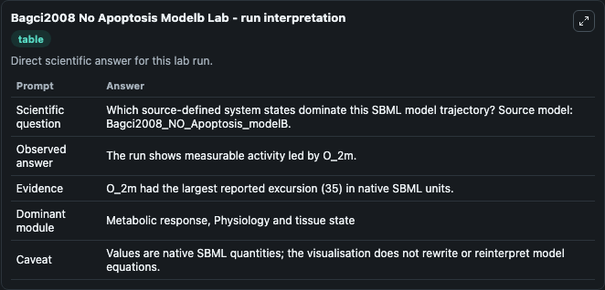
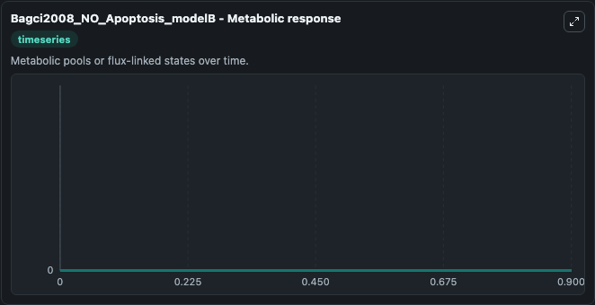

# Bagci2008 No Apoptosis Modelb

This Biosimulant lab wraps `Bagci2008 No Apoptosis Modelb` as a runnable systems biology model with a companion visualization module.
This a model from the article: Computational insights on the competing effects of nitric oxide in regulatingapoptosis. It can be used to explore the configured dynamics and compare scenario outcomes across configurations.

## What You'll See

The lab asks: Which source-defined system states dominate this SBML model trajectory? Source model: Bagci2008_NO_Apoptosis_modelB. It runs for 1.0 time units with a communication step of 0.1. The run uses the model defaults declared by the curated SBML wrapper. The generated visualizations focus on CytcApaf 1, Casp9Pro3, Casp9IAP, Casp9, Casp8Bid, and Casp8, combining trajectory, endpoint-comparison, and summary-table views from one completed dark-mode run.

In this captured run, **CytcApaf 1** moved from 0 to 0 across 1.0 simulation windows.


### Output Visualizations



*Summary table for Bagci2008 No Apoptosis Modelb, reporting the scientific question, observed answer, dominant module, and caveat.*



*Trajectories of CytcApaf 1, Casp9Pro3, Casp9IAP, Casp9, Casp8Bid, and Casp8 across the 1.0 simulation. In this run CytcApaf 1, Casp9Pro3, Casp9IAP, Casp9 stayed near their initial values — no observable moved appreciably.*


## Model Context

- Core model: `models/core`
- Visualization model: `models/visualisation`
- Standard: `other`
- Upstream source: `biomodels_ebi:MODEL1006230026`
- License: `CC0`

## Inputs

| Input | Maps To | Default | Notes |
|---|---|---|---|
| Initial Cytc Apaf 1 | `systemsbiology_sbml_bagci2008_no_apoptosis_modelb_model1006230026_model.initial_cytc_apaf_1` | | Source state initial condition exposed as a model-specific control because no explicit intervention parameter is identifiable. Maps to SBML symbol `CytcApaf_1`. |
| Initial Casp9 Pro3 | `systemsbiology_sbml_bagci2008_no_apoptosis_modelb_model1006230026_model.initial_casp9_pro3` | | Source state initial condition exposed as a model-specific control because no explicit intervention parameter is identifiable. Maps to SBML symbol `Casp9Pro3`. |
| Initial Casp9 Iap | `systemsbiology_sbml_bagci2008_no_apoptosis_modelb_model1006230026_model.initial_casp9_iap` | | Source state initial condition exposed as a model-specific control because no explicit intervention parameter is identifiable. Maps to SBML symbol `Casp9IAP`. |
| Initial Casp9 | `systemsbiology_sbml_bagci2008_no_apoptosis_modelb_model1006230026_model.initial_casp9` | | Source state initial condition exposed as a model-specific control because no explicit intervention parameter is identifiable. Maps to SBML symbol `Casp9`. |
| Initial Casp8 Bid | `systemsbiology_sbml_bagci2008_no_apoptosis_modelb_model1006230026_model.initial_casp8_bid` | | Source state initial condition exposed as a model-specific control because no explicit intervention parameter is identifiable. Maps to SBML symbol `Casp8Bid`. |
| Initial Casp8 | `systemsbiology_sbml_bagci2008_no_apoptosis_modelb_model1006230026_model.initial_casp8` | | Source state initial condition exposed as a model-specific control because no explicit intervention parameter is identifiable. Maps to SBML symbol `Casp8`. |

## Outputs

| Output | Maps To | Role |
|---|---|---|
| `state` | `systemsbiology_sbml_bagci2008_no_apoptosis_modelb_model1006230026_model.state` | Available to the visualization model and downstream workflows. |
| `summary` | `systemsbiology_sbml_bagci2008_no_apoptosis_modelb_model1006230026_model.summary` | Available to the visualization model and downstream workflows. |
| `species_labels` | `systemsbiology_sbml_bagci2008_no_apoptosis_modelb_model1006230026_model.species_labels` | Available to the visualization model and downstream workflows. |
| `cytc_apaf_1` | `systemsbiology_sbml_bagci2008_no_apoptosis_modelb_model1006230026_model.cytc_apaf_1` | Available to the visualization model and downstream workflows. |
| `casp9_pro3` | `systemsbiology_sbml_bagci2008_no_apoptosis_modelb_model1006230026_model.casp9_pro3` | Available to the visualization model and downstream workflows. |
| `casp9_iap` | `systemsbiology_sbml_bagci2008_no_apoptosis_modelb_model1006230026_model.casp9_iap` | Available to the visualization model and downstream workflows. |
| `casp9` | `systemsbiology_sbml_bagci2008_no_apoptosis_modelb_model1006230026_model.casp9` | Available to the visualization model and downstream workflows. |
| `casp8_bid` | `systemsbiology_sbml_bagci2008_no_apoptosis_modelb_model1006230026_model.casp8_bid` | Available to the visualization model and downstream workflows. |
| `casp8` | `systemsbiology_sbml_bagci2008_no_apoptosis_modelb_model1006230026_model.casp8` | Available to the visualization model and downstream workflows. |

## Runtime

- Duration: `1.0`
- Communication step: `0.1`

## Running Locally

```bash
biosimulant labs serve
```
