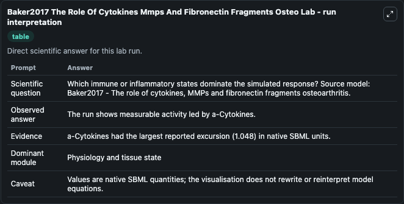
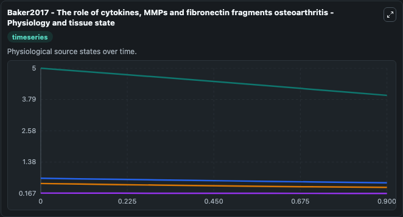
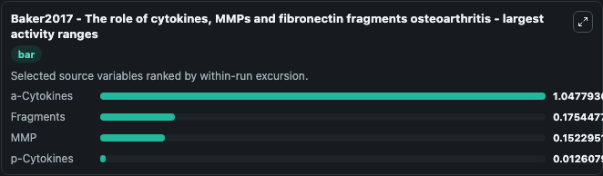
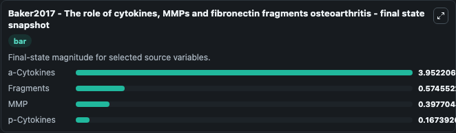
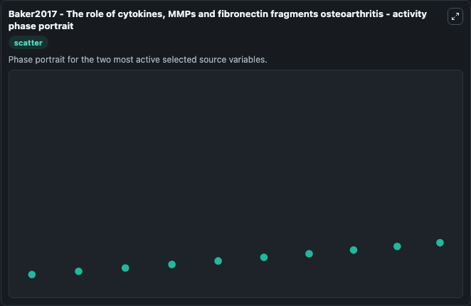

# Baker2017 The Role Of Cytokines Mmps And Fibronectin Fragments Osteo

This Biosimulant lab wraps `Baker2017 The Role Of Cytokines Mmps And Fibronectin Fragments Osteo` as a runnable systems biology model with a companion visualization module.
Baker2017 - The role of cytokines, MMPs andfibronectin fragments osteoarthritis This model is described in the article: Mathematical modelling of cytokines, MMPs and fibronectin fragments in osteoarth. It can be used to explore the configured dynamics and compare scenario outcomes across configurations.

## What You'll See

The lab asks: Which immune or inflammatory states dominate the simulated response? Source model: Baker2017 - The role of cytokines, MMPs and fibronectin fragments osteoarthritis. It runs for 1.0 time units with a communication step of 0.1. The run uses the model defaults declared by the curated SBML wrapper. The generated visualizations focus on a-Cytokines, Fragments, MMP, and p-Cytokines, combining trajectory, endpoint-comparison, and summary-table views from one completed dark-mode run.

In this captured run, **a-Cytokines** moved from 5.000 to 3.952 across 1.0 simulation windows.


### Output Visualizations



*Summary table for Baker2017 The Role Of Cytokines Mmps And Fibronectin Fragments Osteo, reporting the scientific question, observed answer, dominant module, and caveat.*



*Trajectories of a-Cytokines, Fragments, MMP, and p-Cytokines across the 1.0 simulation. In this run **a-Cytokines** fell from 5.000 to 3.952 — the largest movements among the focused observables.*



*Largest-excursion ranking of the focused observables — the absolute movement magnitude during the run. Top 3: **a-Cytokines** = 1.048, **Fragments** = 0.1754, **MMP** = 0.1523, with 1 more observable below.*



*Endpoint snapshot of the focused observables — final values from the captured run. Top 3 by value: **a-Cytokines** = 3.952, **Fragments** = 0.5746, **MMP** = 0.3977, with 1 more observable below.*



*Visualization card from the Baker2017 The Role Of Cytokines Mmps And Fibronectin Fragments Osteo dark-mode run.*


## Model Context

- Core model: `models/core`
- Visualization model: `models/visualisation`
- Standard: `other`
- Upstream source: `biomodels_ebi:BIOMD0000000928`
- License: `CC0`

## Inputs

| Input | Maps To | Default | Notes |
|---|---|---|---|
| Initial A Cytokines | `systemsbiology_sbml_baker2017_the_role_of_cytokines_mmps_and_fibrone_biomd0000000928_model.initial_a_cytokines` | | Source state initial condition exposed as a model-specific control because no explicit intervention parameter is identifiable. Maps to SBML symbol `solution1`. |
| Initial Fragments | `systemsbiology_sbml_baker2017_the_role_of_cytokines_mmps_and_fibrone_biomd0000000928_model.initial_fragments` | | Source state initial condition exposed as a model-specific control because no explicit intervention parameter is identifiable. Maps to SBML symbol `solution3`. |
| Initial Model State Mmp | `systemsbiology_sbml_baker2017_the_role_of_cytokines_mmps_and_fibrone_biomd0000000928_model.initial_model_state_mmp` | | Source state initial condition exposed as a model-specific control because no explicit intervention parameter is identifiable. Maps to SBML symbol `solution2`. |
| Initial P Cytokines | `systemsbiology_sbml_baker2017_the_role_of_cytokines_mmps_and_fibrone_biomd0000000928_model.initial_p_cytokines` | | Source state initial condition exposed as a model-specific control because no explicit intervention parameter is identifiable. Maps to SBML symbol `solution0`. |

## Outputs

| Output | Maps To | Role |
|---|---|---|
| `state` | `systemsbiology_sbml_baker2017_the_role_of_cytokines_mmps_and_fibrone_biomd0000000928_model.state` | Available to the visualization model and downstream workflows. |
| `summary` | `systemsbiology_sbml_baker2017_the_role_of_cytokines_mmps_and_fibrone_biomd0000000928_model.summary` | Available to the visualization model and downstream workflows. |
| `species_labels` | `systemsbiology_sbml_baker2017_the_role_of_cytokines_mmps_and_fibrone_biomd0000000928_model.species_labels` | Available to the visualization model and downstream workflows. |
| `a_cytokines` | `systemsbiology_sbml_baker2017_the_role_of_cytokines_mmps_and_fibrone_biomd0000000928_model.a_cytokines` | Available to the visualization model and downstream workflows. |
| `fragments` | `systemsbiology_sbml_baker2017_the_role_of_cytokines_mmps_and_fibrone_biomd0000000928_model.fragments` | Available to the visualization model and downstream workflows. |
| `mmp` | `systemsbiology_sbml_baker2017_the_role_of_cytokines_mmps_and_fibrone_biomd0000000928_model.mmp` | Available to the visualization model and downstream workflows. |
| `p_cytokines` | `systemsbiology_sbml_baker2017_the_role_of_cytokines_mmps_and_fibrone_biomd0000000928_model.p_cytokines` | Available to the visualization model and downstream workflows. |

## Runtime

- Duration: `1.0`
- Communication step: `0.1`

## Running Locally

```bash
biosimulant labs serve
```
