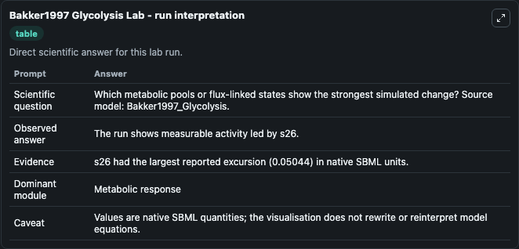
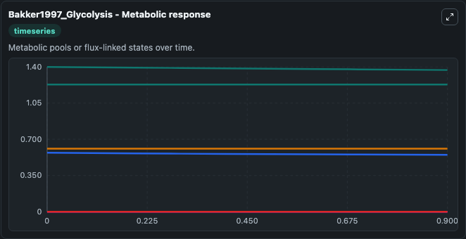
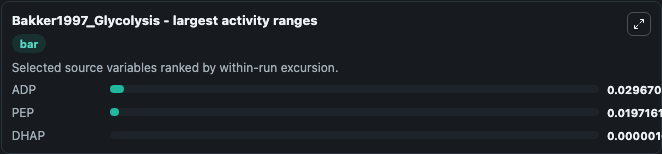
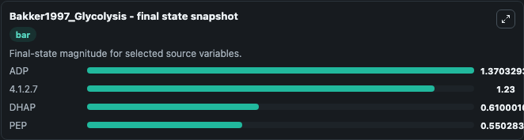
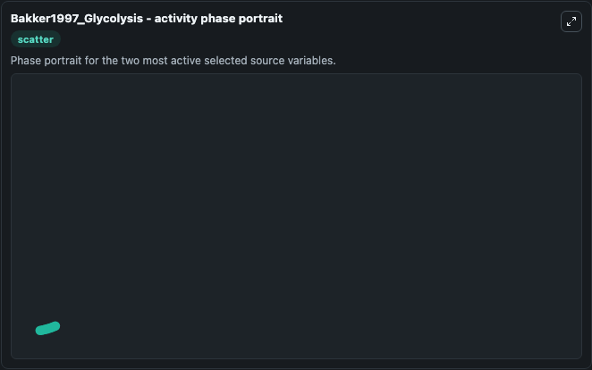

# Bakker1997 Glycolysis

This Biosimulant lab wraps `Bakker1997 Glycolysis` as a runnable systems biology model with a companion visualization module.
This model originates from BioModels Database: A Database of Annotated Published Models (http://www.ebi.ac.uk/biomodels/). It can be used to explore the configured dynamics and compare scenario outcomes across configurations.

## What You'll See

The lab asks: Which metabolic pools or flux-linked states show the strongest simulated change? Source model: Bakker1997_Glycolysis. It runs for 1.0 time units with a communication step of 0.1. The run uses the model defaults declared by the curated SBML wrapper. The generated visualizations focus on cAMP, Ca_super_2+_endsuper_, ADP, 4.1.2.7, DHAP, and PEP, combining trajectory, endpoint-comparison, and summary-table views from one completed dark-mode run.

In this captured run, **ADP** moved from 1.400 to 1.370 across 1.0 simulation windows.


### Output Visualizations



*Summary table for Bakker1997 Glycolysis, reporting the scientific question, observed answer, dominant module, and caveat.*



*Trajectories of ADP, PEP, DHAP, cAMP, Ca_super_2+_endsuper_, and 4.1.2.7 across the 1.0 simulation. In this run **DHAP** climbed from 0.6100 to 0.6100 and **ADP** fell from 1.400 to 1.370 — the largest movements among the focused observables.*



*Largest-excursion ranking of the focused observables — the absolute movement magnitude during the run. Top 3: **ADP** = 0.0297, **PEP** = 0.0197, **DHAP** = 1.04e-06.*



*Endpoint snapshot of the focused observables — final values from the captured run. Top 3 by value: **ADP** = 1.370, **4.1.2.7** = 1.230, **DHAP** = 0.6100, with 1 more observable below.*



*Visualization card from the Bakker1997 Glycolysis dark-mode run.*


## Model Context

- Core model: `models/core`
- Visualization model: `models/visualisation`
- Standard: `other`
- Upstream source: `biomodels_ebi:MODEL1101100000`
- License: `CC0`

## Inputs

| Input | Maps To | Default | Notes |
|---|---|---|---|
| Initial CAMP | `systemsbiology_sbml_bakker1997_glycolysis_model1101100000_model.initial_camp` | | Source state initial condition exposed as a model-specific control because no explicit intervention parameter is identifiable. Maps to SBML symbol `s11`. |
| Initial Ca Super 2 Endsuper | `systemsbiology_sbml_bakker1997_glycolysis_model1101100000_model.initial_ca_super_2_endsuper` | | Source state initial condition exposed as a model-specific control because no explicit intervention parameter is identifiable. Maps to SBML symbol `s46`. |
| Initial Model State ADP | `systemsbiology_sbml_bakker1997_glycolysis_model1101100000_model.initial_model_state_adp` | | Source state initial condition exposed as a model-specific control because no explicit intervention parameter is identifiable. Maps to SBML symbol `s4`. |
| Initial Model State 4 1 2 7 | `systemsbiology_sbml_bakker1997_glycolysis_model1101100000_model.initial_model_state_4_1_2_7` | | Source state initial condition exposed as a model-specific control because no explicit intervention parameter is identifiable. Maps to SBML symbol `s17`. |
| Initial Dhap | `systemsbiology_sbml_bakker1997_glycolysis_model1101100000_model.initial_dhap` | | Source state initial condition exposed as a model-specific control because no explicit intervention parameter is identifiable. Maps to SBML symbol `s15`. |
| Initial Model State Pep | `systemsbiology_sbml_bakker1997_glycolysis_model1101100000_model.initial_model_state_pep` | | Source state initial condition exposed as a model-specific control because no explicit intervention parameter is identifiable. Maps to SBML symbol `s28`. |

## Outputs

| Output | Maps To | Role |
|---|---|---|
| `state` | `systemsbiology_sbml_bakker1997_glycolysis_model1101100000_model.state` | Available to the visualization model and downstream workflows. |
| `summary` | `systemsbiology_sbml_bakker1997_glycolysis_model1101100000_model.summary` | Available to the visualization model and downstream workflows. |
| `species_labels` | `systemsbiology_sbml_bakker1997_glycolysis_model1101100000_model.species_labels` | Available to the visualization model and downstream workflows. |
| `camp` | `systemsbiology_sbml_bakker1997_glycolysis_model1101100000_model.camp` | Available to the visualization model and downstream workflows. |
| `ca_super_2_endsuper` | `systemsbiology_sbml_bakker1997_glycolysis_model1101100000_model.ca_super_2_endsuper` | Available to the visualization model and downstream workflows. |
| `adp` | `systemsbiology_sbml_bakker1997_glycolysis_model1101100000_model.adp` | Available to the visualization model and downstream workflows. |
| `model_state_4_1_2_7` | `systemsbiology_sbml_bakker1997_glycolysis_model1101100000_model.model_state_4_1_2_7` | Available to the visualization model and downstream workflows. |
| `dhap` | `systemsbiology_sbml_bakker1997_glycolysis_model1101100000_model.dhap` | Available to the visualization model and downstream workflows. |
| `pep` | `systemsbiology_sbml_bakker1997_glycolysis_model1101100000_model.pep` | Available to the visualization model and downstream workflows. |

## Runtime

- Duration: `1.0`
- Communication step: `0.1`

## Running Locally

```bash
biosimulant labs serve
```
