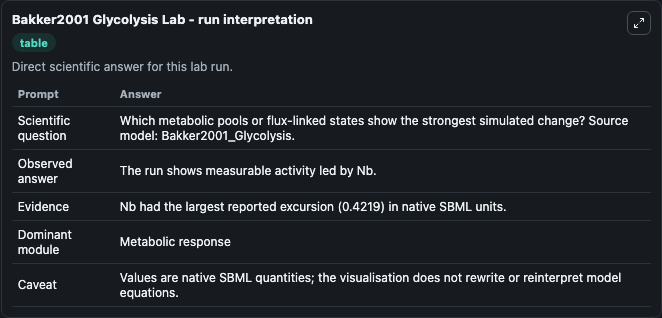
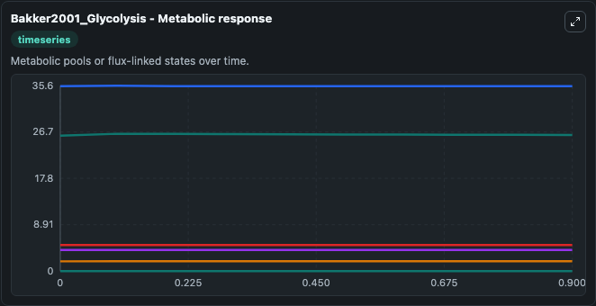
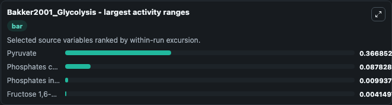
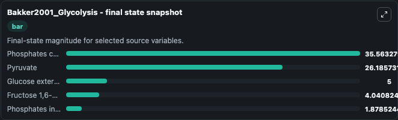
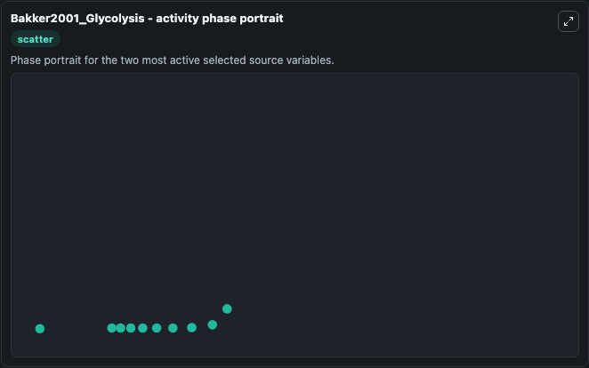

# Bakker2001 Glycolysis

This Biosimulant lab wraps `Bakker2001 Glycolysis` as a runnable systems biology model with a companion visualization module.
. It can be used to explore the configured dynamics and compare scenario outcomes across configurations.

## What You'll See

The lab asks: Which metabolic pools or flux-linked states show the strongest simulated change? Source model: Bakker2001_Glycolysis. It runs for 1.0 time units with a communication step of 0.1. The run uses the model defaults declared by the curated SBML wrapper. The generated visualizations focus on Glucose external, Pyruvate external, Fructose 1,6-bisphosphate, Phosphates in Glycosome, Phosphates cytosol, and Pyruvate, combining trajectory, endpoint-comparison, and summary-table views from one completed dark-mode run.

In this captured run, **Pyruvate** moved from 26.045 to 26.186 across 1.0 simulation windows.


### Output Visualizations



*Summary table for Bakker2001 Glycolysis, reporting the scientific question, observed answer, dominant module, and caveat.*



*Trajectories of Pyruvate, Phosphates cytosol, Phosphates in Glycosome, Fructose 1,6-bisphosphate, Glucose external, and Pyruvate external across the 1.0 simulation. In this run **Pyruvate** climbed from 26.045 to 26.186 and **Fructose 1,6-bisphosphate** fell from 4.045 to 4.041 — the largest movements among the focused observables.*



*Largest-excursion ranking of the focused observables — the absolute movement magnitude during the run. Top 3: **Pyruvate** = 0.3669, **Phosphates cytosol** = 0.0878, **Phosphates in Glycosome** = 0.00994, with 1 more observable below.*



*Endpoint snapshot of the focused observables — final values from the captured run. Top 3 by value: **Phosphates cytosol** = 35.563, **Pyruvate** = 26.186, **Glucose external** = 5.000, with 2 more observables below.*



*Visualization card from the Bakker2001 Glycolysis dark-mode run.*


## Model Context

- Core model: `models/core`
- Visualization model: `models/visualisation`
- Standard: `other`
- Upstream source: `biomodels_ebi:BIOMD0000000071`
- License: `CC0`

## Inputs

| Input | Maps To | Default | Notes |
|---|---|---|---|
| Initial Glucose External | `systemsbiology_sbml_bakker2001_glycolysis_biomd0000000071_model.initial_glucose_external` | | Source state initial condition exposed as a model-specific control because no explicit intervention parameter is identifiable. Maps to SBML symbol `GlcE`. |
| Initial Pyruvate External | `systemsbiology_sbml_bakker2001_glycolysis_biomd0000000071_model.initial_pyruvate_external` | | Source state initial condition exposed as a model-specific control because no explicit intervention parameter is identifiable. Maps to SBML symbol `PyrE`. |
| Initial Fructose 1 6 Bisphosphate | `systemsbiology_sbml_bakker2001_glycolysis_biomd0000000071_model.initial_fructose_1_6_bisphosphate` | | Source state initial condition exposed as a model-specific control because no explicit intervention parameter is identifiable. Maps to SBML symbol `Fru16BP`. |
| Initial Phosphates In Glycosome | `systemsbiology_sbml_bakker2001_glycolysis_biomd0000000071_model.initial_phosphates_in_glycosome` | | Source state initial condition exposed as a model-specific control because no explicit intervention parameter is identifiable. Maps to SBML symbol `Pg`. |
| Initial Phosphates Cytosol | `systemsbiology_sbml_bakker2001_glycolysis_biomd0000000071_model.initial_phosphates_cytosol` | | Source state initial condition exposed as a model-specific control because no explicit intervention parameter is identifiable. Maps to SBML symbol `Pc`. |
| Initial Pyruvate | `systemsbiology_sbml_bakker2001_glycolysis_biomd0000000071_model.initial_pyruvate` | | Source state initial condition exposed as a model-specific control because no explicit intervention parameter is identifiable. Maps to SBML symbol `Pyr`. |

## Outputs

| Output | Maps To | Role |
|---|---|---|
| `state` | `systemsbiology_sbml_bakker2001_glycolysis_biomd0000000071_model.state` | Available to the visualization model and downstream workflows. |
| `summary` | `systemsbiology_sbml_bakker2001_glycolysis_biomd0000000071_model.summary` | Available to the visualization model and downstream workflows. |
| `species_labels` | `systemsbiology_sbml_bakker2001_glycolysis_biomd0000000071_model.species_labels` | Available to the visualization model and downstream workflows. |
| `glucose_external` | `systemsbiology_sbml_bakker2001_glycolysis_biomd0000000071_model.glucose_external` | Available to the visualization model and downstream workflows. |
| `pyruvate_external` | `systemsbiology_sbml_bakker2001_glycolysis_biomd0000000071_model.pyruvate_external` | Available to the visualization model and downstream workflows. |
| `fructose_1_6_bisphosphate` | `systemsbiology_sbml_bakker2001_glycolysis_biomd0000000071_model.fructose_1_6_bisphosphate` | Available to the visualization model and downstream workflows. |
| `phosphates_in_glycosome` | `systemsbiology_sbml_bakker2001_glycolysis_biomd0000000071_model.phosphates_in_glycosome` | Available to the visualization model and downstream workflows. |
| `phosphates_cytosol` | `systemsbiology_sbml_bakker2001_glycolysis_biomd0000000071_model.phosphates_cytosol` | Available to the visualization model and downstream workflows. |
| `pyruvate` | `systemsbiology_sbml_bakker2001_glycolysis_biomd0000000071_model.pyruvate` | Available to the visualization model and downstream workflows. |

## Runtime

- Duration: `1.0`
- Communication step: `0.1`

## Running Locally

```bash
biosimulant labs serve
```
