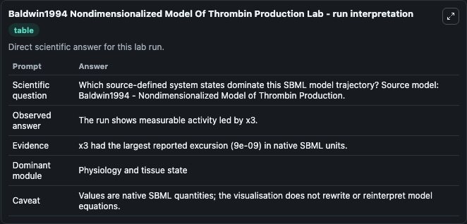
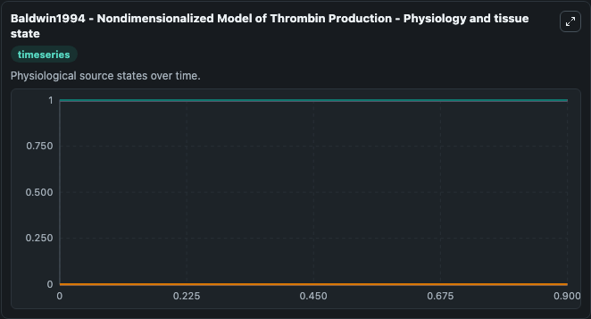
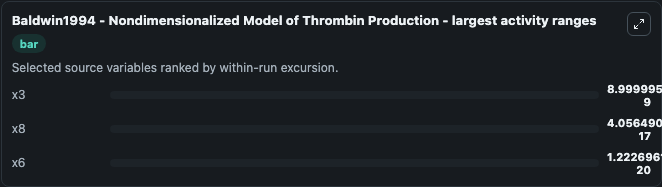
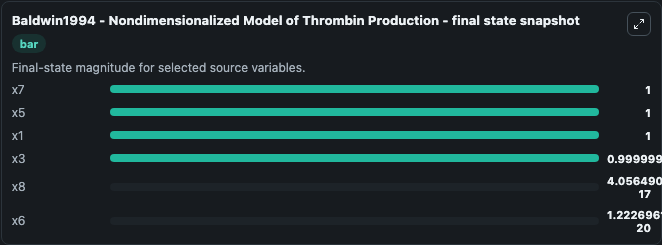
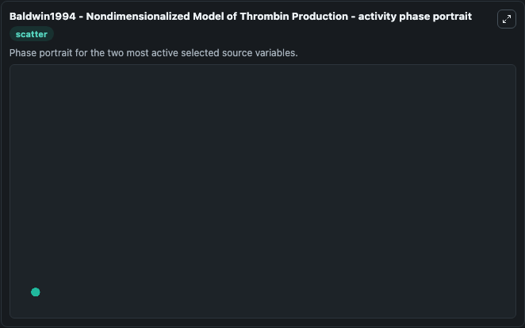

# Baldwin1994 Nondimensionalized Model Of Thrombin Production

This Biosimulant lab wraps `Baldwin1994 Nondimensionalized Model Of Thrombin Production` as a runnable systems biology model with a companion visualization module.
First mathematical model of thrombin production in flowing blood. It can be used to explore the configured dynamics and compare scenario outcomes across configurations.

## What You'll See

The lab asks: Which source-defined system states dominate this SBML model trajectory? Source model: Baldwin1994 - Nondimensionalized Model of Thrombin Production. It runs for 1.0 time units with a communication step of 0.1. The run uses the model defaults declared by the curated SBML wrapper. The generated visualizations focus on x7, x5, x3, x1, x8, and x6, combining trajectory, endpoint-comparison, and summary-table views from one completed dark-mode run.

In this captured run, **x3** moved from 1.000 to 1.0000 across 1.0 simulation windows.


### Output Visualizations



*Summary table for Baldwin1994 Nondimensionalized Model Of Thrombin Production, reporting the scientific question, observed answer, dominant module, and caveat.*



*Trajectories of x3, x8, x6, x7, x5, and x1 across the 1.0 simulation. In this run **x8** climbed from 0 to 4.06e-17 and **x3** fell from 1.000 to 1.0000 — the largest movements among the focused observables.*



*Largest-excursion ranking of the focused observables — the absolute movement magnitude during the run. Top 3: **x3** = 9e-09, **x8** = 4.06e-17, **x6** = 1.22e-20.*



*Endpoint snapshot of the focused observables — final values from the captured run. Top 3 by value: **x7** = 1.000, **x5** = 1.000, **x1** = 1.000, with 3 more observables below.*



*Visualization card from the Baldwin1994 Nondimensionalized Model Of Thrombin Production dark-mode run.*


## Model Context

- Core model: `models/core`
- Visualization model: `models/visualisation`
- Standard: `other`
- Upstream source: `biomodels_ebi:MODEL1806010001`
- License: `CC0`

## Inputs

| Input | Maps To | Default | Notes |
|---|---|---|---|
| Initial Model State X7 | `systemsbiology_sbml_baldwin1994_nondimensionalized_model_of_thrombin_model1806010001_model.initial_model_state_x7` | | Source state initial condition exposed as a model-specific control because no explicit intervention parameter is identifiable. Maps to SBML symbol `x7`. |
| Initial Model State X5 | `systemsbiology_sbml_baldwin1994_nondimensionalized_model_of_thrombin_model1806010001_model.initial_model_state_x5` | | Source state initial condition exposed as a model-specific control because no explicit intervention parameter is identifiable. Maps to SBML symbol `x5`. |
| Initial Model State X3 | `systemsbiology_sbml_baldwin1994_nondimensionalized_model_of_thrombin_model1806010001_model.initial_model_state_x3` | | Source state initial condition exposed as a model-specific control because no explicit intervention parameter is identifiable. Maps to SBML symbol `x3`. |
| Initial Model State X1 | `systemsbiology_sbml_baldwin1994_nondimensionalized_model_of_thrombin_model1806010001_model.initial_model_state_x1` | | Source state initial condition exposed as a model-specific control because no explicit intervention parameter is identifiable. Maps to SBML symbol `x1`. |
| Initial Model State X8 | `systemsbiology_sbml_baldwin1994_nondimensionalized_model_of_thrombin_model1806010001_model.initial_model_state_x8` | | Source state initial condition exposed as a model-specific control because no explicit intervention parameter is identifiable. Maps to SBML symbol `x8`. |
| Initial Model State X6 | `systemsbiology_sbml_baldwin1994_nondimensionalized_model_of_thrombin_model1806010001_model.initial_model_state_x6` | | Source state initial condition exposed as a model-specific control because no explicit intervention parameter is identifiable. Maps to SBML symbol `x6`. |

## Outputs

| Output | Maps To | Role |
|---|---|---|
| `state` | `systemsbiology_sbml_baldwin1994_nondimensionalized_model_of_thrombin_model1806010001_model.state` | Available to the visualization model and downstream workflows. |
| `summary` | `systemsbiology_sbml_baldwin1994_nondimensionalized_model_of_thrombin_model1806010001_model.summary` | Available to the visualization model and downstream workflows. |
| `species_labels` | `systemsbiology_sbml_baldwin1994_nondimensionalized_model_of_thrombin_model1806010001_model.species_labels` | Available to the visualization model and downstream workflows. |
| `model_state_x7` | `systemsbiology_sbml_baldwin1994_nondimensionalized_model_of_thrombin_model1806010001_model.model_state_x7` | Available to the visualization model and downstream workflows. |
| `model_state_x5` | `systemsbiology_sbml_baldwin1994_nondimensionalized_model_of_thrombin_model1806010001_model.model_state_x5` | Available to the visualization model and downstream workflows. |
| `model_state_x3` | `systemsbiology_sbml_baldwin1994_nondimensionalized_model_of_thrombin_model1806010001_model.model_state_x3` | Available to the visualization model and downstream workflows. |
| `model_state_x1` | `systemsbiology_sbml_baldwin1994_nondimensionalized_model_of_thrombin_model1806010001_model.model_state_x1` | Available to the visualization model and downstream workflows. |
| `model_state_x8` | `systemsbiology_sbml_baldwin1994_nondimensionalized_model_of_thrombin_model1806010001_model.model_state_x8` | Available to the visualization model and downstream workflows. |
| `model_state_x6` | `systemsbiology_sbml_baldwin1994_nondimensionalized_model_of_thrombin_model1806010001_model.model_state_x6` | Available to the visualization model and downstream workflows. |

## Runtime

- Duration: `1.0`
- Communication step: `0.1`

## Running Locally

```bash
biosimulant labs serve
```
