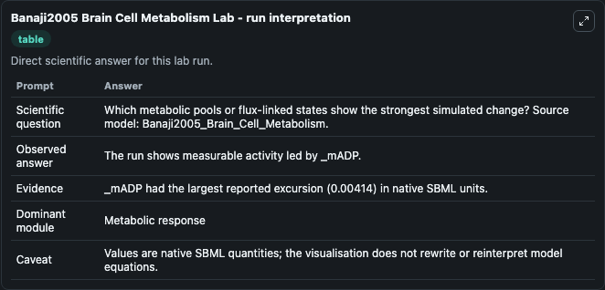
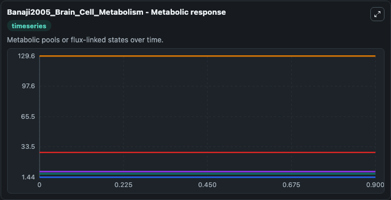
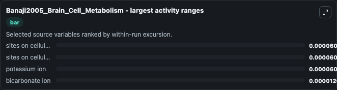
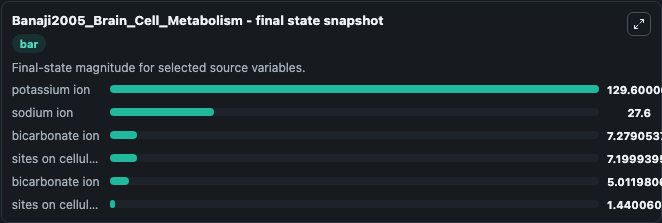
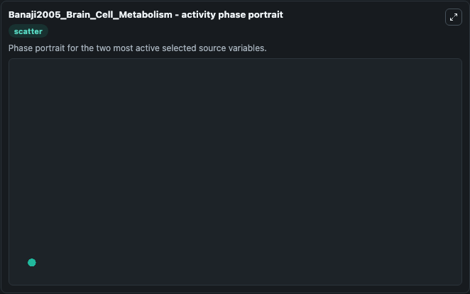

# Banaji2005 Brain Cell Metabolism

This Biosimulant lab wraps `Banaji2005 Brain Cell Metabolism` as a runnable systems biology model with a companion visualization module.
This is a part of the model described in: A physiological model of cerebral blood flow control Murad Banaji, Ilias Tachtsidis, David Delpy, Stephen Baigent, Mathematical biosciences 2005 194:125-173;. It can be used to explore the configured dynamics and compare scenario outcomes across configurations.

## What You'll See

The lab asks: Which metabolic pools or flux-linked states show the strongest simulated change? Source model: Banaji2005_Brain_Cell_Metabolism. It runs for 1.0 time units with a communication step of 0.1. The run uses the model defaults declared by the curated SBML wrapper. The generated visualizations focus on sites on cellular proteins capable of binding protons, sites on cellular proteins bound to protons, potassium ion, sodium ion, and bicarbonate ion, combining trajectory, endpoint-comparison, and summary-table views from one completed dark-mode run.

In this captured run, **sites on cellular proteins capable of binding protons** moved from 7.200 to 7.200 across 1.0 simulation windows.


### Output Visualizations



*Summary table for Banaji2005 Brain Cell Metabolism, reporting the scientific question, observed answer, dominant module, and caveat.*



*Trajectories of sites on cellular proteins capable of binding protons, sites on cellular proteins bound to protons, potassium ion, bicarbonate ion, sodium ion, and bicarbonate ion across the 1.0 simulation. In this run **sites on cellular proteins bound to protons** climbed from 1.440 to 1.440 and **sites on cellular proteins capable of binding protons** fell from 7.200 to 7.200 — the largest movements among the focused observables.*



*Largest-excursion ranking of the focused observables — the absolute movement magnitude during the run. Top 3: **sites on cellular proteins capable of binding protons** = 6.05e-05, **sites on cellular proteins bound to protons** = 6.05e-05, **potassium ion** = 6.04e-05, with 1 more observable below.*



*Endpoint snapshot of the focused observables — final values from the captured run. Top 3 by value: **potassium ion** = 129.6, **sodium ion** = 27.600, **bicarbonate ion** = 7.279, with 3 more observables below.*



*Visualization card from the Banaji2005 Brain Cell Metabolism dark-mode run.*


## Model Context

- Core model: `models/core`
- Visualization model: `models/visualisation`
- Standard: `other`
- Upstream source: `biomodels_ebi:MODEL4992089662`
- License: `CC0`

## Inputs

| Input | Maps To | Default | Notes |
|---|---|---|---|
| Initial Sites On Cellular Proteins Capable Of Binding Protons | `systemsbiology_sbml_banaji2005_brain_cell_metabolism_model4992089662_model.initial_sites_on_cellular_proteins_capable_of_binding_protons` | | Source state initial condition exposed as a model-specific control because no explicit intervention parameter is identifiable. Maps to SBML symbol `Pbuf`. |
| Initial Sites On Cellular Proteins Bound To Protons | `systemsbiology_sbml_banaji2005_brain_cell_metabolism_model4992089662_model.initial_sites_on_cellular_proteins_bound_to_protons` | | Source state initial condition exposed as a model-specific control because no explicit intervention parameter is identifiable. Maps to SBML symbol `PbufH`. |
| Initial Potassium Ion | `systemsbiology_sbml_banaji2005_brain_cell_metabolism_model4992089662_model.initial_potassium_ion` | | Source state initial condition exposed as a model-specific control because no explicit intervention parameter is identifiable. Maps to SBML symbol `_K`. |
| Initial Sodium Ion | `systemsbiology_sbml_banaji2005_brain_cell_metabolism_model4992089662_model.initial_sodium_ion` | | Source state initial condition exposed as a model-specific control because no explicit intervention parameter is identifiable. Maps to SBML symbol `_eNa`. |
| Initial Bicarbonate Ion | `systemsbiology_sbml_banaji2005_brain_cell_metabolism_model4992089662_model.initial_bicarbonate_ion` | | Source state initial condition exposed as a model-specific control because no explicit intervention parameter is identifiable. Maps to SBML symbol `_mBiC`. |
| Initial Bicarbonate Ion 2 | `systemsbiology_sbml_banaji2005_brain_cell_metabolism_model4992089662_model.initial_bicarbonate_ion_2` | | Source state initial condition exposed as a model-specific control because no explicit intervention parameter is identifiable. Maps to SBML symbol `_eBiC`. |

## Outputs

| Output | Maps To | Role |
|---|---|---|
| `state` | `systemsbiology_sbml_banaji2005_brain_cell_metabolism_model4992089662_model.state` | Available to the visualization model and downstream workflows. |
| `summary` | `systemsbiology_sbml_banaji2005_brain_cell_metabolism_model4992089662_model.summary` | Available to the visualization model and downstream workflows. |
| `species_labels` | `systemsbiology_sbml_banaji2005_brain_cell_metabolism_model4992089662_model.species_labels` | Available to the visualization model and downstream workflows. |
| `sites_on_cellular_proteins_capable_of_binding_protons` | `systemsbiology_sbml_banaji2005_brain_cell_metabolism_model4992089662_model.sites_on_cellular_proteins_capable_of_binding_protons` | Available to the visualization model and downstream workflows. |
| `sites_on_cellular_proteins_bound_to_protons` | `systemsbiology_sbml_banaji2005_brain_cell_metabolism_model4992089662_model.sites_on_cellular_proteins_bound_to_protons` | Available to the visualization model and downstream workflows. |
| `potassium_ion` | `systemsbiology_sbml_banaji2005_brain_cell_metabolism_model4992089662_model.potassium_ion` | Available to the visualization model and downstream workflows. |
| `sodium_ion` | `systemsbiology_sbml_banaji2005_brain_cell_metabolism_model4992089662_model.sodium_ion` | Available to the visualization model and downstream workflows. |
| `bicarbonate_ion` | `systemsbiology_sbml_banaji2005_brain_cell_metabolism_model4992089662_model.bicarbonate_ion` | Available to the visualization model and downstream workflows. |
| `bicarbonate_ion_2` | `systemsbiology_sbml_banaji2005_brain_cell_metabolism_model4992089662_model.bicarbonate_ion_2` | Available to the visualization model and downstream workflows. |

## Runtime

- Duration: `1.0`
- Communication step: `0.1`

## Running Locally

```bash
biosimulant labs serve
```
