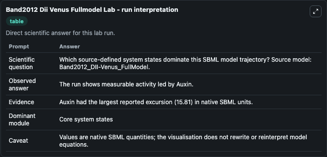
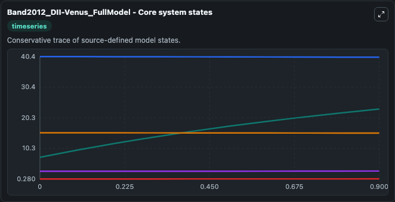
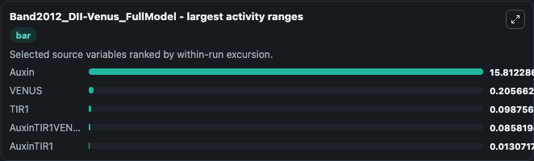
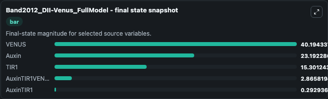
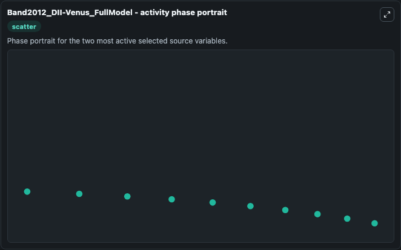

# Band2012 Dii Venus Fullmodel

This Biosimulant lab wraps `Band2012 Dii Venus Fullmodel` as a runnable systems biology model with a companion visualization module.
This model is from the article: Root gravitropism is regulated by a transient lateral auxin gradient controlled by a tipping-point mechanism. It can be used to explore the configured dynamics and compare scenario outcomes across configurations.

## What You'll See

The lab asks: Which source-defined system states dominate this SBML model trajectory? Source model: Band2012_DII-Venus_FullModel. It runs for 1.0 time units with a communication step of 0.1. The run uses the model defaults declared by the curated SBML wrapper. The generated visualizations focus on VENUS, TIR1, Auxin, AuxinTIR1VENUS, and AuxinTIR1, combining trajectory, endpoint-comparison, and summary-table views from one completed dark-mode run.

In this captured run, **Auxin** moved from 7.380 to 23.192 across 1.0 simulation windows.


### Output Visualizations



*Summary table for Band2012 Dii Venus Fullmodel, reporting the scientific question, observed answer, dominant module, and caveat.*



*Trajectories of Auxin, VENUS, TIR1, AuxinTIR1VENUS, and AuxinTIR1 across the 1.0 simulation. In this run **Auxin** climbed from 7.380 to 23.192 and **VENUS** fell from 40.400 to 40.194 — the largest movements among the focused observables.*



*Largest-excursion ranking of the focused observables — the absolute movement magnitude during the run. Top 3: **Auxin** = 15.812, **VENUS** = 0.2057, **TIR1** = 0.0988, with 2 more observables below.*



*Endpoint snapshot of the focused observables — final values from the captured run. Top 3 by value: **VENUS** = 40.194, **Auxin** = 23.192, **TIR1** = 15.301, with 2 more observables below.*



*Visualization card from the Band2012 Dii Venus Fullmodel dark-mode run.*


## Model Context

- Core model: `models/core`
- Visualization model: `models/visualisation`
- Standard: `other`
- Upstream source: `biomodels_ebi:BIOMD0000000413`
- License: `CC0`

## Inputs

| Input | Maps To | Default | Notes |
|---|---|---|---|
| Initial Venus | `systemsbiology_sbml_band2012_dii_venus_fullmodel_biomd0000000413_model.initial_venus` | | Source state initial condition exposed as a model-specific control because no explicit intervention parameter is identifiable. Maps to SBML symbol `VENUS`. |
| Initial Tir1 | `systemsbiology_sbml_band2012_dii_venus_fullmodel_biomd0000000413_model.initial_tir1` | | Source state initial condition exposed as a model-specific control because no explicit intervention parameter is identifiable. Maps to SBML symbol `TIR1`. |
| Initial Auxin | `systemsbiology_sbml_band2012_dii_venus_fullmodel_biomd0000000413_model.initial_auxin` | | Source state initial condition exposed as a model-specific control because no explicit intervention parameter is identifiable. Maps to SBML symbol `auxin`. |
| Initial Auxin Tir1 Venus | `systemsbiology_sbml_band2012_dii_venus_fullmodel_biomd0000000413_model.initial_auxin_tir1_venus` | | Source state initial condition exposed as a model-specific control because no explicit intervention parameter is identifiable. Maps to SBML symbol `auxinTIR1VENUS`. |
| Initial Auxin Tir1 | `systemsbiology_sbml_band2012_dii_venus_fullmodel_biomd0000000413_model.initial_auxin_tir1` | | Source state initial condition exposed as a model-specific control because no explicit intervention parameter is identifiable. Maps to SBML symbol `auxinTIR1`. |

## Outputs

| Output | Maps To | Role |
|---|---|---|
| `state` | `systemsbiology_sbml_band2012_dii_venus_fullmodel_biomd0000000413_model.state` | Available to the visualization model and downstream workflows. |
| `summary` | `systemsbiology_sbml_band2012_dii_venus_fullmodel_biomd0000000413_model.summary` | Available to the visualization model and downstream workflows. |
| `species_labels` | `systemsbiology_sbml_band2012_dii_venus_fullmodel_biomd0000000413_model.species_labels` | Available to the visualization model and downstream workflows. |
| `venus` | `systemsbiology_sbml_band2012_dii_venus_fullmodel_biomd0000000413_model.venus` | Available to the visualization model and downstream workflows. |
| `tir1` | `systemsbiology_sbml_band2012_dii_venus_fullmodel_biomd0000000413_model.tir1` | Available to the visualization model and downstream workflows. |
| `auxin` | `systemsbiology_sbml_band2012_dii_venus_fullmodel_biomd0000000413_model.auxin` | Available to the visualization model and downstream workflows. |
| `auxin_tir1_venus` | `systemsbiology_sbml_band2012_dii_venus_fullmodel_biomd0000000413_model.auxin_tir1_venus` | Available to the visualization model and downstream workflows. |
| `auxin_tir1` | `systemsbiology_sbml_band2012_dii_venus_fullmodel_biomd0000000413_model.auxin_tir1` | Available to the visualization model and downstream workflows. |

## Runtime

- Duration: `1.0`
- Communication step: `0.1`

## Running Locally

```bash
biosimulant labs serve
```
