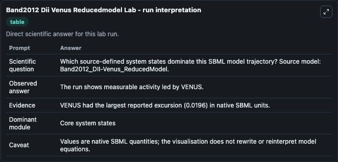
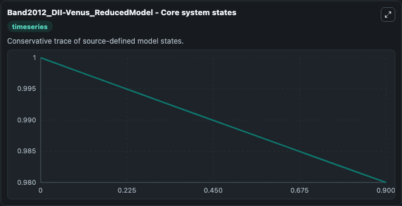
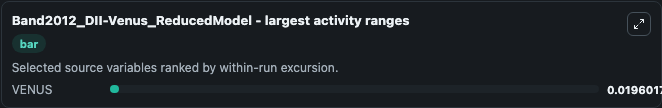
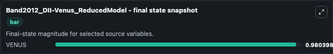

# Band2012 Dii Venus Reducedmodel

This Biosimulant lab wraps `Band2012 Dii Venus Reducedmodel` as a runnable systems biology model with a companion visualization module.
This model is from the article: Root gravitropism is regulated by a transient lateral auxin gradient controlled by a tipping-point mechanism. It can be used to explore the configured dynamics and compare scenario outcomes across configurations.

## What You'll See

The lab asks: Which source-defined system states dominate this SBML model trajectory? Source model: Band2012_DII-Venus_ReducedModel. It runs for 1.0 time units with a communication step of 0.1. The run uses the model defaults declared by the curated SBML wrapper. The generated visualizations focus on VENUS, combining trajectory, endpoint-comparison, and summary-table views from one completed dark-mode run.

In this captured run, **VENUS** moved from 1.000 to 0.9804 across 1.0 simulation windows.


### Output Visualizations



*Summary table for Band2012 Dii Venus Reducedmodel, reporting the scientific question, observed answer, dominant module, and caveat.*



*Trajectories of VENUS across the 1.0 simulation. In this run **VENUS** fell from 1.000 to 0.9804 — the largest movements among the focused observables.*



*Largest-excursion ranking of the focused observables — the absolute movement magnitude during the run. Top 1: **VENUS** = 0.0196.*



*Endpoint snapshot of the focused observables — final values from the captured run. Top 1 by value: **VENUS** = 0.9804.*


## Model Context

- Core model: `models/core`
- Visualization model: `models/visualisation`
- Standard: `other`
- Upstream source: `biomodels_ebi:BIOMD0000000414`
- License: `CC0`

## Inputs

| Input | Maps To | Default | Notes |
|---|---|---|---|
| Initial Venus | `systemsbiology_sbml_band2012_dii_venus_reducedmodel_biomd0000000414_model.initial_venus` | | Source state initial condition exposed as a model-specific control because no explicit intervention parameter is identifiable. Maps to SBML symbol `VENUS`. |

## Outputs

| Output | Maps To | Role |
|---|---|---|
| `state` | `systemsbiology_sbml_band2012_dii_venus_reducedmodel_biomd0000000414_model.state` | Available to the visualization model and downstream workflows. |
| `summary` | `systemsbiology_sbml_band2012_dii_venus_reducedmodel_biomd0000000414_model.summary` | Available to the visualization model and downstream workflows. |
| `species_labels` | `systemsbiology_sbml_band2012_dii_venus_reducedmodel_biomd0000000414_model.species_labels` | Available to the visualization model and downstream workflows. |
| `venus` | `systemsbiology_sbml_band2012_dii_venus_reducedmodel_biomd0000000414_model.venus` | Available to the visualization model and downstream workflows. |

## Runtime

- Duration: `1.0`
- Communication step: `0.1`

## Running Locally

```bash
biosimulant labs serve
```
