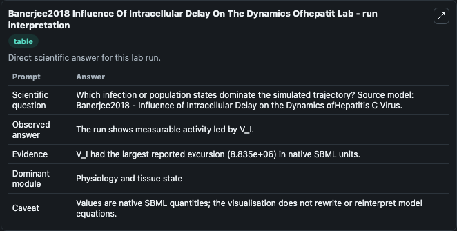
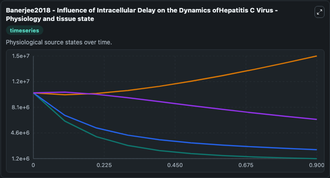
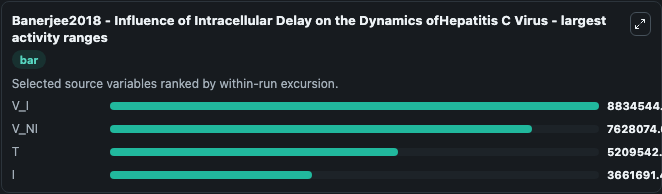
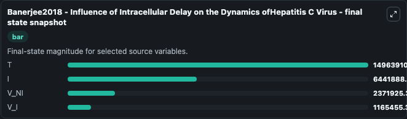
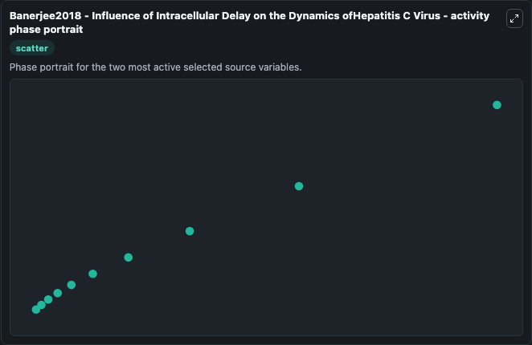

# Banerjee2018 Influence Of Intracellular Delay On The Dynamics Ofhepatit

This Biosimulant lab wraps `Banerjee2018 Influence Of Intracellular Delay On The Dynamics Ofhepatit` as a runnable systems biology model with a companion visualization module.
Influence of Intracellular Delay on the Dynamics of Hepatitis C VirusSandip Banerjee 1· Ram Keval 2AbstractIn this paper, we present a delay induced model for hepatitis C virus incorporat-ing the heal. It can be used to explore the configured dynamics and compare scenario outcomes across configurations.

## What You'll See

The lab asks: Which infection or population states dominate the simulated trajectory? Source model: Banerjee2018 - Influence of Intracellular Delay on the Dynamics ofHepatitis C Virus. It runs for 1.0 time units with a communication step of 0.1. The run uses the model defaults declared by the curated SBML wrapper. The generated visualizations focus on V_NI, V_I, T, and I, combining trajectory, endpoint-comparison, and summary-table views from one completed dark-mode run.

In this captured run, **V_I** moved from 1e+07 to 1.17e+06 across 1.0 simulation windows.


### Output Visualizations



*Summary table for Banerjee2018 Influence Of Intracellular Delay On The Dynamics Ofhepatit, reporting the scientific question, observed answer, dominant module, and caveat.*



*Trajectories of V_I, V_NI, T, and I across the 1.0 simulation. In this run **T** climbed from 1e+07 to 1.5e+07 and **V_I** fell from 1e+07 to 1.17e+06 — the largest movements among the focused observables.*



*Largest-excursion ranking of the focused observables — the absolute movement magnitude during the run. Top 3: **V_I** = 8.83e+06, **V_NI** = 7.63e+06, **T** = 5.21e+06, with 1 more observable below.*



*Endpoint snapshot of the focused observables — final values from the captured run. Top 3 by value: **T** = 1.5e+07, **I** = 6.44e+06, **V_NI** = 2.37e+06, with 1 more observable below.*



*Visualization card from the Banerjee2018 Influence Of Intracellular Delay On The Dynamics Ofhepatit dark-mode run.*


## Model Context

- Core model: `models/core`
- Visualization model: `models/visualisation`
- Standard: `other`
- Upstream source: `biomodels_ebi:MODEL2001300001`
- License: `CC0`

## Inputs

| Input | Maps To | Default | Notes |
|---|---|---|---|
| Initial V Ni | `systemsbiology_sbml_banerjee2018_influence_of_intracellular_delay_on_model2001300001_model.initial_v_ni` | | Source state initial condition exposed as a model-specific control because no explicit intervention parameter is identifiable. Maps to SBML symbol `V_NI`. |
| Initial Model State V I | `systemsbiology_sbml_banerjee2018_influence_of_intracellular_delay_on_model2001300001_model.initial_model_state_v_i` | | Source state initial condition exposed as a model-specific control because no explicit intervention parameter is identifiable. Maps to SBML symbol `V_I`. |
| Initial Model State T | `systemsbiology_sbml_banerjee2018_influence_of_intracellular_delay_on_model2001300001_model.initial_model_state_t` | | Source state initial condition exposed as a model-specific control because no explicit intervention parameter is identifiable. Maps to SBML symbol `T`. |
| Initial Model State I | `systemsbiology_sbml_banerjee2018_influence_of_intracellular_delay_on_model2001300001_model.initial_model_state_i` | | Source state initial condition exposed as a model-specific control because no explicit intervention parameter is identifiable. Maps to SBML symbol `I`. |

## Outputs

| Output | Maps To | Role |
|---|---|---|
| `state` | `systemsbiology_sbml_banerjee2018_influence_of_intracellular_delay_on_model2001300001_model.state` | Available to the visualization model and downstream workflows. |
| `summary` | `systemsbiology_sbml_banerjee2018_influence_of_intracellular_delay_on_model2001300001_model.summary` | Available to the visualization model and downstream workflows. |
| `species_labels` | `systemsbiology_sbml_banerjee2018_influence_of_intracellular_delay_on_model2001300001_model.species_labels` | Available to the visualization model and downstream workflows. |
| `v_ni` | `systemsbiology_sbml_banerjee2018_influence_of_intracellular_delay_on_model2001300001_model.v_ni` | Available to the visualization model and downstream workflows. |
| `v_i` | `systemsbiology_sbml_banerjee2018_influence_of_intracellular_delay_on_model2001300001_model.v_i` | Available to the visualization model and downstream workflows. |
| `model_state_t` | `systemsbiology_sbml_banerjee2018_influence_of_intracellular_delay_on_model2001300001_model.model_state_t` | Available to the visualization model and downstream workflows. |
| `model_state_i` | `systemsbiology_sbml_banerjee2018_influence_of_intracellular_delay_on_model2001300001_model.model_state_i` | Available to the visualization model and downstream workflows. |

## Runtime

- Duration: `1.0`
- Communication step: `0.1`

## Running Locally

```bash
biosimulant labs serve
```
