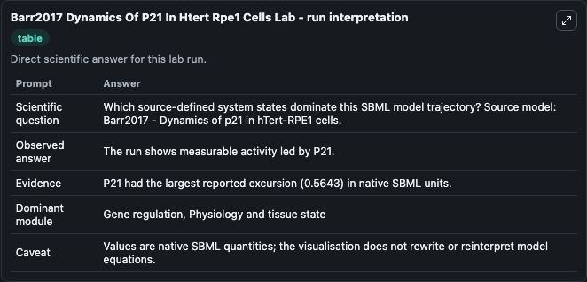
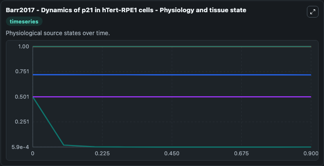
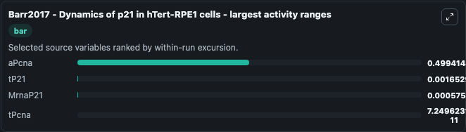
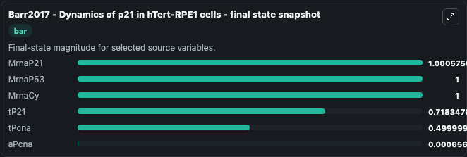
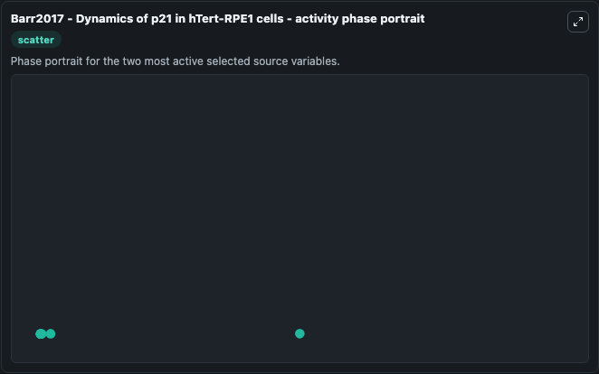

# Barr2017 Dynamics Of P21 In Htert Rpe1 Cells

This Biosimulant lab wraps `Barr2017 Dynamics Of P21 In Htert Rpe1 Cells` as a runnable systems biology model with a companion visualization module.
Barr2017 - Dynamics of p21 in hTert-RPE1cells This deteministic model reveals that abistable switch created by Cdt2, promotes irreversible S-phaseentry by keeping p21 levels low, prevents premature S-. It can be used to explore the configured dynamics and compare scenario outcomes across configurations.

## What You'll See

The lab asks: Which source-defined system states dominate this SBML model trajectory? Source model: Barr2017 - Dynamics of p21 in hTert-RPE1 cells. It runs for 1.0 time units with a communication step of 0.1. The run uses the model defaults declared by the curated SBML wrapper. The generated visualizations focus on MrnaP53, MrnaP21, MrnaCy, tP21, tPcna, and aPcna, combining trajectory, endpoint-comparison, and summary-table views from one completed dark-mode run.

In this captured run, **aPcna** moved from 0.5000 to 0.000657 across 1.0 simulation windows.


### Output Visualizations



*Summary table for Barr2017 Dynamics Of P21 In Htert Rpe1 Cells, reporting the scientific question, observed answer, dominant module, and caveat.*



*Trajectories of aPcna, tP21, MrnaP21, tPcna, MrnaP53, and MrnaCy across the 1.0 simulation. In this run **MrnaP21** climbed from 1.000 to 1.001 and **aPcna** fell from 0.5000 to 0.000657 — the largest movements among the focused observables.*



*Largest-excursion ranking of the focused observables — the absolute movement magnitude during the run. Top 3: **aPcna** = 0.4994, **tP21** = 0.00165, **MrnaP21** = 0.000576, with 1 more observable below.*



*Endpoint snapshot of the focused observables — final values from the captured run. Top 3 by value: **MrnaP21** = 1.001, **MrnaP53** = 1.000, **MrnaCy** = 1.000, with 3 more observables below.*



*Visualization card from the Barr2017 Dynamics Of P21 In Htert Rpe1 Cells dark-mode run.*


## Model Context

- Core model: `models/core`
- Visualization model: `models/visualisation`
- Standard: `other`
- Upstream source: `biomodels_ebi:BIOMD0000000660`
- License: `CC0`

## Inputs

| Input | Maps To | Default | Notes |
|---|---|---|---|
| Initial MRNA P53 | `systemsbiology_sbml_barr2017_dynamics_of_p21_in_htert_rpe1_cells_biomd0000000660_model.initial_mrna_p53` | | Source state initial condition exposed as a model-specific control because no explicit intervention parameter is identifiable. Maps to SBML symbol `MrnaP53`. |
| Initial MRNA P21 | `systemsbiology_sbml_barr2017_dynamics_of_p21_in_htert_rpe1_cells_biomd0000000660_model.initial_mrna_p21` | | Source state initial condition exposed as a model-specific control because no explicit intervention parameter is identifiable. Maps to SBML symbol `MrnaP21`. |
| Initial MRNA Cy | `systemsbiology_sbml_barr2017_dynamics_of_p21_in_htert_rpe1_cells_biomd0000000660_model.initial_mrna_cy` | | Source state initial condition exposed as a model-specific control because no explicit intervention parameter is identifiable. Maps to SBML symbol `MrnaCy`. |
| Initial T P21 | `systemsbiology_sbml_barr2017_dynamics_of_p21_in_htert_rpe1_cells_biomd0000000660_model.initial_t_p21` | | Source state initial condition exposed as a model-specific control because no explicit intervention parameter is identifiable. Maps to SBML symbol `tP21`. |
| Initial T Pcna | `systemsbiology_sbml_barr2017_dynamics_of_p21_in_htert_rpe1_cells_biomd0000000660_model.initial_t_pcna` | | Source state initial condition exposed as a model-specific control because no explicit intervention parameter is identifiable. Maps to SBML symbol `tPcna`. |
| Initial A Pcna | `systemsbiology_sbml_barr2017_dynamics_of_p21_in_htert_rpe1_cells_biomd0000000660_model.initial_a_pcna` | | Source state initial condition exposed as a model-specific control because no explicit intervention parameter is identifiable. Maps to SBML symbol `aPcna`. |

## Outputs

| Output | Maps To | Role |
|---|---|---|
| `state` | `systemsbiology_sbml_barr2017_dynamics_of_p21_in_htert_rpe1_cells_biomd0000000660_model.state` | Available to the visualization model and downstream workflows. |
| `summary` | `systemsbiology_sbml_barr2017_dynamics_of_p21_in_htert_rpe1_cells_biomd0000000660_model.summary` | Available to the visualization model and downstream workflows. |
| `species_labels` | `systemsbiology_sbml_barr2017_dynamics_of_p21_in_htert_rpe1_cells_biomd0000000660_model.species_labels` | Available to the visualization model and downstream workflows. |
| `mrna_p53` | `systemsbiology_sbml_barr2017_dynamics_of_p21_in_htert_rpe1_cells_biomd0000000660_model.mrna_p53` | Available to the visualization model and downstream workflows. |
| `mrna_p21` | `systemsbiology_sbml_barr2017_dynamics_of_p21_in_htert_rpe1_cells_biomd0000000660_model.mrna_p21` | Available to the visualization model and downstream workflows. |
| `mrna_cy` | `systemsbiology_sbml_barr2017_dynamics_of_p21_in_htert_rpe1_cells_biomd0000000660_model.mrna_cy` | Available to the visualization model and downstream workflows. |
| `t_p21` | `systemsbiology_sbml_barr2017_dynamics_of_p21_in_htert_rpe1_cells_biomd0000000660_model.t_p21` | Available to the visualization model and downstream workflows. |
| `t_pcna` | `systemsbiology_sbml_barr2017_dynamics_of_p21_in_htert_rpe1_cells_biomd0000000660_model.t_pcna` | Available to the visualization model and downstream workflows. |
| `a_pcna` | `systemsbiology_sbml_barr2017_dynamics_of_p21_in_htert_rpe1_cells_biomd0000000660_model.a_pcna` | Available to the visualization model and downstream workflows. |

## Runtime

- Duration: `1.0`
- Communication step: `0.1`

## Running Locally

```bash
biosimulant labs serve
```
