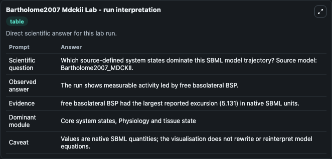
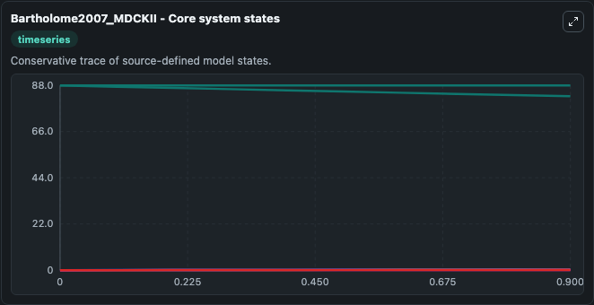
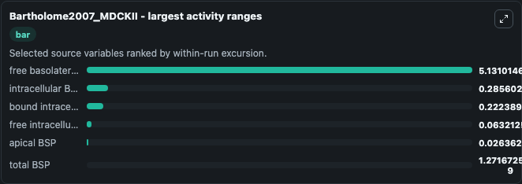
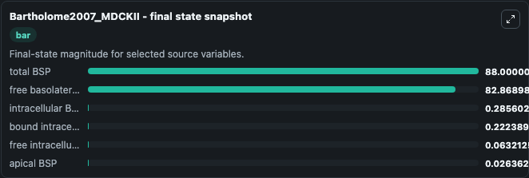
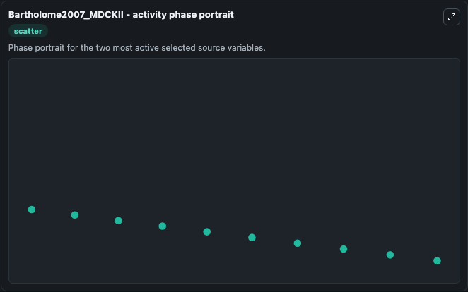

# Bartholome2007 Mdckii

This Biosimulant lab wraps `Bartholome2007 Mdckii` as a runnable systems biology model with a companion visualization module.
SBML model exported from PottersWheel on 2007-09-19 15:35:47. It can be used to explore the configured dynamics and compare scenario outcomes across configurations.

## What You'll See

The lab asks: Which source-defined system states dominate this SBML model trajectory? Source model: Bartholome2007_MDCKII. It runs for 1.0 time units with a communication step of 0.1. The run uses the model defaults declared by the curated SBML wrapper. The generated visualizations focus on intracellular BSP, free intracellular BSP, bound intracellular BSP, apical BSP, free basolateral BSP, and total BSP, combining trajectory, endpoint-comparison, and summary-table views from one completed dark-mode run.

In this captured run, **free basolateral BSP** moved from 88.000 to 82.869 across 1.0 simulation windows.


### Output Visualizations



*Summary table for Bartholome2007 Mdckii, reporting the scientific question, observed answer, dominant module, and caveat.*



*Trajectories of free basolateral BSP, intracellular BSP, bound intracellular BSP, free intracellular BSP, apical BSP, and total BSP across the 1.0 simulation. In this run **intracellular BSP** climbed from 0 to 0.2856 and **free basolateral BSP** fell from 88.000 to 82.869 — the largest movements among the focused observables.*



*Largest-excursion ranking of the focused observables — the absolute movement magnitude during the run. Top 3: **free basolateral BSP** = 5.131, **intracellular BSP** = 0.2856, **bound intracellular BSP** = 0.2224, with 3 more observables below.*



*Endpoint snapshot of the focused observables — final values from the captured run. Top 3 by value: **total BSP** = 88.000, **free basolateral BSP** = 82.869, **intracellular BSP** = 0.2856, with 3 more observables below.*



*Visualization card from the Bartholome2007 Mdckii dark-mode run.*


## Model Context

- Core model: `models/core`
- Visualization model: `models/visualisation`
- Standard: `other`
- Upstream source: `biomodels_ebi:BIOMD0000000197`
- License: `CC0`

## Inputs

| Input | Maps To | Default | Notes |
|---|---|---|---|
| Initial Intracellular Bsp | `systemsbiology_sbml_bartholome2007_mdckii_biomd0000000197_model.initial_intracellular_bsp` | | Source state initial condition exposed as a model-specific control because no explicit intervention parameter is identifiable. Maps to SBML symbol `BSP_cell`. |
| Initial Free Intracellular Bsp | `systemsbiology_sbml_bartholome2007_mdckii_biomd0000000197_model.initial_free_intracellular_bsp` | | Source state initial condition exposed as a model-specific control because no explicit intervention parameter is identifiable. Maps to SBML symbol `x3`. |
| Initial Bound Intracellular Bsp | `systemsbiology_sbml_bartholome2007_mdckii_biomd0000000197_model.initial_bound_intracellular_bsp` | | Source state initial condition exposed as a model-specific control because no explicit intervention parameter is identifiable. Maps to SBML symbol `x4`. |
| Initial Apical Bsp | `systemsbiology_sbml_bartholome2007_mdckii_biomd0000000197_model.initial_apical_bsp` | | Source state initial condition exposed as a model-specific control because no explicit intervention parameter is identifiable. Maps to SBML symbol `x5`. |
| Initial Free Basolateral Bsp | `systemsbiology_sbml_bartholome2007_mdckii_biomd0000000197_model.initial_free_basolateral_bsp` | | Source state initial condition exposed as a model-specific control because no explicit intervention parameter is identifiable. Maps to SBML symbol `x1`. |
| Initial Total Bsp | `systemsbiology_sbml_bartholome2007_mdckii_biomd0000000197_model.initial_total_bsp` | | Source state initial condition exposed as a model-specific control because no explicit intervention parameter is identifiable. Maps to SBML symbol `BSP_tot`. |

## Outputs

| Output | Maps To | Role |
|---|---|---|
| `state` | `systemsbiology_sbml_bartholome2007_mdckii_biomd0000000197_model.state` | Available to the visualization model and downstream workflows. |
| `summary` | `systemsbiology_sbml_bartholome2007_mdckii_biomd0000000197_model.summary` | Available to the visualization model and downstream workflows. |
| `species_labels` | `systemsbiology_sbml_bartholome2007_mdckii_biomd0000000197_model.species_labels` | Available to the visualization model and downstream workflows. |
| `intracellular_bsp` | `systemsbiology_sbml_bartholome2007_mdckii_biomd0000000197_model.intracellular_bsp` | Available to the visualization model and downstream workflows. |
| `free_intracellular_bsp` | `systemsbiology_sbml_bartholome2007_mdckii_biomd0000000197_model.free_intracellular_bsp` | Available to the visualization model and downstream workflows. |
| `bound_intracellular_bsp` | `systemsbiology_sbml_bartholome2007_mdckii_biomd0000000197_model.bound_intracellular_bsp` | Available to the visualization model and downstream workflows. |
| `apical_bsp` | `systemsbiology_sbml_bartholome2007_mdckii_biomd0000000197_model.apical_bsp` | Available to the visualization model and downstream workflows. |
| `free_basolateral_bsp` | `systemsbiology_sbml_bartholome2007_mdckii_biomd0000000197_model.free_basolateral_bsp` | Available to the visualization model and downstream workflows. |
| `total_bsp` | `systemsbiology_sbml_bartholome2007_mdckii_biomd0000000197_model.total_bsp` | Available to the visualization model and downstream workflows. |

## Runtime

- Duration: `1.0`
- Communication step: `0.1`

## Running Locally

```bash
biosimulant labs serve
```
