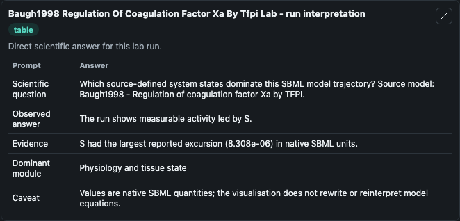
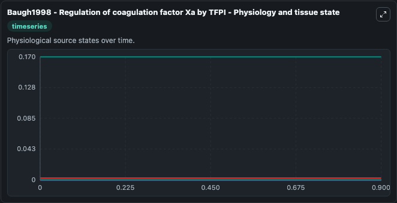
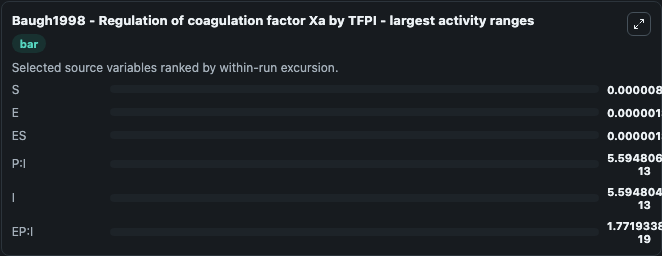
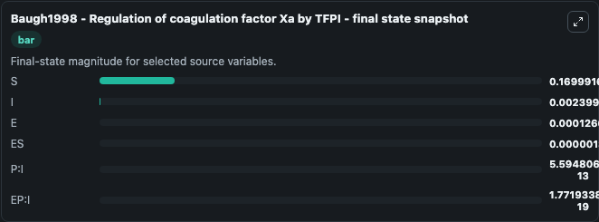
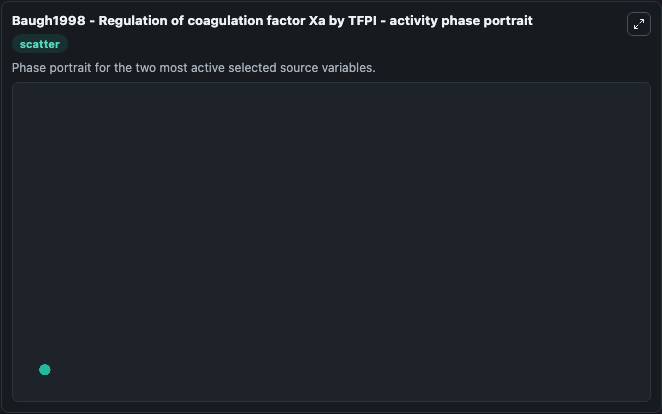

# Baugh1998 Regulation Of Coagulation Factor Xa By Tfpi

This Biosimulant lab wraps `Baugh1998 Regulation Of Coagulation Factor Xa By Tfpi` as a runnable systems biology model with a companion visualization module.
Basic mathematical model of the formation of coagulation factor Xa involving TF:VIIa and its inhibition by TFPI. It can be used to explore the configured dynamics and compare scenario outcomes across configurations.

## What You'll See

The lab asks: Which source-defined system states dominate this SBML model trajectory? Source model: Baugh1998 - Regulation of coagulation factor Xa by TFPI. It runs for 1.0 time units with a communication step of 0.1. The run uses the model defaults declared by the curated SBML wrapper. The generated visualizations focus on P:I, EP:I, ES, S, I, and E, combining trajectory, endpoint-comparison, and summary-table views from one completed dark-mode run.

In this captured run, **S** moved from 0.1700 to 0.1700 across 1.0 simulation windows.


### Output Visualizations



*Summary table for Baugh1998 Regulation Of Coagulation Factor Xa By Tfpi, reporting the scientific question, observed answer, dominant module, and caveat.*



*Trajectories of S, E, ES, P:I, I, and EP:I across the 1.0 simulation. In this run **ES** climbed from 0 to 1.31e-06 and **S** fell from 0.1700 to 0.1700 — the largest movements among the focused observables.*



*Largest-excursion ranking of the focused observables — the absolute movement magnitude during the run. Top 3: **S** = 8.31e-06, **E** = 1.31e-06, **ES** = 1.31e-06, with 3 more observables below.*



*Endpoint snapshot of the focused observables — final values from the captured run. Top 3 by value: **S** = 0.1700, **I** = 0.0024, **E** = 0.000127, with 3 more observables below.*



*Visualization card from the Baugh1998 Regulation Of Coagulation Factor Xa By Tfpi dark-mode run.*


## Model Context

- Core model: `models/core`
- Visualization model: `models/visualisation`
- Standard: `other`
- Upstream source: `biomodels_ebi:MODEL1807180001`
- License: `CC0`

## Inputs

| Input | Maps To | Default | Notes |
|---|---|---|---|
| Initial Model State P I | `systemsbiology_sbml_baugh1998_regulation_of_coagulation_factor_xa_by_model1807180001_model.initial_model_state_p_i` | | Source state initial condition exposed as a model-specific control because no explicit intervention parameter is identifiable. Maps to SBML symbol `P_I`. |
| Initial Ep I | `systemsbiology_sbml_baugh1998_regulation_of_coagulation_factor_xa_by_model1807180001_model.initial_ep_i` | | Source state initial condition exposed as a model-specific control because no explicit intervention parameter is identifiable. Maps to SBML symbol `EP_I`. |
| Initial Model State Es | `systemsbiology_sbml_baugh1998_regulation_of_coagulation_factor_xa_by_model1807180001_model.initial_model_state_es` | | Source state initial condition exposed as a model-specific control because no explicit intervention parameter is identifiable. Maps to SBML symbol `ES`. |
| Initial Model State S | `systemsbiology_sbml_baugh1998_regulation_of_coagulation_factor_xa_by_model1807180001_model.initial_model_state_s` | | Source state initial condition exposed as a model-specific control because no explicit intervention parameter is identifiable. Maps to SBML symbol `S`. |
| Initial Model State I | `systemsbiology_sbml_baugh1998_regulation_of_coagulation_factor_xa_by_model1807180001_model.initial_model_state_i` | | Source state initial condition exposed as a model-specific control because no explicit intervention parameter is identifiable. Maps to SBML symbol `I`. |
| Initial Model State E | `systemsbiology_sbml_baugh1998_regulation_of_coagulation_factor_xa_by_model1807180001_model.initial_model_state_e` | | Source state initial condition exposed as a model-specific control because no explicit intervention parameter is identifiable. Maps to SBML symbol `E`. |

## Outputs

| Output | Maps To | Role |
|---|---|---|
| `state` | `systemsbiology_sbml_baugh1998_regulation_of_coagulation_factor_xa_by_model1807180001_model.state` | Available to the visualization model and downstream workflows. |
| `summary` | `systemsbiology_sbml_baugh1998_regulation_of_coagulation_factor_xa_by_model1807180001_model.summary` | Available to the visualization model and downstream workflows. |
| `species_labels` | `systemsbiology_sbml_baugh1998_regulation_of_coagulation_factor_xa_by_model1807180001_model.species_labels` | Available to the visualization model and downstream workflows. |
| `p_i` | `systemsbiology_sbml_baugh1998_regulation_of_coagulation_factor_xa_by_model1807180001_model.p_i` | Available to the visualization model and downstream workflows. |
| `ep_i` | `systemsbiology_sbml_baugh1998_regulation_of_coagulation_factor_xa_by_model1807180001_model.ep_i` | Available to the visualization model and downstream workflows. |
| `model_state_es` | `systemsbiology_sbml_baugh1998_regulation_of_coagulation_factor_xa_by_model1807180001_model.model_state_es` | Available to the visualization model and downstream workflows. |
| `model_state_s` | `systemsbiology_sbml_baugh1998_regulation_of_coagulation_factor_xa_by_model1807180001_model.model_state_s` | Available to the visualization model and downstream workflows. |
| `model_state_i` | `systemsbiology_sbml_baugh1998_regulation_of_coagulation_factor_xa_by_model1807180001_model.model_state_i` | Available to the visualization model and downstream workflows. |
| `model_state_e` | `systemsbiology_sbml_baugh1998_regulation_of_coagulation_factor_xa_by_model1807180001_model.model_state_e` | Available to the visualization model and downstream workflows. |

## Runtime

- Duration: `1.0`
- Communication step: `0.1`

## Running Locally

```bash
biosimulant labs serve
```
