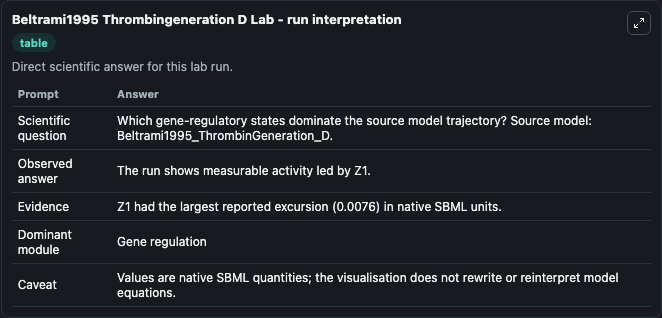
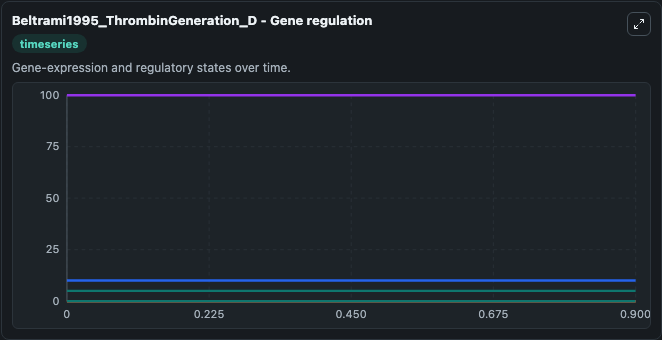
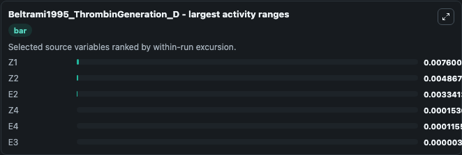
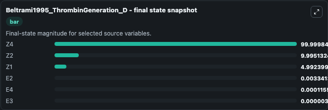
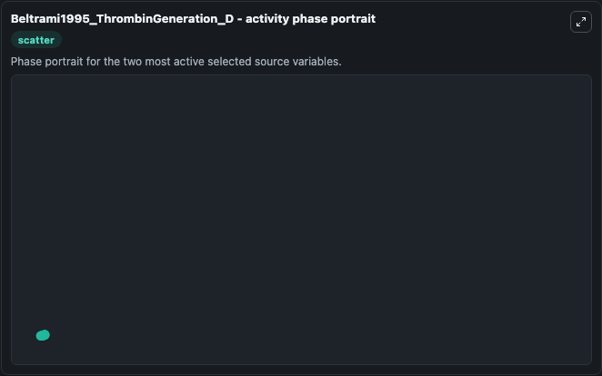

# Beltrami1995 Thrombingeneration D

This Biosimulant lab wraps `Beltrami1995 Thrombingeneration D` as a runnable systems biology model with a companion visualization module.
This model originates from BioModels Database: A Database of Annotated Published Models (http://www.ebi.ac.uk/biomodels/). It can be used to explore the configured dynamics and compare scenario outcomes across configurations.

## What You'll See

The lab asks: Which gene-regulatory states dominate the source model trajectory? Source model: Beltrami1995_ThrombinGeneration_D. It runs for 1.0 time units with a communication step of 0.1. The run uses the model defaults declared by the curated SBML wrapper. The generated visualizations focus on Z4, Z2, Z1, E4, E3, and E2, combining trajectory, endpoint-comparison, and summary-table views from one completed dark-mode run.

In this captured run, **Z1** moved from 5.000 to 4.992 across 1.0 simulation windows.


### Output Visualizations



*Summary table for Beltrami1995 Thrombingeneration D, reporting the scientific question, observed answer, dominant module, and caveat.*



*Trajectories of Z1, Z2, E2, Z4, E4, and E3 across the 1.0 simulation. In this run **E2** climbed from 0 to 0.00334 and **Z1** fell from 5.000 to 4.992 — the largest movements among the focused observables.*



*Largest-excursion ranking of the focused observables — the absolute movement magnitude during the run. Top 3: **Z1** = 0.0076, **Z2** = 0.00487, **E2** = 0.00334, with 3 more observables below.*



*Endpoint snapshot of the focused observables — final values from the captured run. Top 3 by value: **Z4** = 100.000, **Z2** = 9.995, **Z1** = 4.992, with 3 more observables below.*



*Visualization card from the Beltrami1995 Thrombingeneration D dark-mode run.*


## Model Context

- Core model: `models/core`
- Visualization model: `models/visualisation`
- Standard: `other`
- Upstream source: `biomodels_ebi:BIOMD0000000369`
- License: `CC0`

## Inputs

| Input | Maps To | Default | Notes |
|---|---|---|---|
| Initial Model State Z4 | `systemsbiology_sbml_beltrami1995_thrombingeneration_d_biomd0000000369_model.initial_model_state_z4` | | Source state initial condition exposed as a model-specific control because no explicit intervention parameter is identifiable. Maps to SBML symbol `Z4`. |
| Initial Model State Z2 | `systemsbiology_sbml_beltrami1995_thrombingeneration_d_biomd0000000369_model.initial_model_state_z2` | | Source state initial condition exposed as a model-specific control because no explicit intervention parameter is identifiable. Maps to SBML symbol `Z2`. |
| Initial Model State Z1 | `systemsbiology_sbml_beltrami1995_thrombingeneration_d_biomd0000000369_model.initial_model_state_z1` | | Source state initial condition exposed as a model-specific control because no explicit intervention parameter is identifiable. Maps to SBML symbol `Z1`. |
| Initial Model State E4 | `systemsbiology_sbml_beltrami1995_thrombingeneration_d_biomd0000000369_model.initial_model_state_e4` | | Source state initial condition exposed as a model-specific control because no explicit intervention parameter is identifiable. Maps to SBML symbol `E4`. |
| Initial Model State E3 | `systemsbiology_sbml_beltrami1995_thrombingeneration_d_biomd0000000369_model.initial_model_state_e3` | | Source state initial condition exposed as a model-specific control because no explicit intervention parameter is identifiable. Maps to SBML symbol `E3`. |
| Initial Model State E2 | `systemsbiology_sbml_beltrami1995_thrombingeneration_d_biomd0000000369_model.initial_model_state_e2` | | Source state initial condition exposed as a model-specific control because no explicit intervention parameter is identifiable. Maps to SBML symbol `E2`. |

## Outputs

| Output | Maps To | Role |
|---|---|---|
| `state` | `systemsbiology_sbml_beltrami1995_thrombingeneration_d_biomd0000000369_model.state` | Available to the visualization model and downstream workflows. |
| `summary` | `systemsbiology_sbml_beltrami1995_thrombingeneration_d_biomd0000000369_model.summary` | Available to the visualization model and downstream workflows. |
| `species_labels` | `systemsbiology_sbml_beltrami1995_thrombingeneration_d_biomd0000000369_model.species_labels` | Available to the visualization model and downstream workflows. |
| `model_state_z4` | `systemsbiology_sbml_beltrami1995_thrombingeneration_d_biomd0000000369_model.model_state_z4` | Available to the visualization model and downstream workflows. |
| `model_state_z2` | `systemsbiology_sbml_beltrami1995_thrombingeneration_d_biomd0000000369_model.model_state_z2` | Available to the visualization model and downstream workflows. |
| `model_state_z1` | `systemsbiology_sbml_beltrami1995_thrombingeneration_d_biomd0000000369_model.model_state_z1` | Available to the visualization model and downstream workflows. |
| `model_state_e4` | `systemsbiology_sbml_beltrami1995_thrombingeneration_d_biomd0000000369_model.model_state_e4` | Available to the visualization model and downstream workflows. |
| `model_state_e3` | `systemsbiology_sbml_beltrami1995_thrombingeneration_d_biomd0000000369_model.model_state_e3` | Available to the visualization model and downstream workflows. |
| `model_state_e2` | `systemsbiology_sbml_beltrami1995_thrombingeneration_d_biomd0000000369_model.model_state_e2` | Available to the visualization model and downstream workflows. |

## Runtime

- Duration: `1.0`
- Communication step: `0.1`

## Running Locally

```bash
biosimulant labs serve
```
