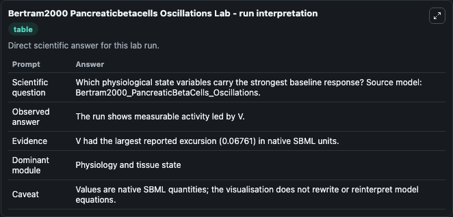
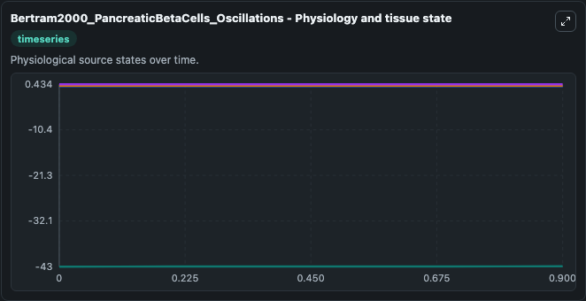
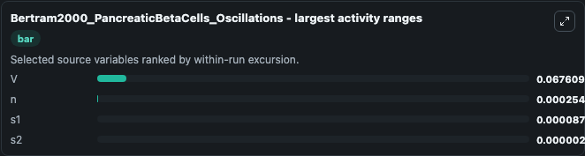
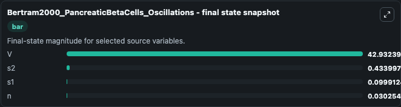
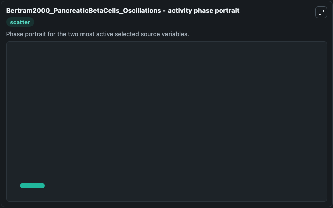

# Bertram2000 Pancreaticbetacells Oscillations

This Biosimulant lab wraps `Bertram2000 Pancreaticbetacells Oscillations` as a runnable systems biology model with a companion visualization module.
This a model from the article: The phantom burster model for pancreatic beta-cells. It can be used to explore the configured dynamics and compare scenario outcomes across configurations.

## What You'll See

The lab asks: Which physiological state variables carry the strongest baseline response? Source model: Bertram2000_PancreaticBetaCells_Oscillations. It runs for 1.0 time units with a communication step of 0.1. The run uses the model defaults declared by the curated SBML wrapper. The generated visualizations focus on s2, s1, n, and V, combining trajectory, endpoint-comparison, and summary-table views from one completed dark-mode run.

In this captured run, **V** moved from -43.000 to -42.932 across 1.0 simulation windows.


### Output Visualizations



*Summary table for Bertram2000 Pancreaticbetacells Oscillations, reporting the scientific question, observed answer, dominant module, and caveat.*



*Trajectories of V, n, s1, and s2 across the 1.0 simulation. In this run **V** climbed from -43.000 to -42.932 and **s1** fell from 0.1000 to 0.0999 — the largest movements among the focused observables.*



*Largest-excursion ranking of the focused observables — the absolute movement magnitude during the run. Top 3: **V** = 0.0676, **n** = 0.000255, **s1** = 8.76e-05, with 1 more observable below.*



*Endpoint snapshot of the focused observables — final values from the captured run. Top 3 by value: **V** = 42.932, **s2** = 0.4340, **s1** = 0.0999, with 1 more observable below.*



*Visualization card from the Bertram2000 Pancreaticbetacells Oscillations dark-mode run.*


## Model Context

- Core model: `models/core`
- Visualization model: `models/visualisation`
- Standard: `other`
- Upstream source: `biomodels_ebi:BIOMD0000000377`
- License: `CC0`

## Inputs

| Input | Maps To | Default | Notes |
|---|---|---|---|
| Initial Model State S2 | `systemsbiology_sbml_bertram2000_pancreaticbetacells_oscillations_biomd0000000377_model.initial_model_state_s2` | | Source state initial condition exposed as a model-specific control because no explicit intervention parameter is identifiable. Maps to SBML symbol `s2`. |
| Initial Model State S1 | `systemsbiology_sbml_bertram2000_pancreaticbetacells_oscillations_biomd0000000377_model.initial_model_state_s1` | | Source state initial condition exposed as a model-specific control because no explicit intervention parameter is identifiable. Maps to SBML symbol `s1`. |
| Initial Model State N | `systemsbiology_sbml_bertram2000_pancreaticbetacells_oscillations_biomd0000000377_model.initial_model_state_n` | | Source state initial condition exposed as a model-specific control because no explicit intervention parameter is identifiable. Maps to SBML symbol `n`. |
| Initial Model State V | `systemsbiology_sbml_bertram2000_pancreaticbetacells_oscillations_biomd0000000377_model.initial_model_state_v` | | Source state initial condition exposed as a model-specific control because no explicit intervention parameter is identifiable. Maps to SBML symbol `V`. |

## Outputs

| Output | Maps To | Role |
|---|---|---|
| `state` | `systemsbiology_sbml_bertram2000_pancreaticbetacells_oscillations_biomd0000000377_model.state` | Available to the visualization model and downstream workflows. |
| `summary` | `systemsbiology_sbml_bertram2000_pancreaticbetacells_oscillations_biomd0000000377_model.summary` | Available to the visualization model and downstream workflows. |
| `species_labels` | `systemsbiology_sbml_bertram2000_pancreaticbetacells_oscillations_biomd0000000377_model.species_labels` | Available to the visualization model and downstream workflows. |
| `model_state_s2` | `systemsbiology_sbml_bertram2000_pancreaticbetacells_oscillations_biomd0000000377_model.model_state_s2` | Available to the visualization model and downstream workflows. |
| `model_state_s1` | `systemsbiology_sbml_bertram2000_pancreaticbetacells_oscillations_biomd0000000377_model.model_state_s1` | Available to the visualization model and downstream workflows. |
| `model_state_n` | `systemsbiology_sbml_bertram2000_pancreaticbetacells_oscillations_biomd0000000377_model.model_state_n` | Available to the visualization model and downstream workflows. |
| `model_state_v` | `systemsbiology_sbml_bertram2000_pancreaticbetacells_oscillations_biomd0000000377_model.model_state_v` | Available to the visualization model and downstream workflows. |

## Runtime

- Duration: `1.0`
- Communication step: `0.1`

## Running Locally

```bash
biosimulant labs serve
```
