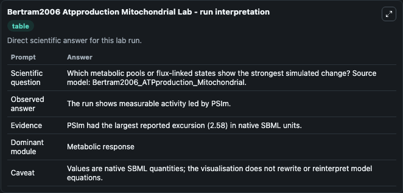
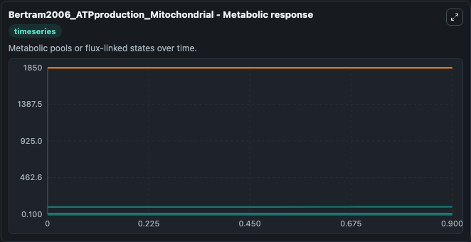
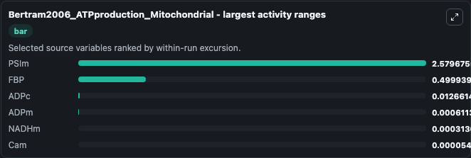
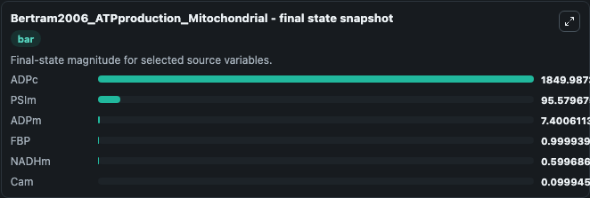
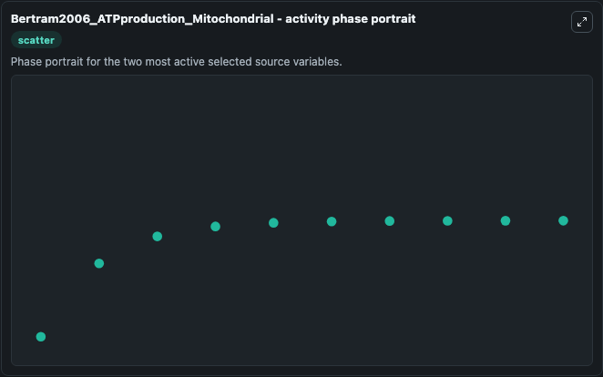

# Bertram2006 Atpproduction Mitochondrial

This Biosimulant lab wraps `Bertram2006 Atpproduction Mitochondrial` as a runnable systems biology model with a companion visualization module.
This a model from the article: A simplified model for mitochondrial ATP production. It can be used to explore the configured dynamics and compare scenario outcomes across configurations.

## What You'll See

The lab asks: Which metabolic pools or flux-linked states show the strongest simulated change? Source model: Bertram2006_ATPproduction_Mitochondrial. It runs for 1.0 time units with a communication step of 0.1. The run uses the model defaults declared by the curated SBML wrapper. The generated visualizations focus on Cam, PSIm, NADHm, FBP, ADPm, and ADPc, combining trajectory, endpoint-comparison, and summary-table views from one completed dark-mode run.

In this captured run, **PSIm** moved from 93.000 to 95.580 across 1.0 simulation windows.


### Output Visualizations



*Summary table for Bertram2006 Atpproduction Mitochondrial, reporting the scientific question, observed answer, dominant module, and caveat.*



*Trajectories of PSIm, FBP, ADPc, ADPm, NADHm, and Cam across the 1.0 simulation. In this run **PSIm** climbed from 93.000 to 95.580 and **ADPc** fell from 1850.0 to 1850.0 — the largest movements among the focused observables.*



*Largest-excursion ranking of the focused observables — the absolute movement magnitude during the run. Top 3: **PSIm** = 2.580, **FBP** = 0.4999, **ADPc** = 0.0127, with 3 more observables below.*



*Endpoint snapshot of the focused observables — final values from the captured run. Top 3 by value: **ADPc** = 1850.0, **PSIm** = 95.580, **ADPm** = 7.401, with 3 more observables below.*



*Visualization card from the Bertram2006 Atpproduction Mitochondrial dark-mode run.*


## Model Context

- Core model: `models/core`
- Visualization model: `models/visualisation`
- Standard: `other`
- Upstream source: `biomodels_ebi:MODEL1006230114`
- License: `CC0`

## Inputs

| Input | Maps To | Default | Notes |
|---|---|---|---|
| Initial Model State Cam | `systemsbiology_sbml_bertram2006_atpproduction_mitochondrial_model1006230114_model.initial_model_state_cam` | | Source state initial condition exposed as a model-specific control because no explicit intervention parameter is identifiable. Maps to SBML symbol `Cam`. |
| Initial Ps Im | `systemsbiology_sbml_bertram2006_atpproduction_mitochondrial_model1006230114_model.initial_ps_im` | | Source state initial condition exposed as a model-specific control because no explicit intervention parameter is identifiable. Maps to SBML symbol `PSIm`. |
| Initial Nad Hm | `systemsbiology_sbml_bertram2006_atpproduction_mitochondrial_model1006230114_model.initial_nad_hm` | | Source state initial condition exposed as a model-specific control because no explicit intervention parameter is identifiable. Maps to SBML symbol `NADHm`. |
| Initial Model State Fbp | `systemsbiology_sbml_bertram2006_atpproduction_mitochondrial_model1006230114_model.initial_model_state_fbp` | | Source state initial condition exposed as a model-specific control because no explicit intervention parameter is identifiable. Maps to SBML symbol `FBP`. |
| Initial Ad Pm | `systemsbiology_sbml_bertram2006_atpproduction_mitochondrial_model1006230114_model.initial_ad_pm` | | Source state initial condition exposed as a model-specific control because no explicit intervention parameter is identifiable. Maps to SBML symbol `ADPm`. |
| Initial Ad Pc | `systemsbiology_sbml_bertram2006_atpproduction_mitochondrial_model1006230114_model.initial_ad_pc` | | Source state initial condition exposed as a model-specific control because no explicit intervention parameter is identifiable. Maps to SBML symbol `ADPc`. |

## Outputs

| Output | Maps To | Role |
|---|---|---|
| `state` | `systemsbiology_sbml_bertram2006_atpproduction_mitochondrial_model1006230114_model.state` | Available to the visualization model and downstream workflows. |
| `summary` | `systemsbiology_sbml_bertram2006_atpproduction_mitochondrial_model1006230114_model.summary` | Available to the visualization model and downstream workflows. |
| `species_labels` | `systemsbiology_sbml_bertram2006_atpproduction_mitochondrial_model1006230114_model.species_labels` | Available to the visualization model and downstream workflows. |
| `cam` | `systemsbiology_sbml_bertram2006_atpproduction_mitochondrial_model1006230114_model.cam` | Available to the visualization model and downstream workflows. |
| `ps_im` | `systemsbiology_sbml_bertram2006_atpproduction_mitochondrial_model1006230114_model.ps_im` | Available to the visualization model and downstream workflows. |
| `nad_hm` | `systemsbiology_sbml_bertram2006_atpproduction_mitochondrial_model1006230114_model.nad_hm` | Available to the visualization model and downstream workflows. |
| `fbp` | `systemsbiology_sbml_bertram2006_atpproduction_mitochondrial_model1006230114_model.fbp` | Available to the visualization model and downstream workflows. |
| `ad_pm` | `systemsbiology_sbml_bertram2006_atpproduction_mitochondrial_model1006230114_model.ad_pm` | Available to the visualization model and downstream workflows. |
| `ad_pc` | `systemsbiology_sbml_bertram2006_atpproduction_mitochondrial_model1006230114_model.ad_pc` | Available to the visualization model and downstream workflows. |

## Runtime

- Duration: `1.0`
- Communication step: `0.1`

## Running Locally

```bash
biosimulant labs serve
```
