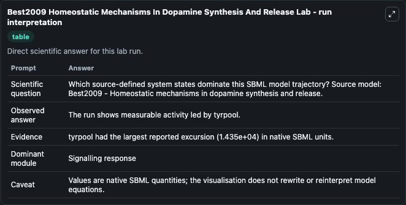
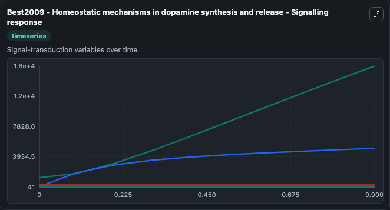
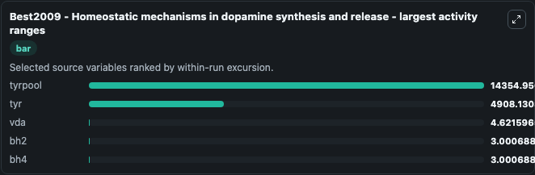
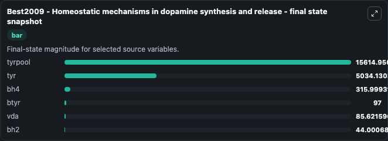
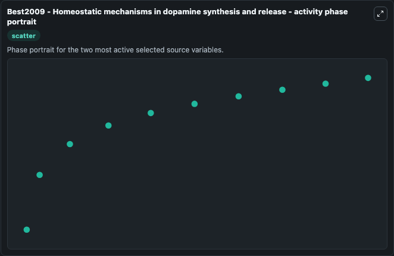

# Best2009 Homeostatic Mechanisms In Dopamine Synthesis And Release

This Biosimulant lab wraps `Best2009 Homeostatic Mechanisms In Dopamine Synthesis And Release` as a runnable systems biology model with a companion visualization module.
Best2009 - Homeostatic mechanisms in dopaminesynthesis and release Encoded non-curated model. It can be used to explore the configured dynamics and compare scenario outcomes across configurations.

## What You'll See

The lab asks: Which source-defined system states dominate this SBML model trajectory? Source model: Best2009 - Homeostatic mechanisms in dopamine synthesis and release. It runs for 1.0 time units with a communication step of 0.1. The run uses the model defaults declared by the curated SBML wrapper. The generated visualizations focus on tyrpool, bh4, tyr, btyr, vda, and bh2, combining trajectory, endpoint-comparison, and summary-table views from one completed dark-mode run.

In this captured run, **tyrpool** moved from 1260.0 to 1.56e+04 across 1.0 simulation windows.


### Output Visualizations



*Summary table for Best2009 Homeostatic Mechanisms In Dopamine Synthesis And Release, reporting the scientific question, observed answer, dominant module, and caveat.*



*Trajectories of tyrpool, tyr, vda, bh2, bh4, and btyr across the 1.0 simulation. In this run **tyrpool** climbed from 1260.0 to 1.56e+04 and **bh4** fell from 319.0 to 316.0 — the largest movements among the focused observables.*



*Largest-excursion ranking of the focused observables — the absolute movement magnitude during the run. Top 3: **tyrpool** = 1.44e+04, **tyr** = 4908.1, **vda** = 4.622, with 2 more observables below.*



*Trajectories of tyrpool, tyr, vda, bh2, bh4, and btyr across the 1.0 simulation. In this run **tyrpool** climbed from 1260.0 to 1.56e+04 and **bh4** fell from 319.0 to 316.0 — the largest movements among the focused observables.*



*Visualization card from the Best2009 Homeostatic Mechanisms In Dopamine Synthesis And Release dark-mode run.*


## Model Context

- Core model: `models/core`
- Visualization model: `models/visualisation`
- Standard: `other`
- Upstream source: `biomodels_ebi:MODEL1502230000`
- License: `CC0`

## Inputs

| Input | Maps To | Default | Notes |
|---|---|---|---|
| Initial Tyrpool | `systemsbiology_sbml_best2009_homeostatic_mechanisms_in_dopamine_synt_model1502230000_model.initial_tyrpool` | | Source state initial condition exposed as a model-specific control because no explicit intervention parameter is identifiable. Maps to SBML symbol `tyrpool`. |
| Initial Model State BH4 | `systemsbiology_sbml_best2009_homeostatic_mechanisms_in_dopamine_synt_model1502230000_model.initial_model_state_bh4` | | Source state initial condition exposed as a model-specific control because no explicit intervention parameter is identifiable. Maps to SBML symbol `bh4`. |
| Initial Model State Tyr | `systemsbiology_sbml_best2009_homeostatic_mechanisms_in_dopamine_synt_model1502230000_model.initial_model_state_tyr` | | Source state initial condition exposed as a model-specific control because no explicit intervention parameter is identifiable. Maps to SBML symbol `tyr`. |
| Initial Btyr | `systemsbiology_sbml_best2009_homeostatic_mechanisms_in_dopamine_synt_model1502230000_model.initial_btyr` | | Source state initial condition exposed as a model-specific control because no explicit intervention parameter is identifiable. Maps to SBML symbol `btyr`. |
| Initial Model State Vda | `systemsbiology_sbml_best2009_homeostatic_mechanisms_in_dopamine_synt_model1502230000_model.initial_model_state_vda` | | Source state initial condition exposed as a model-specific control because no explicit intervention parameter is identifiable. Maps to SBML symbol `vda`. |
| Initial Model State BH2 | `systemsbiology_sbml_best2009_homeostatic_mechanisms_in_dopamine_synt_model1502230000_model.initial_model_state_bh2` | | Source state initial condition exposed as a model-specific control because no explicit intervention parameter is identifiable. Maps to SBML symbol `bh2`. |

## Outputs

| Output | Maps To | Role |
|---|---|---|
| `state` | `systemsbiology_sbml_best2009_homeostatic_mechanisms_in_dopamine_synt_model1502230000_model.state` | Available to the visualization model and downstream workflows. |
| `summary` | `systemsbiology_sbml_best2009_homeostatic_mechanisms_in_dopamine_synt_model1502230000_model.summary` | Available to the visualization model and downstream workflows. |
| `species_labels` | `systemsbiology_sbml_best2009_homeostatic_mechanisms_in_dopamine_synt_model1502230000_model.species_labels` | Available to the visualization model and downstream workflows. |
| `tyrpool` | `systemsbiology_sbml_best2009_homeostatic_mechanisms_in_dopamine_synt_model1502230000_model.tyrpool` | Available to the visualization model and downstream workflows. |
| `bh4` | `systemsbiology_sbml_best2009_homeostatic_mechanisms_in_dopamine_synt_model1502230000_model.bh4` | Available to the visualization model and downstream workflows. |
| `tyr` | `systemsbiology_sbml_best2009_homeostatic_mechanisms_in_dopamine_synt_model1502230000_model.tyr` | Available to the visualization model and downstream workflows. |
| `btyr` | `systemsbiology_sbml_best2009_homeostatic_mechanisms_in_dopamine_synt_model1502230000_model.btyr` | Available to the visualization model and downstream workflows. |
| `vda` | `systemsbiology_sbml_best2009_homeostatic_mechanisms_in_dopamine_synt_model1502230000_model.vda` | Available to the visualization model and downstream workflows. |
| `bh2` | `systemsbiology_sbml_best2009_homeostatic_mechanisms_in_dopamine_synt_model1502230000_model.bh2` | Available to the visualization model and downstream workflows. |

## Runtime

- Duration: `1.0`
- Communication step: `0.1`

## Running Locally

```bash
biosimulant labs serve
```
