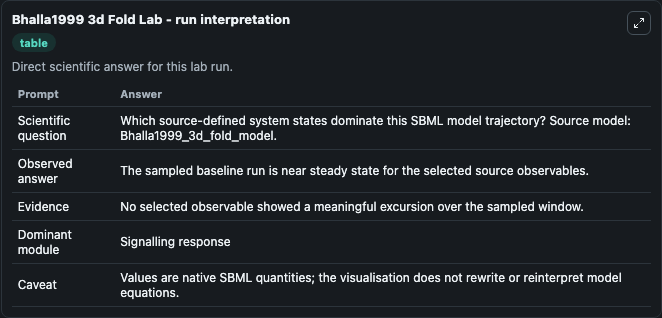
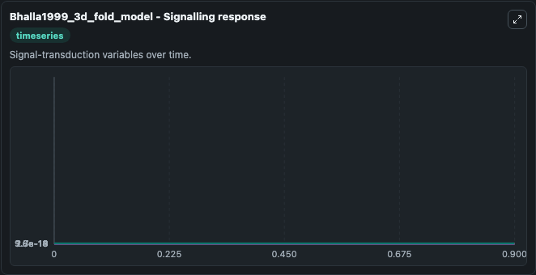
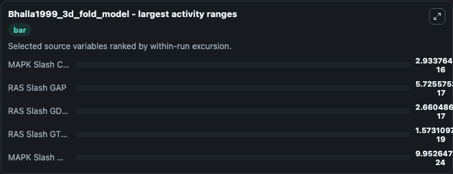
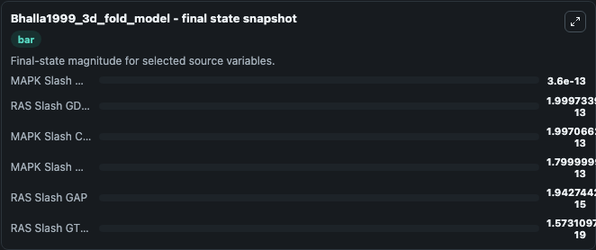
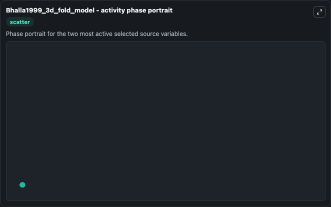

# Bhalla1999 3d Fold

This Biosimulant lab wraps `Bhalla1999 3d Fold` as a runnable systems biology model with a companion visualization module.
This model is based closely on the one from the referenced publication. It can be used to explore the configured dynamics and compare scenario outcomes across configurations.

## What You'll See

The lab asks: Which source-defined system states dominate this SBML model trajectory? Source model: Bhalla1999_3d_fold_model. It runs for 1.0 time units with a communication step of 0.1. The run uses the model defaults declared by the curated SBML wrapper. The generated visualizations focus on MAPK Slash MAPK, RAS Slash GDP Minus RAS, MAPK Slash Craf Minus 1, MAPK Slash MAPKK, RAS Slash GAP, and RAS Slash GTP Minus RAS, combining trajectory, endpoint-comparison, and summary-table views from one completed dark-mode run.

In this captured run, **MAPK Slash Craf Minus 1** moved from 2e-13 to 2e-13 across 1.0 simulation windows.


### Output Visualizations



*Summary table for Bhalla1999 3d Fold, reporting the scientific question, observed answer, dominant module, and caveat.*



*Trajectories of MAPK Slash Craf Minus 1, RAS Slash GAP, RAS Slash GDP Minus RAS, RAS Slash GTP Minus RAS, MAPK Slash MAPKK, and MAPK Slash MAPK across the 1.0 simulation. In this run **RAS Slash GTP Minus RAS** climbed from 0 to 1.57e-19 and **MAPK Slash Craf Minus 1** fell from 2e-13 to 2e-13 — the largest movements among the focused observables.*



*Largest-excursion ranking of the focused observables — the absolute movement magnitude during the run. Top 3: **MAPK Slash Craf Minus 1** = 2.93e-16, **RAS Slash GAP** = 5.73e-17, **RAS Slash GDP Minus RAS** = 2.66e-17, with 2 more observables below.*



*Endpoint snapshot of the focused observables — final values from the captured run. Top 3 by value: **MAPK Slash MAPK** = 3.6e-13, **RAS Slash GDP Minus RAS** = 2e-13, **MAPK Slash Craf Minus 1** = 2e-13, with 3 more observables below.*



*Visualization card from the Bhalla1999 3d Fold dark-mode run.*


## Model Context

- Core model: `models/core`
- Visualization model: `models/visualisation`
- Standard: `other`
- Upstream source: `biomodels_ebi:MODEL9071122126`
- License: `CC0`

## Inputs

| Input | Maps To | Default | Notes |
|---|---|---|---|
| Initial MAPK Slash MAPK | `systemsbiology_sbml_bhalla1999_3d_fold_model_model9071122126_model.initial_mapk_slash_mapk` | | Source state initial condition exposed as a model-specific control because no explicit intervention parameter is identifiable. Maps to SBML symbol `MAPK_slash_MAPK`. |
| Initial RAS Slash Gdp Minus RAS | `systemsbiology_sbml_bhalla1999_3d_fold_model_model9071122126_model.initial_ras_slash_gdp_minus_ras` | | Source state initial condition exposed as a model-specific control because no explicit intervention parameter is identifiable. Maps to SBML symbol `Ras_slash_GDP_minus_Ras`. |
| Initial MAPK Slash Craf Minus 1 | `systemsbiology_sbml_bhalla1999_3d_fold_model_model9071122126_model.initial_mapk_slash_craf_minus_1` | | Source state initial condition exposed as a model-specific control because no explicit intervention parameter is identifiable. Maps to SBML symbol `MAPK_slash_craf_minus_1`. |
| Initial MAPK Slash Mapkk | `systemsbiology_sbml_bhalla1999_3d_fold_model_model9071122126_model.initial_mapk_slash_mapkk` | | Source state initial condition exposed as a model-specific control because no explicit intervention parameter is identifiable. Maps to SBML symbol `MAPK_slash_MAPKK`. |
| Initial RAS Slash Gap | `systemsbiology_sbml_bhalla1999_3d_fold_model_model9071122126_model.initial_ras_slash_gap` | | Source state initial condition exposed as a model-specific control because no explicit intervention parameter is identifiable. Maps to SBML symbol `Ras_slash_GAP`. |
| Initial RAS Slash Gtp Minus RAS | `systemsbiology_sbml_bhalla1999_3d_fold_model_model9071122126_model.initial_ras_slash_gtp_minus_ras` | | Source state initial condition exposed as a model-specific control because no explicit intervention parameter is identifiable. Maps to SBML symbol `Ras_slash_GTP_minus_Ras`. |

## Outputs

| Output | Maps To | Role |
|---|---|---|
| `state` | `systemsbiology_sbml_bhalla1999_3d_fold_model_model9071122126_model.state` | Available to the visualization model and downstream workflows. |
| `summary` | `systemsbiology_sbml_bhalla1999_3d_fold_model_model9071122126_model.summary` | Available to the visualization model and downstream workflows. |
| `species_labels` | `systemsbiology_sbml_bhalla1999_3d_fold_model_model9071122126_model.species_labels` | Available to the visualization model and downstream workflows. |
| `mapk_slash_mapk` | `systemsbiology_sbml_bhalla1999_3d_fold_model_model9071122126_model.mapk_slash_mapk` | Available to the visualization model and downstream workflows. |
| `ras_slash_gdp_minus_ras` | `systemsbiology_sbml_bhalla1999_3d_fold_model_model9071122126_model.ras_slash_gdp_minus_ras` | Available to the visualization model and downstream workflows. |
| `mapk_slash_craf_minus_1` | `systemsbiology_sbml_bhalla1999_3d_fold_model_model9071122126_model.mapk_slash_craf_minus_1` | Available to the visualization model and downstream workflows. |
| `mapk_slash_mapkk` | `systemsbiology_sbml_bhalla1999_3d_fold_model_model9071122126_model.mapk_slash_mapkk` | Available to the visualization model and downstream workflows. |
| `ras_slash_gap` | `systemsbiology_sbml_bhalla1999_3d_fold_model_model9071122126_model.ras_slash_gap` | Available to the visualization model and downstream workflows. |
| `ras_slash_gtp_minus_ras` | `systemsbiology_sbml_bhalla1999_3d_fold_model_model9071122126_model.ras_slash_gtp_minus_ras` | Available to the visualization model and downstream workflows. |

## Runtime

- Duration: `1.0`
- Communication step: `0.1`

## Running Locally

```bash
biosimulant labs serve
```
