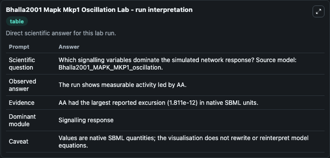
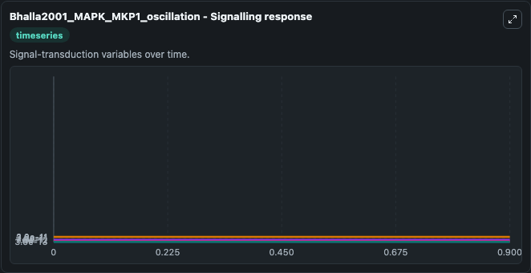
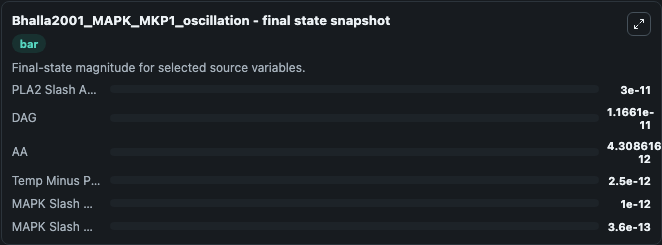

# Bhalla2001 Mapk Mkp1 Oscillation

This Biosimulant lab wraps `Bhalla2001 Mapk Mkp1 Oscillation` as a runnable systems biology model with a companion visualization module.
This model relates to figure 5 in the referenced publication. It can be used to explore the configured dynamics and compare scenario outcomes across configurations.

## What You'll See

The lab asks: Which signalling variables dominate the simulated network response? Source model: Bhalla2001_MAPK_MKP1_oscillation. It runs for 1.0 time units with a communication step of 0.1. The run uses the model defaults declared by the curated SBML wrapper. The generated visualizations focus on MAPK Slash MKP Minus 1 Minus Gene, PLA2 Slash APC, DAG, AA, Temp Minus PIP2, and MAPK Slash MAPK, combining trajectory, endpoint-comparison, and summary-table views from one completed dark-mode run.

In this captured run, **AA** moved from 6.12e-12 to 4.31e-12 across 1.0 simulation windows.


### Output Visualizations



*Summary table for Bhalla2001 Mapk Mkp1 Oscillation, reporting the scientific question, observed answer, dominant module, and caveat.*



*Trajectories of AA, MAPK Slash MKP Minus 1 Minus Gene, PLA2 Slash APC, DAG, Temp Minus PIP2, and MAPK Slash MAPK across the 1.0 simulation. In this run **AA** fell from 6.12e-12 to 4.31e-12 — the largest movements among the focused observables.*


*Largest-excursion ranking of the focused observables — the absolute movement magnitude during the run. Top 1: **AA** = 1.81e-12.*



*Endpoint snapshot of the focused observables — final values from the captured run. Top 3 by value: **PLA2 Slash APC** = 3e-11, **DAG** = 1.17e-11, **AA** = 4.31e-12, with 3 more observables below.*


## Model Context

- Core model: `models/core`
- Visualization model: `models/visualisation`
- Standard: `other`
- Upstream source: `biomodels_ebi:MODEL9071773985`
- License: `CC0`

## Inputs

| Input | Maps To | Default | Notes |
|---|---|---|---|
| Initial MAPK Slash Mkp Minus 1 Minus Gene | `systemsbiology_sbml_bhalla2001_mapk_mkp1_oscillation_model9071773985_model.initial_mapk_slash_mkp_minus_1_minus_gene` | | Source state initial condition exposed as a model-specific control because no explicit intervention parameter is identifiable. Maps to SBML symbol `MAPK_slash_MKP_minus_1_minus_gene`. |
| Initial Pla2 Slash Apc | `systemsbiology_sbml_bhalla2001_mapk_mkp1_oscillation_model9071773985_model.initial_pla2_slash_apc` | | Source state initial condition exposed as a model-specific control because no explicit intervention parameter is identifiable. Maps to SBML symbol `PLA2_slash_APC`. |
| Initial Model State Dag | `systemsbiology_sbml_bhalla2001_mapk_mkp1_oscillation_model9071773985_model.initial_model_state_dag` | | Source state initial condition exposed as a model-specific control because no explicit intervention parameter is identifiable. Maps to SBML symbol `DAG`. |
| Initial Model State Aa | `systemsbiology_sbml_bhalla2001_mapk_mkp1_oscillation_model9071773985_model.initial_model_state_aa` | | Source state initial condition exposed as a model-specific control because no explicit intervention parameter is identifiable. Maps to SBML symbol `AA`. |
| Initial Temp Minus Pip2 | `systemsbiology_sbml_bhalla2001_mapk_mkp1_oscillation_model9071773985_model.initial_temp_minus_pip2` | | Source state initial condition exposed as a model-specific control because no explicit intervention parameter is identifiable. Maps to SBML symbol `temp_minus_PIP2`. |
| Initial MAPK Slash MAPK | `systemsbiology_sbml_bhalla2001_mapk_mkp1_oscillation_model9071773985_model.initial_mapk_slash_mapk` | | Source state initial condition exposed as a model-specific control because no explicit intervention parameter is identifiable. Maps to SBML symbol `MAPK_slash_MAPK`. |

## Outputs

| Output | Maps To | Role |
|---|---|---|
| `state` | `systemsbiology_sbml_bhalla2001_mapk_mkp1_oscillation_model9071773985_model.state` | Available to the visualization model and downstream workflows. |
| `summary` | `systemsbiology_sbml_bhalla2001_mapk_mkp1_oscillation_model9071773985_model.summary` | Available to the visualization model and downstream workflows. |
| `species_labels` | `systemsbiology_sbml_bhalla2001_mapk_mkp1_oscillation_model9071773985_model.species_labels` | Available to the visualization model and downstream workflows. |
| `mapk_slash_mkp_minus_1_minus_gene` | `systemsbiology_sbml_bhalla2001_mapk_mkp1_oscillation_model9071773985_model.mapk_slash_mkp_minus_1_minus_gene` | Available to the visualization model and downstream workflows. |
| `pla2_slash_apc` | `systemsbiology_sbml_bhalla2001_mapk_mkp1_oscillation_model9071773985_model.pla2_slash_apc` | Available to the visualization model and downstream workflows. |
| `dag` | `systemsbiology_sbml_bhalla2001_mapk_mkp1_oscillation_model9071773985_model.dag` | Available to the visualization model and downstream workflows. |
| `model_state_aa` | `systemsbiology_sbml_bhalla2001_mapk_mkp1_oscillation_model9071773985_model.model_state_aa` | Available to the visualization model and downstream workflows. |
| `temp_minus_pip2` | `systemsbiology_sbml_bhalla2001_mapk_mkp1_oscillation_model9071773985_model.temp_minus_pip2` | Available to the visualization model and downstream workflows. |
| `mapk_slash_mapk` | `systemsbiology_sbml_bhalla2001_mapk_mkp1_oscillation_model9071773985_model.mapk_slash_mapk` | Available to the visualization model and downstream workflows. |

## Runtime

- Duration: `1.0`
- Communication step: `0.1`

## Running Locally

```bash
biosimulant labs serve
```
