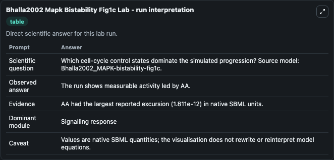
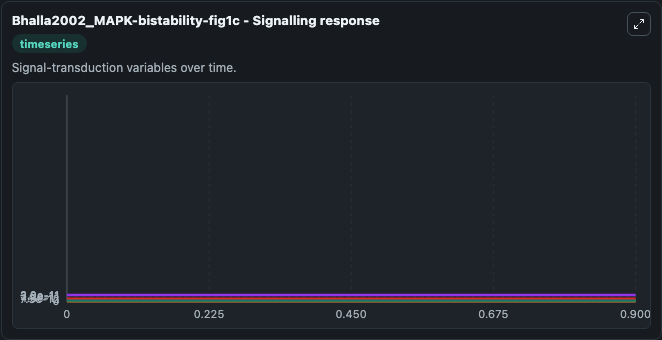
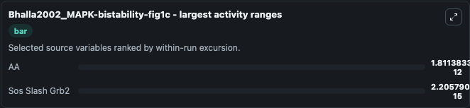
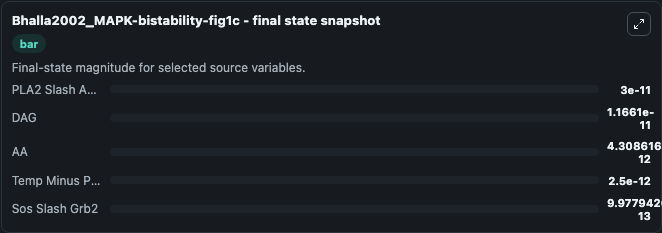
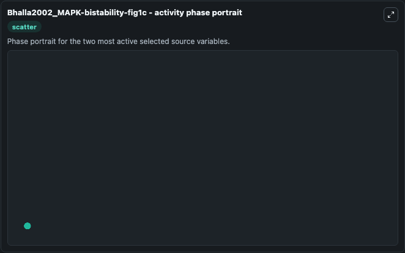

# Bhalla2002 Mapk Bistability Fig1c

This Biosimulant lab wraps `Bhalla2002 Mapk Bistability Fig1c` as a runnable systems biology model with a companion visualization module.
Model for figure 1c in the referenced publication. It can be used to explore the configured dynamics and compare scenario outcomes across configurations.

## What You'll See

The lab asks: Which cell-cycle control states dominate the simulated progression? Source model: Bhalla2002_MAPK-bistability-fig1c. It runs for 1.0 time units with a communication step of 0.1. The run uses the model defaults declared by the curated SBML wrapper. The generated visualizations focus on PDGFR Slash Internal L Dot PDGFR, PLA2 Slash APC, DAG, AA, Temp Minus PIP2, and Sos Slash Grb2, combining trajectory, endpoint-comparison, and summary-table views from one completed dark-mode run.

In this captured run, **AA** moved from 6.12e-12 to 4.31e-12 across 1.0 simulation windows.


### Output Visualizations



*Summary table for Bhalla2002 Mapk Bistability Fig1c, reporting the scientific question, observed answer, dominant module, and caveat.*



*Trajectories of AA, Sos Slash Grb2, PDGFR Slash Internal L Dot PDGFR, PLA2 Slash APC, DAG, and Temp Minus PIP2 across the 1.0 simulation. In this run **AA** fell from 6.12e-12 to 4.31e-12 — the largest movements among the focused observables.*



*Largest-excursion ranking of the focused observables — the absolute movement magnitude during the run. Top 2: **AA** = 1.81e-12, **Sos Slash Grb2** = 2.21e-15.*



*Endpoint snapshot of the focused observables — final values from the captured run. Top 3 by value: **PLA2 Slash APC** = 3e-11, **DAG** = 1.17e-11, **AA** = 4.31e-12, with 2 more observables below.*



*Visualization card from the Bhalla2002 Mapk Bistability Fig1c dark-mode run.*


## Model Context

- Core model: `models/core`
- Visualization model: `models/visualisation`
- Standard: `other`
- Upstream source: `biomodels_ebi:MODEL9079179924`
- License: `CC0`

## Inputs

| Input | Maps To | Default | Notes |
|---|---|---|---|
| Initial Pdgfr Slash Internal L Dot Pdgfr | `systemsbiology_sbml_bhalla2002_mapk_bistability_fig1c_model9079179924_model.initial_pdgfr_slash_internal_l_dot_pdgfr` | | Source state initial condition exposed as a model-specific control because no explicit intervention parameter is identifiable. Maps to SBML symbol `PDGFR_slash_Internal_L_dot_PDGFR`. |
| Initial Pla2 Slash Apc | `systemsbiology_sbml_bhalla2002_mapk_bistability_fig1c_model9079179924_model.initial_pla2_slash_apc` | | Source state initial condition exposed as a model-specific control because no explicit intervention parameter is identifiable. Maps to SBML symbol `PLA2_slash_APC`. |
| Initial Model State Dag | `systemsbiology_sbml_bhalla2002_mapk_bistability_fig1c_model9079179924_model.initial_model_state_dag` | | Source state initial condition exposed as a model-specific control because no explicit intervention parameter is identifiable. Maps to SBML symbol `DAG`. |
| Initial Model State Aa | `systemsbiology_sbml_bhalla2002_mapk_bistability_fig1c_model9079179924_model.initial_model_state_aa` | | Source state initial condition exposed as a model-specific control because no explicit intervention parameter is identifiable. Maps to SBML symbol `AA`. |
| Initial Temp Minus Pip2 | `systemsbiology_sbml_bhalla2002_mapk_bistability_fig1c_model9079179924_model.initial_temp_minus_pip2` | | Source state initial condition exposed as a model-specific control because no explicit intervention parameter is identifiable. Maps to SBML symbol `temp_minus_PIP2`. |
| Initial Sos Slash Grb2 | `systemsbiology_sbml_bhalla2002_mapk_bistability_fig1c_model9079179924_model.initial_sos_slash_grb2` | | Source state initial condition exposed as a model-specific control because no explicit intervention parameter is identifiable. Maps to SBML symbol `Sos_slash_Grb2`. |

## Outputs

| Output | Maps To | Role |
|---|---|---|
| `state` | `systemsbiology_sbml_bhalla2002_mapk_bistability_fig1c_model9079179924_model.state` | Available to the visualization model and downstream workflows. |
| `summary` | `systemsbiology_sbml_bhalla2002_mapk_bistability_fig1c_model9079179924_model.summary` | Available to the visualization model and downstream workflows. |
| `species_labels` | `systemsbiology_sbml_bhalla2002_mapk_bistability_fig1c_model9079179924_model.species_labels` | Available to the visualization model and downstream workflows. |
| `pdgfr_slash_internal_l_dot_pdgfr` | `systemsbiology_sbml_bhalla2002_mapk_bistability_fig1c_model9079179924_model.pdgfr_slash_internal_l_dot_pdgfr` | Available to the visualization model and downstream workflows. |
| `pla2_slash_apc` | `systemsbiology_sbml_bhalla2002_mapk_bistability_fig1c_model9079179924_model.pla2_slash_apc` | Available to the visualization model and downstream workflows. |
| `dag` | `systemsbiology_sbml_bhalla2002_mapk_bistability_fig1c_model9079179924_model.dag` | Available to the visualization model and downstream workflows. |
| `model_state_aa` | `systemsbiology_sbml_bhalla2002_mapk_bistability_fig1c_model9079179924_model.model_state_aa` | Available to the visualization model and downstream workflows. |
| `temp_minus_pip2` | `systemsbiology_sbml_bhalla2002_mapk_bistability_fig1c_model9079179924_model.temp_minus_pip2` | Available to the visualization model and downstream workflows. |
| `sos_slash_grb2` | `systemsbiology_sbml_bhalla2002_mapk_bistability_fig1c_model9079179924_model.sos_slash_grb2` | Available to the visualization model and downstream workflows. |

## Runtime

- Duration: `1.0`
- Communication step: `0.1`

## Running Locally

```bash
biosimulant labs serve
```
