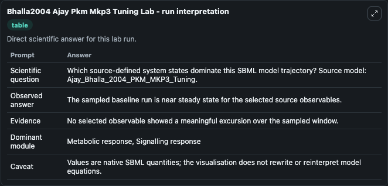
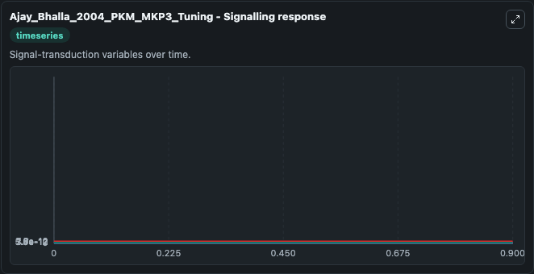
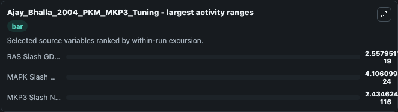
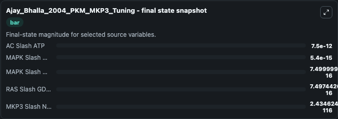
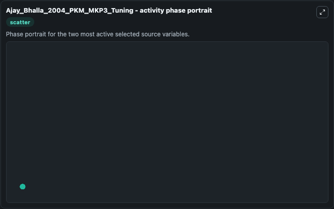

# Bhalla2004 Ajay Pkm Mkp3 Tuning

This Biosimulant lab wraps `Bhalla2004 Ajay Pkm Mkp3 Tuning` as a runnable systems biology model with a companion visualization module.
This model is based on the referenced publication. It can be used to explore the configured dynamics and compare scenario outcomes across configurations.

## What You'll See

The lab asks: Which source-defined system states dominate this SBML model trajectory? Source model: Ajay_Bhalla_2004_PKM_MKP3_Tuning. It runs for 1.0 time units with a communication step of 0.1. The run uses the model defaults declared by the curated SBML wrapper. The generated visualizations focus on MKP3 Slash Nuc MAPK Star Slash Act Transcription Slash Act Transcription Cplx, EGFR Slash Internal L Dot EGFR, AC Slash ATP, MAPK Slash MAPK, RAS Slash GDP Minus RAS, and MAPK Slash MAPKK, combining trajectory, endpoint-comparison, and summary-table views from one completed dark-mode run.

In this captured run, **RAS Slash GDP Minus RAS** moved from 7.5e-16 to 7.5e-16 across 1.0 simulation windows.


### Output Visualizations



*Summary table for Bhalla2004 Ajay Pkm Mkp3 Tuning, reporting the scientific question, observed answer, dominant module, and caveat.*



*Trajectories of RAS Slash GDP Minus RAS, MAPK Slash MAPKK, MKP3 Slash Nuc MAPK Star Slash Act Transcription Slash Act Transcription Cplx, EGFR Slash Internal L Dot EGFR, AC Slash ATP, and MAPK Slash MAPK across the 1.0 simulation. In this run **MKP3 Slash Nuc MAPK Star Slash Act Transcription Slash Act Transcription Cplx** climbed from 0 to 2.43e-116 and **RAS Slash GDP Minus RAS** fell from 7.5e-16 to 7.5e-16 — the largest movements among the focused observables.*



*Largest-excursion ranking of the focused observables — the absolute movement magnitude during the run. Top 3: **RAS Slash GDP Minus RAS** = 2.56e-19, **MAPK Slash MAPKK** = 4.11e-24, **MKP3 Slash Nuc MAPK Star Slash Act Transcription Slash Act Transcription Cplx** = 2.43e-116.*



*Endpoint snapshot of the focused observables — final values from the captured run. Top 3 by value: **AC Slash ATP** = 7.5e-12, **MAPK Slash MAPK** = 5.4e-15, **MAPK Slash MAPKK** = 7.5e-16, with 2 more observables below.*



*Visualization card from the Bhalla2004 Ajay Pkm Mkp3 Tuning dark-mode run.*


## Model Context

- Core model: `models/core`
- Visualization model: `models/visualisation`
- Standard: `other`
- Upstream source: `biomodels_ebi:MODEL9089538076`
- License: `CC0`

## Inputs

| Input | Maps To | Default | Notes |
|---|---|---|---|
| Initial Mkp3 Slash Nuc MAPK Star Slash Act Transcription Slash Act Transcription Cplx | `systemsbiology_sbml_ajay_bhalla_2004_pkm_mkp3_tuning_model9089538076_model.initial_mkp3_slash_nuc_mapk_star_slash_act_transcription_slash_act_transcription_cplx` | | Source state initial condition exposed as a model-specific control because no explicit intervention parameter is identifiable. Maps to SBML symbol `MKP3_slash_nuc_MAPK_star__slash_act_transcription_slash_act_transcription_cplx`. |
| Initial EGFR Slash Internal L Dot EGFR | `systemsbiology_sbml_ajay_bhalla_2004_pkm_mkp3_tuning_model9089538076_model.initial_egfr_slash_internal_l_dot_egfr` | | Source state initial condition exposed as a model-specific control because no explicit intervention parameter is identifiable. Maps to SBML symbol `EGFR_slash_Internal_L_dot_EGFR`. |
| Initial Ac Slash ATP | `systemsbiology_sbml_ajay_bhalla_2004_pkm_mkp3_tuning_model9089538076_model.initial_ac_slash_atp` | | Source state initial condition exposed as a model-specific control because no explicit intervention parameter is identifiable. Maps to SBML symbol `AC_slash_ATP`. |
| Initial MAPK Slash MAPK | `systemsbiology_sbml_ajay_bhalla_2004_pkm_mkp3_tuning_model9089538076_model.initial_mapk_slash_mapk` | | Source state initial condition exposed as a model-specific control because no explicit intervention parameter is identifiable. Maps to SBML symbol `MAPK_slash_MAPK`. |
| Initial RAS Slash Gdp Minus RAS | `systemsbiology_sbml_ajay_bhalla_2004_pkm_mkp3_tuning_model9089538076_model.initial_ras_slash_gdp_minus_ras` | | Source state initial condition exposed as a model-specific control because no explicit intervention parameter is identifiable. Maps to SBML symbol `Ras_slash_GDP_minus_Ras`. |
| Initial MAPK Slash Mapkk | `systemsbiology_sbml_ajay_bhalla_2004_pkm_mkp3_tuning_model9089538076_model.initial_mapk_slash_mapkk` | | Source state initial condition exposed as a model-specific control because no explicit intervention parameter is identifiable. Maps to SBML symbol `MAPK_slash_MAPKK`. |

## Outputs

| Output | Maps To | Role |
|---|---|---|
| `state` | `systemsbiology_sbml_ajay_bhalla_2004_pkm_mkp3_tuning_model9089538076_model.state` | Available to the visualization model and downstream workflows. |
| `summary` | `systemsbiology_sbml_ajay_bhalla_2004_pkm_mkp3_tuning_model9089538076_model.summary` | Available to the visualization model and downstream workflows. |
| `species_labels` | `systemsbiology_sbml_ajay_bhalla_2004_pkm_mkp3_tuning_model9089538076_model.species_labels` | Available to the visualization model and downstream workflows. |
| `mkp3_slash_nuc_mapk_star_slash_act_transcription_slash_act_transcription_cplx` | `systemsbiology_sbml_ajay_bhalla_2004_pkm_mkp3_tuning_model9089538076_model.mkp3_slash_nuc_mapk_star_slash_act_transcription_slash_act_transcription_cplx` | Available to the visualization model and downstream workflows. |
| `egfr_slash_internal_l_dot_egfr` | `systemsbiology_sbml_ajay_bhalla_2004_pkm_mkp3_tuning_model9089538076_model.egfr_slash_internal_l_dot_egfr` | Available to the visualization model and downstream workflows. |
| `ac_slash_atp` | `systemsbiology_sbml_ajay_bhalla_2004_pkm_mkp3_tuning_model9089538076_model.ac_slash_atp` | Available to the visualization model and downstream workflows. |
| `mapk_slash_mapk` | `systemsbiology_sbml_ajay_bhalla_2004_pkm_mkp3_tuning_model9089538076_model.mapk_slash_mapk` | Available to the visualization model and downstream workflows. |
| `ras_slash_gdp_minus_ras` | `systemsbiology_sbml_ajay_bhalla_2004_pkm_mkp3_tuning_model9089538076_model.ras_slash_gdp_minus_ras` | Available to the visualization model and downstream workflows. |
| `mapk_slash_mapkk` | `systemsbiology_sbml_ajay_bhalla_2004_pkm_mkp3_tuning_model9089538076_model.mapk_slash_mapkk` | Available to the visualization model and downstream workflows. |

## Runtime

- Duration: `1.0`
- Communication step: `0.1`

## Running Locally

```bash
biosimulant labs serve
```
