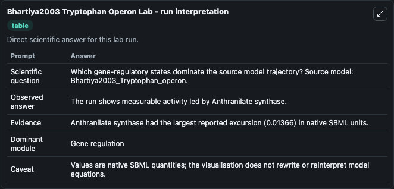
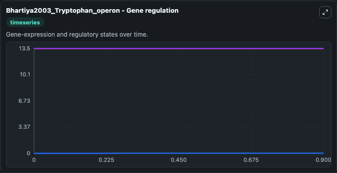
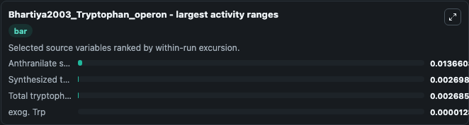
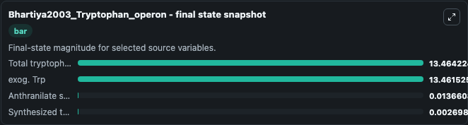
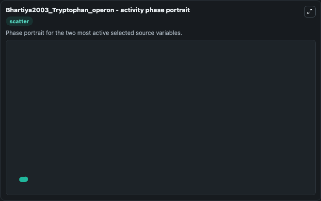

# Bhartiya2003 Tryptophan Operon

This Biosimulant lab wraps `Bhartiya2003 Tryptophan Operon` as a runnable systems biology model with a companion visualization module.
SBML level 2 code originaly generated for the JWS Online project by Jacky Snoep using PySCeS Run this model online at http://jjj.biochem.sun.ac.za To cite JWS Online please refer to: Olivier, B.G. It can be used to explore the configured dynamics and compare scenario outcomes across configurations.

## What You'll See

The lab asks: Which gene-regulatory states dominate the source model trajectory? Source model: Bhartiya2003_Tryptophan_operon. It runs for 1.0 time units with a communication step of 0.1. The run uses the model defaults declared by the curated SBML wrapper. The generated visualizations focus on exog. Trp, Total tryptophan, Synthesized tryptophan, and Anthranilate synthase, combining trajectory, endpoint-comparison, and summary-table views from one completed dark-mode run.

In this captured run, **Anthranilate synthase** moved from 0 to 0.0137 across 1.0 simulation windows.


### Output Visualizations



*Summary table for Bhartiya2003 Tryptophan Operon, reporting the scientific question, observed answer, dominant module, and caveat.*



*Trajectories of Anthranilate synthase, Synthesized tryptophan, Total tryptophan, and exog. Trp across the 1.0 simulation. In this run **Anthranilate synthase** climbed from 0 to 0.0137 and **exog. Trp** fell from 13.462 to 13.462 — the largest movements among the focused observables.*



*Largest-excursion ranking of the focused observables — the absolute movement magnitude during the run. Top 3: **Anthranilate synthase** = 0.0137, **Synthesized tryptophan** = 0.0027, **Total tryptophan** = 0.00269, with 1 more observable below.*



*Endpoint snapshot of the focused observables — final values from the captured run. Top 3 by value: **Total tryptophan** = 13.464, **exog. Trp** = 13.462, **Anthranilate synthase** = 0.0137, with 1 more observable below.*



*Visualization card from the Bhartiya2003 Tryptophan Operon dark-mode run.*


## Model Context

- Core model: `models/core`
- Visualization model: `models/visualisation`
- Standard: `other`
- Upstream source: `biomodels_ebi:BIOMD0000000062`
- License: `CC0`

## Inputs

| Input | Maps To | Default | Notes |
|---|---|---|---|
| Initial Exog Trp | `systemsbiology_sbml_bhartiya2003_tryptophan_operon_biomd0000000062_model.initial_exog_trp` | | Source state initial condition exposed as a model-specific control because no explicit intervention parameter is identifiable. Maps to SBML symbol `To`. |
| Initial Total Tryptophan | `systemsbiology_sbml_bhartiya2003_tryptophan_operon_biomd0000000062_model.initial_total_tryptophan` | | Source state initial condition exposed as a model-specific control because no explicit intervention parameter is identifiable. Maps to SBML symbol `Tt`. |
| Initial Synthesized Tryptophan | `systemsbiology_sbml_bhartiya2003_tryptophan_operon_biomd0000000062_model.initial_synthesized_tryptophan` | | Source state initial condition exposed as a model-specific control because no explicit intervention parameter is identifiable. Maps to SBML symbol `Ts`. |
| Initial Anthranilate Synthase | `systemsbiology_sbml_bhartiya2003_tryptophan_operon_biomd0000000062_model.initial_anthranilate_synthase` | | Source state initial condition exposed as a model-specific control because no explicit intervention parameter is identifiable. Maps to SBML symbol `Enz`. |

## Outputs

| Output | Maps To | Role |
|---|---|---|
| `state` | `systemsbiology_sbml_bhartiya2003_tryptophan_operon_biomd0000000062_model.state` | Available to the visualization model and downstream workflows. |
| `summary` | `systemsbiology_sbml_bhartiya2003_tryptophan_operon_biomd0000000062_model.summary` | Available to the visualization model and downstream workflows. |
| `species_labels` | `systemsbiology_sbml_bhartiya2003_tryptophan_operon_biomd0000000062_model.species_labels` | Available to the visualization model and downstream workflows. |
| `exog_trp` | `systemsbiology_sbml_bhartiya2003_tryptophan_operon_biomd0000000062_model.exog_trp` | Available to the visualization model and downstream workflows. |
| `total_tryptophan` | `systemsbiology_sbml_bhartiya2003_tryptophan_operon_biomd0000000062_model.total_tryptophan` | Available to the visualization model and downstream workflows. |
| `synthesized_tryptophan` | `systemsbiology_sbml_bhartiya2003_tryptophan_operon_biomd0000000062_model.synthesized_tryptophan` | Available to the visualization model and downstream workflows. |
| `anthranilate_synthase` | `systemsbiology_sbml_bhartiya2003_tryptophan_operon_biomd0000000062_model.anthranilate_synthase` | Available to the visualization model and downstream workflows. |

## Runtime

- Duration: `1.0`
- Communication step: `0.1`

## Running Locally

```bash
biosimulant labs serve
```
