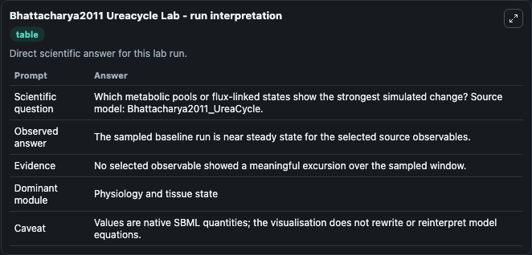
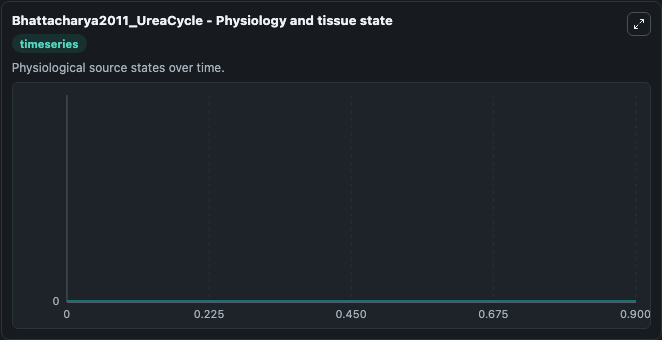

# Bhattacharya2011 Ureacycle

This Biosimulant lab wraps `Bhattacharya2011 Ureacycle` as a runnable systems biology model with a companion visualization module.
This model is from the article: Time Scale Simulation of Vmax of Urea Cycle Enzymes. It can be used to explore the configured dynamics and compare scenario outcomes across configurations.

## What You'll See

The lab asks: Which metabolic pools or flux-linked states show the strongest simulated change? Source model: Bhattacharya2011_UreaCycle. It runs for 1.0 time units with a communication step of 0.1. The run uses the model defaults declared by the curated SBML wrapper. The generated visualizations focus on Node9, Node8, Node7, Node6, Node4, and Node3, combining trajectory, endpoint-comparison, and summary-table views from one completed dark-mode run.

In this captured run, **Node9** moved from 0 to 0 across 1.0 simulation windows.


### Output Visualizations



*Summary table for Bhattacharya2011 Ureacycle, reporting the scientific question, observed answer, dominant module, and caveat.*



*Trajectories of Node9, Node8, Node7, Node6, Node4, and Node3 across the 1.0 simulation. In this run Node9, Node8, Node7, Node6 stayed near their initial values — no observable moved appreciably.*


## Model Context

- Core model: `models/core`
- Visualization model: `models/visualisation`
- Standard: `other`
- Upstream source: `biomodels_ebi:MODEL0318212660`
- License: `CC0`

## Inputs

| Input | Maps To | Default | Notes |
|---|---|---|---|
| Initial Node9 | `systemsbiology_sbml_bhattacharya2011_ureacycle_model0318212660_model.initial_node9` | | Source state initial condition exposed as a model-specific control because no explicit intervention parameter is identifiable. Maps to SBML symbol `Node9`. |
| Initial Node8 | `systemsbiology_sbml_bhattacharya2011_ureacycle_model0318212660_model.initial_node8` | | Source state initial condition exposed as a model-specific control because no explicit intervention parameter is identifiable. Maps to SBML symbol `Node8`. |
| Initial Node7 | `systemsbiology_sbml_bhattacharya2011_ureacycle_model0318212660_model.initial_node7` | | Source state initial condition exposed as a model-specific control because no explicit intervention parameter is identifiable. Maps to SBML symbol `Node7`. |
| Initial Node6 | `systemsbiology_sbml_bhattacharya2011_ureacycle_model0318212660_model.initial_node6` | | Source state initial condition exposed as a model-specific control because no explicit intervention parameter is identifiable. Maps to SBML symbol `Node6`. |
| Initial Node4 | `systemsbiology_sbml_bhattacharya2011_ureacycle_model0318212660_model.initial_node4` | | Source state initial condition exposed as a model-specific control because no explicit intervention parameter is identifiable. Maps to SBML symbol `Node4`. |
| Initial Node3 | `systemsbiology_sbml_bhattacharya2011_ureacycle_model0318212660_model.initial_node3` | | Source state initial condition exposed as a model-specific control because no explicit intervention parameter is identifiable. Maps to SBML symbol `Node3`. |

## Outputs

| Output | Maps To | Role |
|---|---|---|
| `state` | `systemsbiology_sbml_bhattacharya2011_ureacycle_model0318212660_model.state` | Available to the visualization model and downstream workflows. |
| `summary` | `systemsbiology_sbml_bhattacharya2011_ureacycle_model0318212660_model.summary` | Available to the visualization model and downstream workflows. |
| `species_labels` | `systemsbiology_sbml_bhattacharya2011_ureacycle_model0318212660_model.species_labels` | Available to the visualization model and downstream workflows. |
| `node9` | `systemsbiology_sbml_bhattacharya2011_ureacycle_model0318212660_model.node9` | Available to the visualization model and downstream workflows. |
| `node8` | `systemsbiology_sbml_bhattacharya2011_ureacycle_model0318212660_model.node8` | Available to the visualization model and downstream workflows. |
| `node7` | `systemsbiology_sbml_bhattacharya2011_ureacycle_model0318212660_model.node7` | Available to the visualization model and downstream workflows. |
| `node6` | `systemsbiology_sbml_bhattacharya2011_ureacycle_model0318212660_model.node6` | Available to the visualization model and downstream workflows. |
| `node4` | `systemsbiology_sbml_bhattacharya2011_ureacycle_model0318212660_model.node4` | Available to the visualization model and downstream workflows. |
| `node3` | `systemsbiology_sbml_bhattacharya2011_ureacycle_model0318212660_model.node3` | Available to the visualization model and downstream workflows. |

## Runtime

- Duration: `1.0`
- Communication step: `0.1`

## Running Locally

```bash
biosimulant labs serve
```
