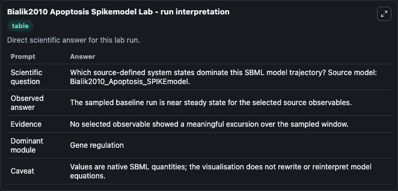
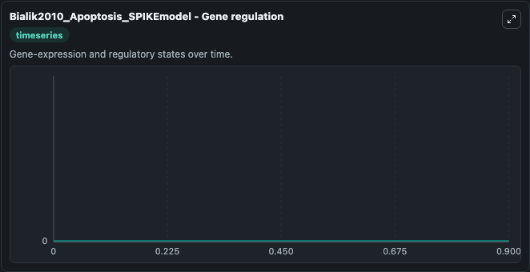

# Bialik2010 Apoptosis Spikemodel

This Biosimulant lab wraps `Bialik2010 Apoptosis Spikemodel` as a runnable systems biology model with a companion visualization module.
This model is from the article: Systems biology analysis of programmed cell death Shani Bialik, Einat Zalckvar, Yaara Ber, Assaf D. It can be used to explore the configured dynamics and compare scenario outcomes across configurations.

## What You'll See

The lab asks: Which source-defined system states dominate this SBML model trajectory? Source model: Bialik2010_Apoptosis_SPIKEmodel. It runs for 1.0 time units with a communication step of 0.1. The run uses the model defaults declared by the curated SBML wrapper. The generated visualizations focus on mRNA_XIAP, mRNA_EIF4G2, mRNA_CDK1, mRNA_BIRC2, mRNA_BCL2, and mRNA_APAF1, combining trajectory, endpoint-comparison, and summary-table views from one completed dark-mode run.

In this captured run, **mRNA_XIAP** moved from 0 to 0 across 1.0 simulation windows.


### Output Visualizations



*Summary table for Bialik2010 Apoptosis Spikemodel, reporting the scientific question, observed answer, dominant module, and caveat.*



*Trajectories of mRNA_XIAP, mRNA_EIF4G2, mRNA_CDK1, mRNA_BIRC2, mRNA_BCL2, and mRNA_APAF1 across the 1.0 simulation. In this run mRNA_XIAP, mRNA_EIF4G2, mRNA_CDK1, mRNA_BIRC2 stayed near their initial values — no observable moved appreciably.*


## Model Context

- Core model: `models/core`
- Visualization model: `models/visualisation`
- Standard: `other`
- Upstream source: `biomodels_ebi:MODEL1107050000`
- License: `CC0`

## Inputs

| Input | Maps To | Default | Notes |
|---|---|---|---|
| Initial MRNA Xiap | `systemsbiology_sbml_bialik2010_apoptosis_spikemodel_model1107050000_model.initial_mrna_xiap` | | Source state initial condition exposed as a model-specific control because no explicit intervention parameter is identifiable. Maps to SBML symbol `mRNA_XIAP`. |
| Initial MRNA Eif4 G2 | `systemsbiology_sbml_bialik2010_apoptosis_spikemodel_model1107050000_model.initial_mrna_eif4_g2` | | Source state initial condition exposed as a model-specific control because no explicit intervention parameter is identifiable. Maps to SBML symbol `mRNA_EIF4G2`. |
| Initial MRNA Cdk1 | `systemsbiology_sbml_bialik2010_apoptosis_spikemodel_model1107050000_model.initial_mrna_cdk1` | | Source state initial condition exposed as a model-specific control because no explicit intervention parameter is identifiable. Maps to SBML symbol `mRNA_CDK1`. |
| Initial MRNA Birc2 | `systemsbiology_sbml_bialik2010_apoptosis_spikemodel_model1107050000_model.initial_mrna_birc2` | | Source state initial condition exposed as a model-specific control because no explicit intervention parameter is identifiable. Maps to SBML symbol `mRNA_BIRC2`. |
| Initial MRNA Bcl2 | `systemsbiology_sbml_bialik2010_apoptosis_spikemodel_model1107050000_model.initial_mrna_bcl2` | | Source state initial condition exposed as a model-specific control because no explicit intervention parameter is identifiable. Maps to SBML symbol `mRNA_BCL2`. |
| Initial MRNA Apaf1 | `systemsbiology_sbml_bialik2010_apoptosis_spikemodel_model1107050000_model.initial_mrna_apaf1` | | Source state initial condition exposed as a model-specific control because no explicit intervention parameter is identifiable. Maps to SBML symbol `mRNA_APAF1`. |

## Outputs

| Output | Maps To | Role |
|---|---|---|
| `state` | `systemsbiology_sbml_bialik2010_apoptosis_spikemodel_model1107050000_model.state` | Available to the visualization model and downstream workflows. |
| `summary` | `systemsbiology_sbml_bialik2010_apoptosis_spikemodel_model1107050000_model.summary` | Available to the visualization model and downstream workflows. |
| `species_labels` | `systemsbiology_sbml_bialik2010_apoptosis_spikemodel_model1107050000_model.species_labels` | Available to the visualization model and downstream workflows. |
| `mrna_xiap` | `systemsbiology_sbml_bialik2010_apoptosis_spikemodel_model1107050000_model.mrna_xiap` | Available to the visualization model and downstream workflows. |
| `mrna_eif4_g2` | `systemsbiology_sbml_bialik2010_apoptosis_spikemodel_model1107050000_model.mrna_eif4_g2` | Available to the visualization model and downstream workflows. |
| `mrna_cdk1` | `systemsbiology_sbml_bialik2010_apoptosis_spikemodel_model1107050000_model.mrna_cdk1` | Available to the visualization model and downstream workflows. |
| `mrna_birc2` | `systemsbiology_sbml_bialik2010_apoptosis_spikemodel_model1107050000_model.mrna_birc2` | Available to the visualization model and downstream workflows. |
| `mrna_bcl2` | `systemsbiology_sbml_bialik2010_apoptosis_spikemodel_model1107050000_model.mrna_bcl2` | Available to the visualization model and downstream workflows. |
| `mrna_apaf1` | `systemsbiology_sbml_bialik2010_apoptosis_spikemodel_model1107050000_model.mrna_apaf1` | Available to the visualization model and downstream workflows. |

## Runtime

- Duration: `1.0`
- Communication step: `0.1`

## Running Locally

```bash
biosimulant labs serve
```
