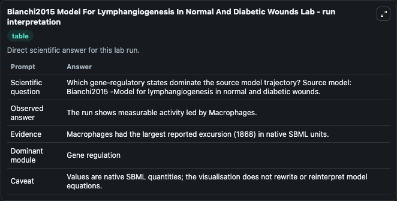
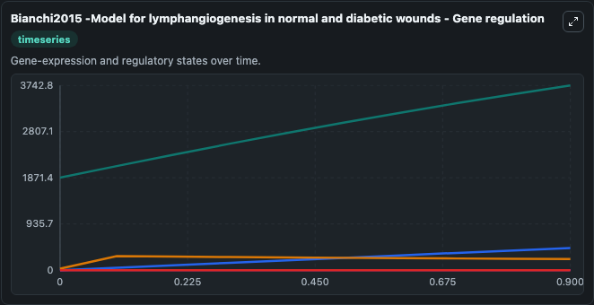
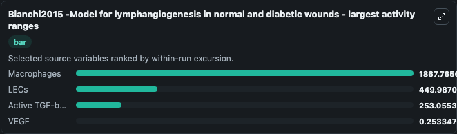
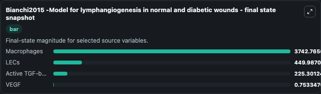
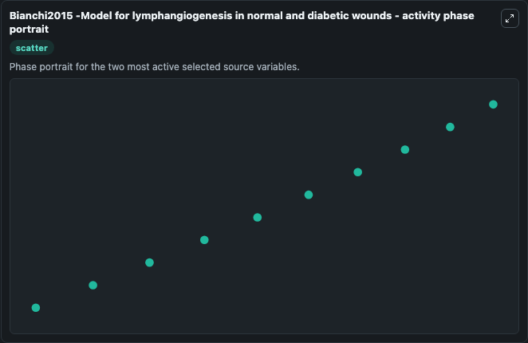

# Bianchi2015 Model For Lymphangiogenesis In Normal And Diabetic Wounds

This Biosimulant lab wraps `Bianchi2015 Model For Lymphangiogenesis In Normal And Diabetic Wounds` as a runnable systems biology model with a companion visualization module.
Arianna Bianchi, Kevin J. It can be used to explore the configured dynamics and compare scenario outcomes across configurations.

## What You'll See

The lab asks: Which gene-regulatory states dominate the source model trajectory? Source model: Bianchi2015 -Model for lymphangiogenesis in normal and diabetic wounds. It runs for 1.0 time units with a communication step of 0.1. The run uses the model defaults declared by the curated SBML wrapper. The generated visualizations focus on Active TGF-beta, Macrophages, VEGF, LECs, and Capillaries, combining trajectory, endpoint-comparison, and summary-table views from one completed dark-mode run.

In this captured run, **Macrophages** moved from 1875.0 to 3742.8 across 1.0 simulation windows.


### Output Visualizations



*Summary table for Bianchi2015 Model For Lymphangiogenesis In Normal And Diabetic Wounds, reporting the scientific question, observed answer, dominant module, and caveat.*



*Trajectories of Macrophages, LECs, Active TGF-beta, VEGF, and Capillaries across the 1.0 simulation. In this run **Macrophages** climbed from 1875.0 to 3742.8 — the largest movements among the focused observables.*



*Largest-excursion ranking of the focused observables — the absolute movement magnitude during the run. Top 3: **Macrophages** = 1867.8, **LECs** = 450.0, **Active TGF-beta** = 253.1, with 1 more observable below.*



*Endpoint snapshot of the focused observables — final values from the captured run. Top 3 by value: **Macrophages** = 3742.8, **LECs** = 450.0, **Active TGF-beta** = 225.3, with 1 more observable below.*



*Visualization card from the Bianchi2015 Model For Lymphangiogenesis In Normal And Diabetic Wounds dark-mode run.*


## Model Context

- Core model: `models/core`
- Visualization model: `models/visualisation`
- Standard: `other`
- Upstream source: `biomodels_ebi:BIOMD0000000722`
- License: `CC0`

## Inputs

| Input | Maps To | Default | Notes |
|---|---|---|---|
| Initial Active Tgf Beta | `systemsbiology_sbml_bianchi2015_model_for_lymphangiogenesis_in_norma_biomd0000000722_model.initial_active_tgf_beta` | | Source state initial condition exposed as a model-specific control because no explicit intervention parameter is identifiable. Maps to SBML symbol `Active_TGF_beta`. |
| Initial Macrophages | `systemsbiology_sbml_bianchi2015_model_for_lymphangiogenesis_in_norma_biomd0000000722_model.initial_macrophages` | | Source state initial condition exposed as a model-specific control because no explicit intervention parameter is identifiable. Maps to SBML symbol `Macrophages`. |
| Initial Vegf | `systemsbiology_sbml_bianchi2015_model_for_lymphangiogenesis_in_norma_biomd0000000722_model.initial_vegf` | | Source state initial condition exposed as a model-specific control because no explicit intervention parameter is identifiable. Maps to SBML symbol `VEGF`. |
| Initial Le Cs | `systemsbiology_sbml_bianchi2015_model_for_lymphangiogenesis_in_norma_biomd0000000722_model.initial_le_cs` | | Source state initial condition exposed as a model-specific control because no explicit intervention parameter is identifiable. Maps to SBML symbol `LECs`. |
| Initial Capillaries | `systemsbiology_sbml_bianchi2015_model_for_lymphangiogenesis_in_norma_biomd0000000722_model.initial_capillaries` | | Source state initial condition exposed as a model-specific control because no explicit intervention parameter is identifiable. Maps to SBML symbol `Capillaries`. |

## Outputs

| Output | Maps To | Role |
|---|---|---|
| `state` | `systemsbiology_sbml_bianchi2015_model_for_lymphangiogenesis_in_norma_biomd0000000722_model.state` | Available to the visualization model and downstream workflows. |
| `summary` | `systemsbiology_sbml_bianchi2015_model_for_lymphangiogenesis_in_norma_biomd0000000722_model.summary` | Available to the visualization model and downstream workflows. |
| `species_labels` | `systemsbiology_sbml_bianchi2015_model_for_lymphangiogenesis_in_norma_biomd0000000722_model.species_labels` | Available to the visualization model and downstream workflows. |
| `active_tgf_beta` | `systemsbiology_sbml_bianchi2015_model_for_lymphangiogenesis_in_norma_biomd0000000722_model.active_tgf_beta` | Available to the visualization model and downstream workflows. |
| `macrophages` | `systemsbiology_sbml_bianchi2015_model_for_lymphangiogenesis_in_norma_biomd0000000722_model.macrophages` | Available to the visualization model and downstream workflows. |
| `vegf` | `systemsbiology_sbml_bianchi2015_model_for_lymphangiogenesis_in_norma_biomd0000000722_model.vegf` | Available to the visualization model and downstream workflows. |
| `le_cs` | `systemsbiology_sbml_bianchi2015_model_for_lymphangiogenesis_in_norma_biomd0000000722_model.le_cs` | Available to the visualization model and downstream workflows. |
| `capillaries` | `systemsbiology_sbml_bianchi2015_model_for_lymphangiogenesis_in_norma_biomd0000000722_model.capillaries` | Available to the visualization model and downstream workflows. |

## Runtime

- Duration: `1.0`
- Communication step: `0.1`

## Running Locally

```bash
biosimulant labs serve
```
