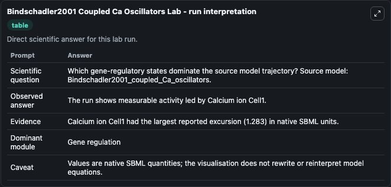
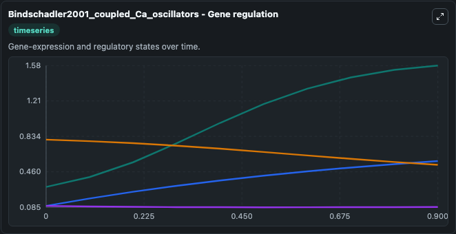
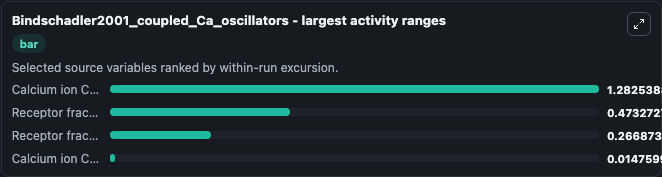
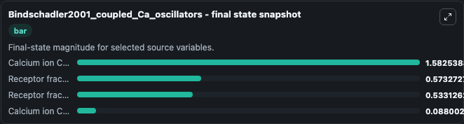
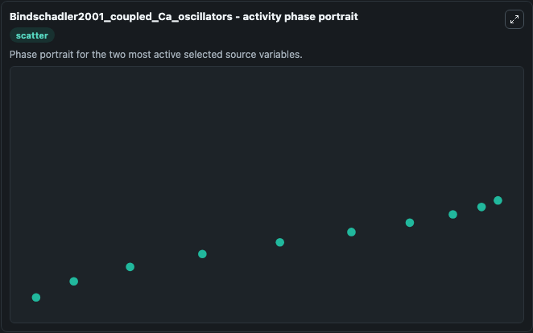

# Bindschadler2001 Coupled Ca Oscillators

This Biosimulant lab wraps `Bindschadler2001 Coupled Ca Oscillators` as a runnable systems biology model with a companion visualization module.
The model reproduces the same amplitude antiphase calcium oscillations of coupled cells depicted in Figure 5B of the publication. It can be used to explore the configured dynamics and compare scenario outcomes across configurations.

## What You'll See

The lab asks: Which gene-regulatory states dominate the source model trajectory? Source model: Bindschadler2001_coupled_Ca_oscillators. It runs for 1.0 time units with a communication step of 0.1. The run uses the model defaults declared by the curated SBML wrapper. The generated visualizations focus on Receptor fraction Cell1, Calcium ion Cell1, Receptor fraction Cell2, and Calcium ion Cell2, combining trajectory, endpoint-comparison, and summary-table views from one completed dark-mode run.

In this captured run, **Calcium ion Cell1** moved from 0.3000 to 1.583 across 1.0 simulation windows.


### Output Visualizations



*Summary table for Bindschadler2001 Coupled Ca Oscillators, reporting the scientific question, observed answer, dominant module, and caveat.*



*Trajectories of Calcium ion Cell1, Receptor fraction Cell2, Receptor fraction Cell1, and Calcium ion Cell2 across the 1.0 simulation. In this run **Calcium ion Cell1** climbed from 0.3000 to 1.583 and **Receptor fraction Cell1** fell from 0.8000 to 0.5331 — the largest movements among the focused observables.*



*Largest-excursion ranking of the focused observables — the absolute movement magnitude during the run. Top 3: **Calcium ion Cell1** = 1.283, **Receptor fraction Cell2** = 0.4733, **Receptor fraction Cell1** = 0.2669, with 1 more observable below.*



*Endpoint snapshot of the focused observables — final values from the captured run. Top 3 by value: **Calcium ion Cell1** = 1.583, **Receptor fraction Cell2** = 0.5733, **Receptor fraction Cell1** = 0.5331, with 1 more observable below.*



*Visualization card from the Bindschadler2001 Coupled Ca Oscillators dark-mode run.*


## Model Context

- Core model: `models/core`
- Visualization model: `models/visualisation`
- Standard: `other`
- Upstream source: `biomodels_ebi:BIOMD0000000058`
- License: `CC0`

## Inputs

| Input | Maps To | Default | Notes |
|---|---|---|---|
| Initial Receptor Fraction Cell1 | `systemsbiology_sbml_bindschadler2001_coupled_ca_oscillators_biomd0000000058_model.initial_receptor_fraction_cell1` | | Source state initial condition exposed as a model-specific control because no explicit intervention parameter is identifiable. Maps to SBML symbol `h1`. |
| Initial Calcium Ion Cell1 | `systemsbiology_sbml_bindschadler2001_coupled_ca_oscillators_biomd0000000058_model.initial_calcium_ion_cell1` | | Source state initial condition exposed as a model-specific control because no explicit intervention parameter is identifiable. Maps to SBML symbol `c1`. |
| Initial Receptor Fraction Cell2 | `systemsbiology_sbml_bindschadler2001_coupled_ca_oscillators_biomd0000000058_model.initial_receptor_fraction_cell2` | | Source state initial condition exposed as a model-specific control because no explicit intervention parameter is identifiable. Maps to SBML symbol `h2`. |
| Initial Calcium Ion Cell2 | `systemsbiology_sbml_bindschadler2001_coupled_ca_oscillators_biomd0000000058_model.initial_calcium_ion_cell2` | | Source state initial condition exposed as a model-specific control because no explicit intervention parameter is identifiable. Maps to SBML symbol `c2`. |

## Outputs

| Output | Maps To | Role |
|---|---|---|
| `state` | `systemsbiology_sbml_bindschadler2001_coupled_ca_oscillators_biomd0000000058_model.state` | Available to the visualization model and downstream workflows. |
| `summary` | `systemsbiology_sbml_bindschadler2001_coupled_ca_oscillators_biomd0000000058_model.summary` | Available to the visualization model and downstream workflows. |
| `species_labels` | `systemsbiology_sbml_bindschadler2001_coupled_ca_oscillators_biomd0000000058_model.species_labels` | Available to the visualization model and downstream workflows. |
| `receptor_fraction_cell1` | `systemsbiology_sbml_bindschadler2001_coupled_ca_oscillators_biomd0000000058_model.receptor_fraction_cell1` | Available to the visualization model and downstream workflows. |
| `calcium_ion_cell1` | `systemsbiology_sbml_bindschadler2001_coupled_ca_oscillators_biomd0000000058_model.calcium_ion_cell1` | Available to the visualization model and downstream workflows. |
| `receptor_fraction_cell2` | `systemsbiology_sbml_bindschadler2001_coupled_ca_oscillators_biomd0000000058_model.receptor_fraction_cell2` | Available to the visualization model and downstream workflows. |
| `calcium_ion_cell2` | `systemsbiology_sbml_bindschadler2001_coupled_ca_oscillators_biomd0000000058_model.calcium_ion_cell2` | Available to the visualization model and downstream workflows. |

## Runtime

- Duration: `1.0`
- Communication step: `0.1`

## Running Locally

```bash
biosimulant labs serve
```
