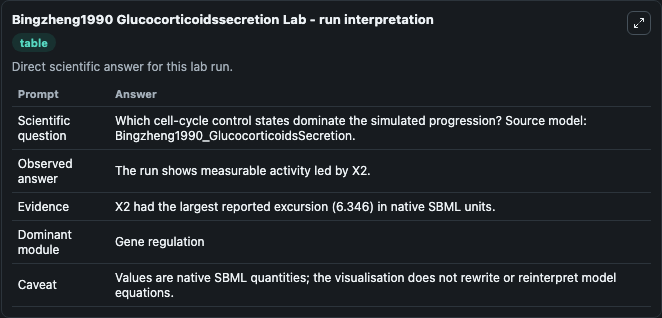
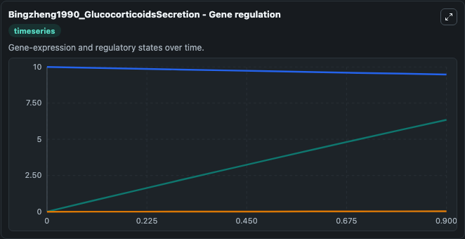
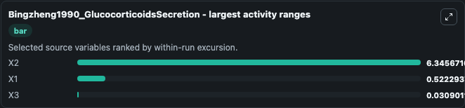
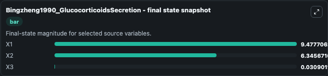
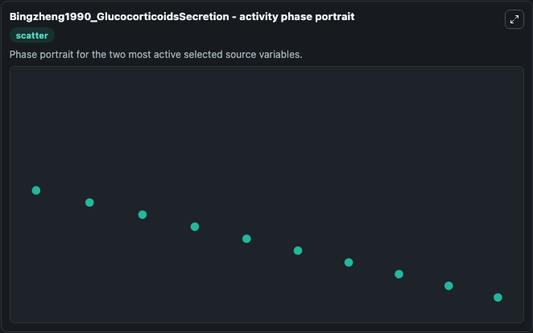

# Bingzheng1990 Glucocorticoidssecretion

This Biosimulant lab wraps `Bingzheng1990 Glucocorticoidssecretion` as a runnable systems biology model with a companion visualization module.
This a model from the article: A mathematical model of the regulation system of the secretion of glucocorticoids Liu Bingzheng, Zhao Zhenye and Chen Liansong Journal of Biological Physics 1990 17(4):2. It can be used to explore the configured dynamics and compare scenario outcomes across configurations.

## What You'll See

The lab asks: Which cell-cycle control states dominate the simulated progression? Source model: Bingzheng1990_GlucocorticoidsSecretion. It runs for 1.0 time units with a communication step of 0.1. The run uses the model defaults declared by the curated SBML wrapper. The generated visualizations focus on X3, X2, and X1, combining trajectory, endpoint-comparison, and summary-table views from one completed dark-mode run.

In this captured run, **X2** moved from 0 to 6.346 across 1.0 simulation windows.


### Output Visualizations



*Summary table for Bingzheng1990 Glucocorticoidssecretion, reporting the scientific question, observed answer, dominant module, and caveat.*



*Trajectories of X2, X1, and X3 across the 1.0 simulation. In this run **X2** climbed from 0 to 6.346 and **X1** fell from 10.000 to 9.478 — the largest movements among the focused observables.*



*Largest-excursion ranking of the focused observables — the absolute movement magnitude during the run. Top 3: **X2** = 6.346, **X1** = 0.5223, **X3** = 0.0309.*



*Endpoint snapshot of the focused observables — final values from the captured run. Top 3 by value: **X1** = 9.478, **X2** = 6.346, **X3** = 0.0309.*



*Visualization card from the Bingzheng1990 Glucocorticoidssecretion dark-mode run.*


## Model Context

- Core model: `models/core`
- Visualization model: `models/visualisation`
- Standard: `other`
- Upstream source: `biomodels_ebi:MODEL1172200168`
- License: `CC0`

## Inputs

| Input | Maps To | Default | Notes |
|---|---|---|---|
| Initial Model State X3 | `systemsbiology_sbml_bingzheng1990_glucocorticoidssecretion_model1172200168_model.initial_model_state_x3` | | Source state initial condition exposed as a model-specific control because no explicit intervention parameter is identifiable. Maps to SBML symbol `X3`. |
| Initial Model State X2 | `systemsbiology_sbml_bingzheng1990_glucocorticoidssecretion_model1172200168_model.initial_model_state_x2` | | Source state initial condition exposed as a model-specific control because no explicit intervention parameter is identifiable. Maps to SBML symbol `X2`. |
| Initial Model State X1 | `systemsbiology_sbml_bingzheng1990_glucocorticoidssecretion_model1172200168_model.initial_model_state_x1` | | Source state initial condition exposed as a model-specific control because no explicit intervention parameter is identifiable. Maps to SBML symbol `X1`. |

## Outputs

| Output | Maps To | Role |
|---|---|---|
| `state` | `systemsbiology_sbml_bingzheng1990_glucocorticoidssecretion_model1172200168_model.state` | Available to the visualization model and downstream workflows. |
| `summary` | `systemsbiology_sbml_bingzheng1990_glucocorticoidssecretion_model1172200168_model.summary` | Available to the visualization model and downstream workflows. |
| `species_labels` | `systemsbiology_sbml_bingzheng1990_glucocorticoidssecretion_model1172200168_model.species_labels` | Available to the visualization model and downstream workflows. |
| `model_state_x3` | `systemsbiology_sbml_bingzheng1990_glucocorticoidssecretion_model1172200168_model.model_state_x3` | Available to the visualization model and downstream workflows. |
| `model_state_x2` | `systemsbiology_sbml_bingzheng1990_glucocorticoidssecretion_model1172200168_model.model_state_x2` | Available to the visualization model and downstream workflows. |
| `model_state_x1` | `systemsbiology_sbml_bingzheng1990_glucocorticoidssecretion_model1172200168_model.model_state_x1` | Available to the visualization model and downstream workflows. |

## Runtime

- Duration: `1.0`
- Communication step: `0.1`

## Running Locally

```bash
biosimulant labs serve
```
