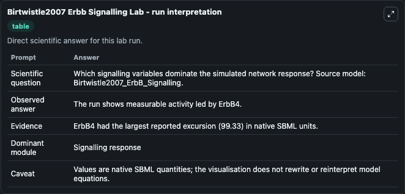
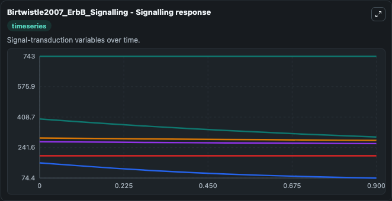
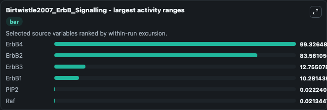
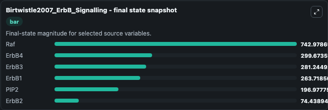
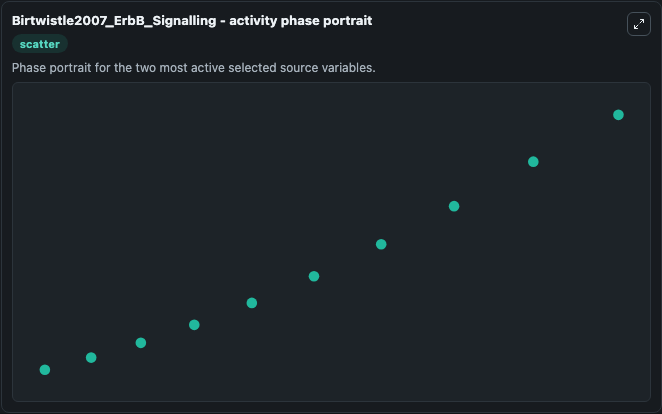

# Birtwistle2007 Erbb Signalling

This Biosimulant lab wraps `Birtwistle2007 Erbb Signalling` as a runnable systems biology model with a companion visualization module.
This model originates from BioModels Database: A Database of Annotated Published Models. It can be used to explore the configured dynamics and compare scenario outcomes across configurations.

## What You'll See

The lab asks: Which signalling variables dominate the simulated network response? Source model: Birtwistle2007_ErbB_Signalling. It runs for 1.0 time units with a communication step of 0.1. The run uses the model defaults declared by the curated SBML wrapper. The generated visualizations focus on Raf, ErbB4, ErbB3, ErbB1, PIP2, and ErbB2, combining trajectory, endpoint-comparison, and summary-table views from one completed dark-mode run.

In this captured run, **ErbB4** moved from 399.0 to 299.7 across 1.0 simulation windows.


### Output Visualizations



*Summary table for Birtwistle2007 Erbb Signalling, reporting the scientific question, observed answer, dominant module, and caveat.*



*Trajectories of ErbB4, ErbB2, ErbB3, ErbB1, PIP2, and Raf across the 1.0 simulation. In this run **ErbB4** fell from 399.0 to 299.7 — the largest movements among the focused observables.*



*Largest-excursion ranking of the focused observables — the absolute movement magnitude during the run. Top 3: **ErbB4** = 99.326, **ErbB2** = 83.561, **ErbB3** = 12.755, with 3 more observables below.*



*Endpoint snapshot of the focused observables — final values from the captured run. Top 3 by value: **Raf** = 743.0, **ErbB4** = 299.7, **ErbB3** = 281.2, with 3 more observables below.*



*Visualization card from the Birtwistle2007 Erbb Signalling dark-mode run.*


## Model Context

- Core model: `models/core`
- Visualization model: `models/visualisation`
- Standard: `other`
- Upstream source: `biomodels_ebi:BIOMD0000000175`
- License: `CC0`

## Inputs

| Input | Maps To | Default | Notes |
|---|---|---|---|
| Initial Model State RAF | `systemsbiology_sbml_birtwistle2007_erbb_signalling_biomd0000000175_model.initial_model_state_raf` | | Source state initial condition exposed as a model-specific control because no explicit intervention parameter is identifiable. Maps to SBML symbol `Raf`. |
| Initial Erb B4 | `systemsbiology_sbml_birtwistle2007_erbb_signalling_biomd0000000175_model.initial_erb_b4` | | Source state initial condition exposed as a model-specific control because no explicit intervention parameter is identifiable. Maps to SBML symbol `E4`. |
| Initial Erb B3 | `systemsbiology_sbml_birtwistle2007_erbb_signalling_biomd0000000175_model.initial_erb_b3` | | Source state initial condition exposed as a model-specific control because no explicit intervention parameter is identifiable. Maps to SBML symbol `E3`. |
| Initial Erb B1 | `systemsbiology_sbml_birtwistle2007_erbb_signalling_biomd0000000175_model.initial_erb_b1` | | Source state initial condition exposed as a model-specific control because no explicit intervention parameter is identifiable. Maps to SBML symbol `E1`. |
| Initial Pip2 | `systemsbiology_sbml_birtwistle2007_erbb_signalling_biomd0000000175_model.initial_pip2` | | Source state initial condition exposed as a model-specific control because no explicit intervention parameter is identifiable. Maps to SBML symbol `P2`. |
| Initial Erb B2 | `systemsbiology_sbml_birtwistle2007_erbb_signalling_biomd0000000175_model.initial_erb_b2` | | Source state initial condition exposed as a model-specific control because no explicit intervention parameter is identifiable. Maps to SBML symbol `E2`. |

## Outputs

| Output | Maps To | Role |
|---|---|---|
| `state` | `systemsbiology_sbml_birtwistle2007_erbb_signalling_biomd0000000175_model.state` | Available to the visualization model and downstream workflows. |
| `summary` | `systemsbiology_sbml_birtwistle2007_erbb_signalling_biomd0000000175_model.summary` | Available to the visualization model and downstream workflows. |
| `species_labels` | `systemsbiology_sbml_birtwistle2007_erbb_signalling_biomd0000000175_model.species_labels` | Available to the visualization model and downstream workflows. |
| `raf` | `systemsbiology_sbml_birtwistle2007_erbb_signalling_biomd0000000175_model.raf` | Available to the visualization model and downstream workflows. |
| `erb_b4` | `systemsbiology_sbml_birtwistle2007_erbb_signalling_biomd0000000175_model.erb_b4` | Available to the visualization model and downstream workflows. |
| `erb_b3` | `systemsbiology_sbml_birtwistle2007_erbb_signalling_biomd0000000175_model.erb_b3` | Available to the visualization model and downstream workflows. |
| `erb_b1` | `systemsbiology_sbml_birtwistle2007_erbb_signalling_biomd0000000175_model.erb_b1` | Available to the visualization model and downstream workflows. |
| `pip2` | `systemsbiology_sbml_birtwistle2007_erbb_signalling_biomd0000000175_model.pip2` | Available to the visualization model and downstream workflows. |
| `erb_b2` | `systemsbiology_sbml_birtwistle2007_erbb_signalling_biomd0000000175_model.erb_b2` | Available to the visualization model and downstream workflows. |

## Runtime

- Duration: `1.0`
- Communication step: `0.1`

## Running Locally

```bash
biosimulant labs serve
```
