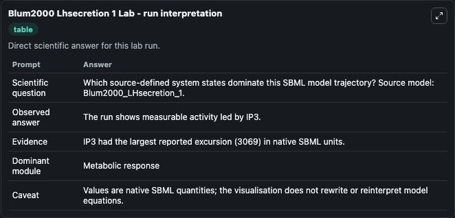
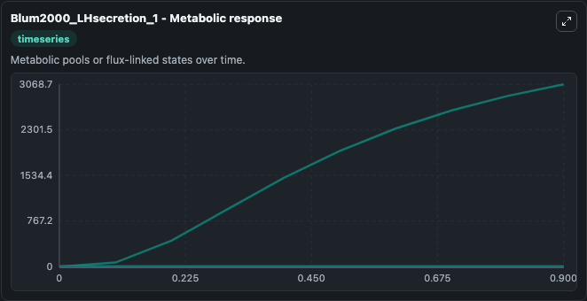
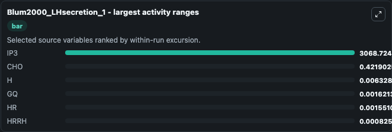
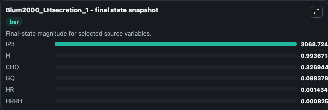
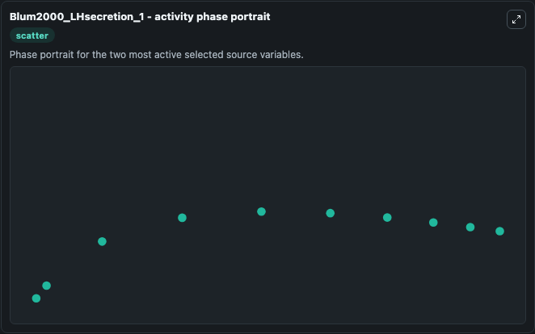

# Blum2000 Lhsecretion 1

This Biosimulant lab wraps `Blum2000 Lhsecretion 1` as a runnable systems biology model with a companion visualization module.
A mathematical model quantifying GnRH-induced LH secretion from gonadotropes by Blum et al (2000) This paper includes three stages, and the model does not include the third stage. It can be used to explore the configured dynamics and compare scenario outcomes across configurations.

## What You'll See

The lab asks: Which source-defined system states dominate this SBML model trajectory? Source model: Blum2000_LHsecretion_1. It runs for 1.0 time units with a communication step of 0.1. The run uses the model defaults declared by the curated SBML wrapper. The generated visualizations focus on GQ, IP3, HRRH, HR, CHO, and H, combining trajectory, endpoint-comparison, and summary-table views from one completed dark-mode run.

In this captured run, **IP3** moved from 0 to 3068.7 across 1.0 simulation windows.


### Output Visualizations



*Summary table for Blum2000 Lhsecretion 1, reporting the scientific question, observed answer, dominant module, and caveat.*



*Trajectories of IP3, CHO, H, GQ, HR, and HRRH across the 1.0 simulation. In this run **IP3** climbed from 0 to 3068.7 and **H** fell from 1.000 to 0.9937 — the largest movements among the focused observables.*



*Largest-excursion ranking of the focused observables — the absolute movement magnitude during the run. Top 3: **IP3** = 3068.7, **CHO** = 0.4219, **H** = 0.00633, with 3 more observables below.*



*Endpoint snapshot of the focused observables — final values from the captured run. Top 3 by value: **IP3** = 3068.7, **H** = 0.9937, **CHO** = 0.3269, with 3 more observables below.*



*Visualization card from the Blum2000 Lhsecretion 1 dark-mode run.*


## Model Context

- Core model: `models/core`
- Visualization model: `models/visualisation`
- Standard: `other`
- Upstream source: `biomodels_ebi:BIOMD0000000077`
- License: `CC0`

## Inputs

| Input | Maps To | Default | Notes |
|---|---|---|---|
| Initial Model State Gq | `systemsbiology_sbml_blum2000_lhsecretion_1_biomd0000000077_model.initial_model_state_gq` | | Source state initial condition exposed as a model-specific control because no explicit intervention parameter is identifiable. Maps to SBML symbol `GQ`. |
| Initial Model State IP3 | `systemsbiology_sbml_blum2000_lhsecretion_1_biomd0000000077_model.initial_model_state_ip3` | | Source state initial condition exposed as a model-specific control because no explicit intervention parameter is identifiable. Maps to SBML symbol `IP3`. |
| Initial Hrrh | `systemsbiology_sbml_blum2000_lhsecretion_1_biomd0000000077_model.initial_hrrh` | | Source state initial condition exposed as a model-specific control because no explicit intervention parameter is identifiable. Maps to SBML symbol `HRRH`. |
| Initial Model State Hr | `systemsbiology_sbml_blum2000_lhsecretion_1_biomd0000000077_model.initial_model_state_hr` | | Source state initial condition exposed as a model-specific control because no explicit intervention parameter is identifiable. Maps to SBML symbol `HR`. |
| Initial Model State Cho | `systemsbiology_sbml_blum2000_lhsecretion_1_biomd0000000077_model.initial_model_state_cho` | | Source state initial condition exposed as a model-specific control because no explicit intervention parameter is identifiable. Maps to SBML symbol `CHO`. |
| Initial Model State H | `systemsbiology_sbml_blum2000_lhsecretion_1_biomd0000000077_model.initial_model_state_h` | | Source state initial condition exposed as a model-specific control because no explicit intervention parameter is identifiable. Maps to SBML symbol `H`. |

## Outputs

| Output | Maps To | Role |
|---|---|---|
| `state` | `systemsbiology_sbml_blum2000_lhsecretion_1_biomd0000000077_model.state` | Available to the visualization model and downstream workflows. |
| `summary` | `systemsbiology_sbml_blum2000_lhsecretion_1_biomd0000000077_model.summary` | Available to the visualization model and downstream workflows. |
| `species_labels` | `systemsbiology_sbml_blum2000_lhsecretion_1_biomd0000000077_model.species_labels` | Available to the visualization model and downstream workflows. |
| `model_state_gq` | `systemsbiology_sbml_blum2000_lhsecretion_1_biomd0000000077_model.model_state_gq` | Available to the visualization model and downstream workflows. |
| `ip3` | `systemsbiology_sbml_blum2000_lhsecretion_1_biomd0000000077_model.ip3` | Available to the visualization model and downstream workflows. |
| `hrrh` | `systemsbiology_sbml_blum2000_lhsecretion_1_biomd0000000077_model.hrrh` | Available to the visualization model and downstream workflows. |
| `model_state_hr` | `systemsbiology_sbml_blum2000_lhsecretion_1_biomd0000000077_model.model_state_hr` | Available to the visualization model and downstream workflows. |
| `cho` | `systemsbiology_sbml_blum2000_lhsecretion_1_biomd0000000077_model.cho` | Available to the visualization model and downstream workflows. |
| `model_state_h` | `systemsbiology_sbml_blum2000_lhsecretion_1_biomd0000000077_model.model_state_h` | Available to the visualization model and downstream workflows. |

## Runtime

- Duration: `1.0`
- Communication step: `0.1`

## Running Locally

```bash
biosimulant labs serve
```
