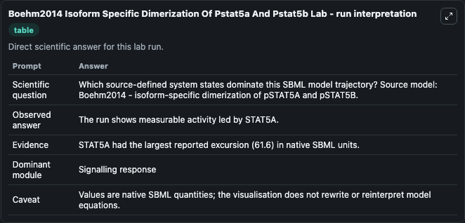
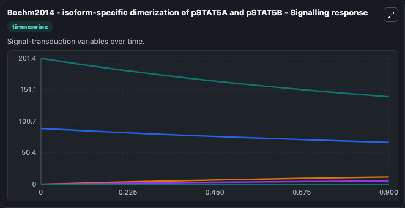
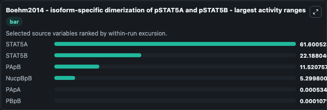
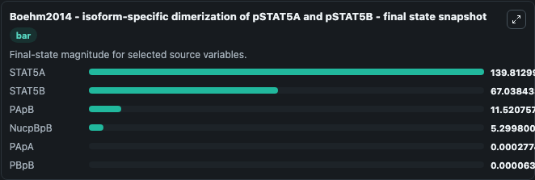
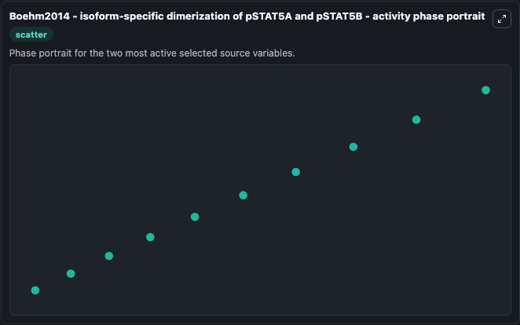

# Boehm2014 Isoform Specific Dimerization Of Pstat5a And Pstat5b

This Biosimulant lab wraps `Boehm2014 Isoform Specific Dimerization Of Pstat5a And Pstat5b` as a runnable systems biology model with a companion visualization module.
Boehm2014 - isoform-specific dimerization of pSTAT5A and pSTAT5B To study STAT5 activation, the authors build a dynamic model of pSTAT5 isoform dimerization. It can be used to explore the configured dynamics and compare scenario outcomes across configurations.

## What You'll See

The lab asks: Which source-defined system states dominate this SBML model trajectory? Source model: Boehm2014 - isoform-specific dimerization of pSTAT5A and pSTAT5B. It runs for 1.0 time units with a communication step of 0.1. The run uses the model defaults declared by the curated SBML wrapper. The generated visualizations focus on STAT5B, STAT5A, PBpB, PApB, PApA, and NucpBpB, combining trajectory, endpoint-comparison, and summary-table views from one completed dark-mode run.

In this captured run, **STAT5A** moved from 201.4 to 139.8 across 1.0 simulation windows.


### Output Visualizations



*Summary table for Boehm2014 Isoform Specific Dimerization Of Pstat5a And Pstat5b, reporting the scientific question, observed answer, dominant module, and caveat.*



*Trajectories of STAT5A, STAT5B, PApB, NucpBpB, PApA, and PBpB across the 1.0 simulation. In this run **PApB** climbed from 0 to 11.521 and **STAT5A** fell from 201.4 to 139.8 — the largest movements among the focused observables.*



*Largest-excursion ranking of the focused observables — the absolute movement magnitude during the run. Top 3: **STAT5A** = 61.601, **STAT5B** = 22.188, **PApB** = 11.521, with 3 more observables below.*



*Trajectories of STAT5A, STAT5B, PApB, NucpBpB, PApA, and PBpB across the 1.0 simulation. In this run **PApB** climbed from 0 to 11.521 and **STAT5A** fell from 201.4 to 139.8 — the largest movements among the focused observables.*



*Visualization card from the Boehm2014 Isoform Specific Dimerization Of Pstat5a And Pstat5b dark-mode run.*


## Model Context

- Core model: `models/core`
- Visualization model: `models/visualisation`
- Standard: `other`
- Upstream source: `biomodels_ebi:BIOMD0000000591`
- License: `CC0`

## Inputs

| Input | Maps To | Default | Notes |
|---|---|---|---|
| Initial Stat5 B | `systemsbiology_sbml_boehm2014_isoform_specific_dimerization_of_pstat_biomd0000000591_model.initial_stat5_b` | | Source state initial condition exposed as a model-specific control because no explicit intervention parameter is identifiable. Maps to SBML symbol `STAT5B`. |
| Initial Stat5 A | `systemsbiology_sbml_boehm2014_isoform_specific_dimerization_of_pstat_biomd0000000591_model.initial_stat5_a` | | Source state initial condition exposed as a model-specific control because no explicit intervention parameter is identifiable. Maps to SBML symbol `STAT5A`. |
| Initial P Bp B | `systemsbiology_sbml_boehm2014_isoform_specific_dimerization_of_pstat_biomd0000000591_model.initial_p_bp_b` | | Source state initial condition exposed as a model-specific control because no explicit intervention parameter is identifiable. Maps to SBML symbol `pBpB`. |
| Initial P Ap B | `systemsbiology_sbml_boehm2014_isoform_specific_dimerization_of_pstat_biomd0000000591_model.initial_p_ap_b` | | Source state initial condition exposed as a model-specific control because no explicit intervention parameter is identifiable. Maps to SBML symbol `pApB`. |
| Initial P Ap A | `systemsbiology_sbml_boehm2014_isoform_specific_dimerization_of_pstat_biomd0000000591_model.initial_p_ap_a` | | Source state initial condition exposed as a model-specific control because no explicit intervention parameter is identifiable. Maps to SBML symbol `pApA`. |
| Initial Nucp Bp B | `systemsbiology_sbml_boehm2014_isoform_specific_dimerization_of_pstat_biomd0000000591_model.initial_nucp_bp_b` | | Source state initial condition exposed as a model-specific control because no explicit intervention parameter is identifiable. Maps to SBML symbol `nucpBpB`. |

## Outputs

| Output | Maps To | Role |
|---|---|---|
| `state` | `systemsbiology_sbml_boehm2014_isoform_specific_dimerization_of_pstat_biomd0000000591_model.state` | Available to the visualization model and downstream workflows. |
| `summary` | `systemsbiology_sbml_boehm2014_isoform_specific_dimerization_of_pstat_biomd0000000591_model.summary` | Available to the visualization model and downstream workflows. |
| `species_labels` | `systemsbiology_sbml_boehm2014_isoform_specific_dimerization_of_pstat_biomd0000000591_model.species_labels` | Available to the visualization model and downstream workflows. |
| `stat5_b` | `systemsbiology_sbml_boehm2014_isoform_specific_dimerization_of_pstat_biomd0000000591_model.stat5_b` | Available to the visualization model and downstream workflows. |
| `stat5_a` | `systemsbiology_sbml_boehm2014_isoform_specific_dimerization_of_pstat_biomd0000000591_model.stat5_a` | Available to the visualization model and downstream workflows. |
| `p_bp_b` | `systemsbiology_sbml_boehm2014_isoform_specific_dimerization_of_pstat_biomd0000000591_model.p_bp_b` | Available to the visualization model and downstream workflows. |
| `p_ap_b` | `systemsbiology_sbml_boehm2014_isoform_specific_dimerization_of_pstat_biomd0000000591_model.p_ap_b` | Available to the visualization model and downstream workflows. |
| `p_ap_a` | `systemsbiology_sbml_boehm2014_isoform_specific_dimerization_of_pstat_biomd0000000591_model.p_ap_a` | Available to the visualization model and downstream workflows. |
| `nucp_bp_b` | `systemsbiology_sbml_boehm2014_isoform_specific_dimerization_of_pstat_biomd0000000591_model.nucp_bp_b` | Available to the visualization model and downstream workflows. |

## Runtime

- Duration: `1.0`
- Communication step: `0.1`

## Running Locally

```bash
biosimulant labs serve
```
