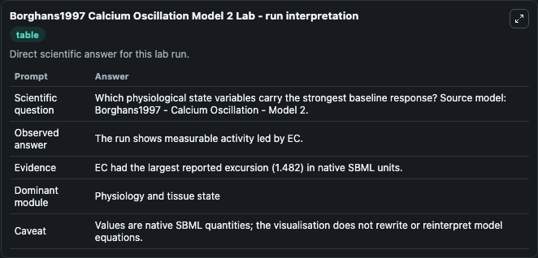
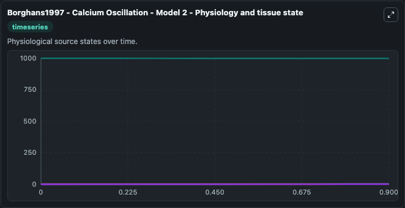
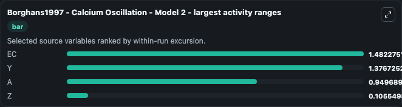
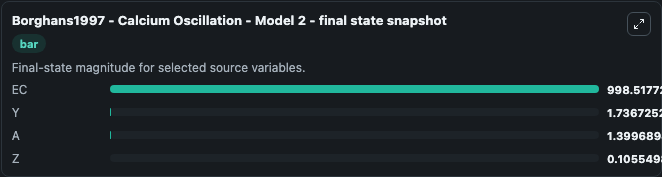
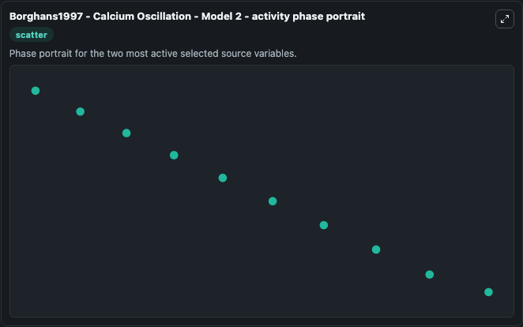

# Borghans1997 Calcium Oscillation Model 2

This Biosimulant lab wraps `Borghans1997 Calcium Oscillation Model 2` as a runnable systems biology model with a companion visualization module.
Borghans1997 - Calcium Oscillation - Model 2 A theoretical expoloration of possible mechanisms of intracellular calcium oscillations has been studied, considering three hypothesis (see below). It can be used to explore the configured dynamics and compare scenario outcomes across configurations.

## What You'll See

The lab asks: Which physiological state variables carry the strongest baseline response? Source model: Borghans1997 - Calcium Oscillation - Model 2. It runs for 1.0 time units with a communication step of 0.1. The run uses the model defaults declared by the curated SBML wrapper. The generated visualizations focus on EC, A, Y, and Z, combining trajectory, endpoint-comparison, and summary-table views from one completed dark-mode run.

In this captured run, **EC** moved from 1000.0 to 998.5 across 1.0 simulation windows.


### Output Visualizations



*Summary table for Borghans1997 Calcium Oscillation Model 2, reporting the scientific question, observed answer, dominant module, and caveat.*



*Trajectories of EC, Y, A, and Z across the 1.0 simulation. In this run **Y** climbed from 0.3600 to 1.737 and **EC** fell from 1000.0 to 998.5 — the largest movements among the focused observables.*



*Largest-excursion ranking of the focused observables — the absolute movement magnitude during the run. Top 3: **EC** = 1.482, **Y** = 1.377, **A** = 0.9497, with 1 more observable below.*



*Endpoint snapshot of the focused observables — final values from the captured run. Top 3 by value: **EC** = 998.5, **Y** = 1.737, **A** = 1.400, with 1 more observable below.*



*Visualization card from the Borghans1997 Calcium Oscillation Model 2 dark-mode run.*


## Model Context

- Core model: `models/core`
- Visualization model: `models/visualisation`
- Standard: `other`
- Upstream source: `biomodels_ebi:BIOMD0000000044`
- License: `CC0`

## Inputs

| Input | Maps To | Default | Notes |
|---|---|---|---|
| Initial Model State Ec | `systemsbiology_sbml_borghans1997_calcium_oscillation_model_2_biomd0000000044_model.initial_model_state_ec` | | Source state initial condition exposed as a model-specific control because no explicit intervention parameter is identifiable. Maps to SBML symbol `EC`. |
| Initial Model State A | `systemsbiology_sbml_borghans1997_calcium_oscillation_model_2_biomd0000000044_model.initial_model_state_a` | | Source state initial condition exposed as a model-specific control because no explicit intervention parameter is identifiable. Maps to SBML symbol `A`. |
| Initial Model State Y | `systemsbiology_sbml_borghans1997_calcium_oscillation_model_2_biomd0000000044_model.initial_model_state_y` | | Source state initial condition exposed as a model-specific control because no explicit intervention parameter is identifiable. Maps to SBML symbol `Y`. |
| Initial Model State Z | `systemsbiology_sbml_borghans1997_calcium_oscillation_model_2_biomd0000000044_model.initial_model_state_z` | | Source state initial condition exposed as a model-specific control because no explicit intervention parameter is identifiable. Maps to SBML symbol `Z`. |

## Outputs

| Output | Maps To | Role |
|---|---|---|
| `state` | `systemsbiology_sbml_borghans1997_calcium_oscillation_model_2_biomd0000000044_model.state` | Available to the visualization model and downstream workflows. |
| `summary` | `systemsbiology_sbml_borghans1997_calcium_oscillation_model_2_biomd0000000044_model.summary` | Available to the visualization model and downstream workflows. |
| `species_labels` | `systemsbiology_sbml_borghans1997_calcium_oscillation_model_2_biomd0000000044_model.species_labels` | Available to the visualization model and downstream workflows. |
| `model_state_ec` | `systemsbiology_sbml_borghans1997_calcium_oscillation_model_2_biomd0000000044_model.model_state_ec` | Available to the visualization model and downstream workflows. |
| `model_state_a` | `systemsbiology_sbml_borghans1997_calcium_oscillation_model_2_biomd0000000044_model.model_state_a` | Available to the visualization model and downstream workflows. |
| `model_state_y` | `systemsbiology_sbml_borghans1997_calcium_oscillation_model_2_biomd0000000044_model.model_state_y` | Available to the visualization model and downstream workflows. |
| `model_state_z` | `systemsbiology_sbml_borghans1997_calcium_oscillation_model_2_biomd0000000044_model.model_state_z` | Available to the visualization model and downstream workflows. |

## Runtime

- Duration: `1.0`
- Communication step: `0.1`

## Running Locally

```bash
biosimulant labs serve
```
