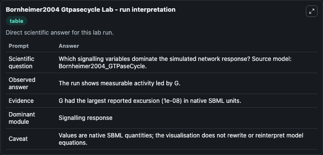
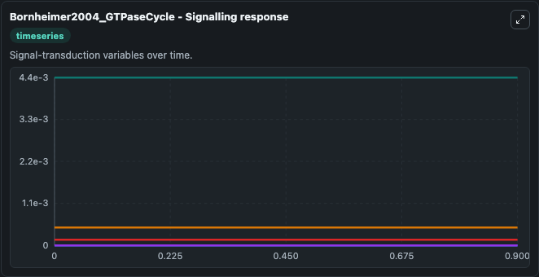
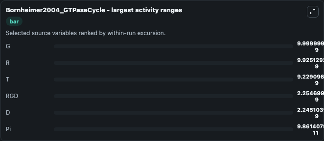
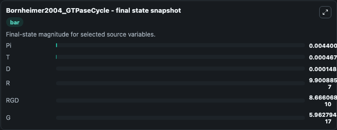
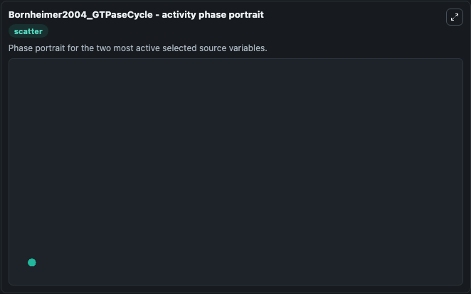

# Bornheimer2004 Gtpasecycle

This Biosimulant lab wraps `Bornheimer2004 Gtpasecycle` as a runnable systems biology model with a companion visualization module.
This model is according to the paper Computational modeling reveals how interplay between components of a GTPase-cycle module regulates signal transduction by Bornheimer et al 2004.The figure 3 is rep. It can be used to explore the configured dynamics and compare scenario outcomes across configurations.

## What You'll See

The lab asks: Which signalling variables dominate the simulated network response? Source model: Bornheimer2004_GTPaseCycle. It runs for 1.0 time units with a communication step of 0.1. The run uses the model defaults declared by the curated SBML wrapper. The generated visualizations focus on Pi, T, D, R, G, and RGD, combining trajectory, endpoint-comparison, and summary-table views from one completed dark-mode run.

In this captured run, **G** moved from 1e-08 to 5.96e-17 across 1.0 simulation windows.


### Output Visualizations



*Summary table for Bornheimer2004 Gtpasecycle, reporting the scientific question, observed answer, dominant module, and caveat.*



*Trajectories of G, R, T, RGD, D, and Pi across the 1.0 simulation. In this run **RGD** climbed from 0 to 8.67e-10 and **G** fell from 1e-08 to 5.96e-17 — the largest movements among the focused observables.*



*Largest-excursion ranking of the focused observables — the absolute movement magnitude during the run. Top 3: **G** = 1e-08, **R** = 9.93e-09, **T** = 9.23e-09, with 3 more observables below.*



*Endpoint snapshot of the focused observables — final values from the captured run. Top 3 by value: **Pi** = 0.0044, **T** = 0.000468, **D** = 0.000149, with 3 more observables below.*



*Visualization card from the Bornheimer2004 Gtpasecycle dark-mode run.*


## Model Context

- Core model: `models/core`
- Visualization model: `models/visualisation`
- Standard: `other`
- Upstream source: `biomodels_ebi:BIOMD0000000086`
- License: `CC0`

## Inputs

| Input | Maps To | Default | Notes |
|---|---|---|---|
| Initial Model State Pi | `systemsbiology_sbml_bornheimer2004_gtpasecycle_biomd0000000086_model.initial_model_state_pi` | | Source state initial condition exposed as a model-specific control because no explicit intervention parameter is identifiable. Maps to SBML symbol `species_7`. |
| Initial Model State T | `systemsbiology_sbml_bornheimer2004_gtpasecycle_biomd0000000086_model.initial_model_state_t` | | Source state initial condition exposed as a model-specific control because no explicit intervention parameter is identifiable. Maps to SBML symbol `species_3`. |
| Initial Model State D | `systemsbiology_sbml_bornheimer2004_gtpasecycle_biomd0000000086_model.initial_model_state_d` | | Source state initial condition exposed as a model-specific control because no explicit intervention parameter is identifiable. Maps to SBML symbol `species_8`. |
| Initial Model State R | `systemsbiology_sbml_bornheimer2004_gtpasecycle_biomd0000000086_model.initial_model_state_r` | | Source state initial condition exposed as a model-specific control because no explicit intervention parameter is identifiable. Maps to SBML symbol `species_4`. |
| Initial Model State G | `systemsbiology_sbml_bornheimer2004_gtpasecycle_biomd0000000086_model.initial_model_state_g` | | Source state initial condition exposed as a model-specific control because no explicit intervention parameter is identifiable. Maps to SBML symbol `species_1`. |
| Initial Model State Rgd | `systemsbiology_sbml_bornheimer2004_gtpasecycle_biomd0000000086_model.initial_model_state_rgd` | | Source state initial condition exposed as a model-specific control because no explicit intervention parameter is identifiable. Maps to SBML symbol `species_13`. |

## Outputs

| Output | Maps To | Role |
|---|---|---|
| `state` | `systemsbiology_sbml_bornheimer2004_gtpasecycle_biomd0000000086_model.state` | Available to the visualization model and downstream workflows. |
| `summary` | `systemsbiology_sbml_bornheimer2004_gtpasecycle_biomd0000000086_model.summary` | Available to the visualization model and downstream workflows. |
| `species_labels` | `systemsbiology_sbml_bornheimer2004_gtpasecycle_biomd0000000086_model.species_labels` | Available to the visualization model and downstream workflows. |
| `model_state_pi` | `systemsbiology_sbml_bornheimer2004_gtpasecycle_biomd0000000086_model.model_state_pi` | Available to the visualization model and downstream workflows. |
| `model_state_t` | `systemsbiology_sbml_bornheimer2004_gtpasecycle_biomd0000000086_model.model_state_t` | Available to the visualization model and downstream workflows. |
| `model_state_d` | `systemsbiology_sbml_bornheimer2004_gtpasecycle_biomd0000000086_model.model_state_d` | Available to the visualization model and downstream workflows. |
| `model_state_r` | `systemsbiology_sbml_bornheimer2004_gtpasecycle_biomd0000000086_model.model_state_r` | Available to the visualization model and downstream workflows. |
| `model_state_g` | `systemsbiology_sbml_bornheimer2004_gtpasecycle_biomd0000000086_model.model_state_g` | Available to the visualization model and downstream workflows. |
| `rgd` | `systemsbiology_sbml_bornheimer2004_gtpasecycle_biomd0000000086_model.rgd` | Available to the visualization model and downstream workflows. |

## Runtime

- Duration: `1.0`
- Communication step: `0.1`

## Running Locally

```bash
biosimulant labs serve
```
