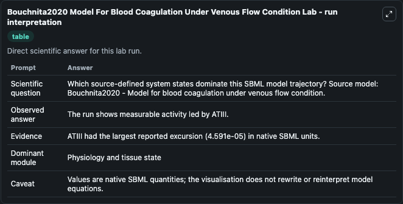
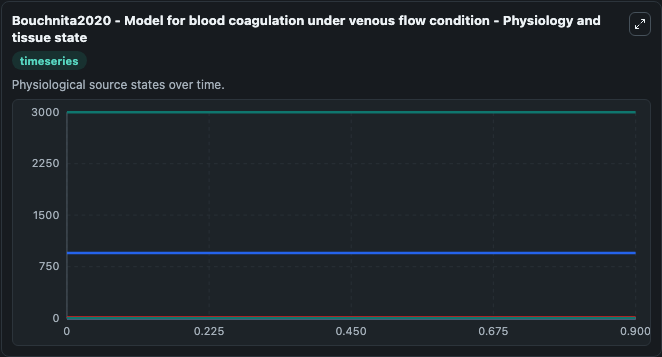
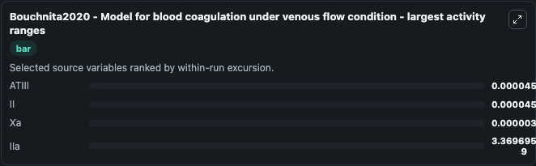
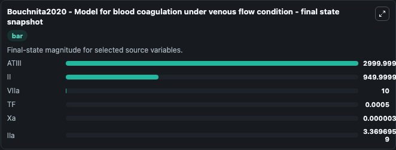
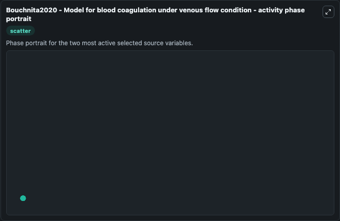

# Bouchnita2020 Model For Blood Coagulation Under Venous Flow Condition

This Biosimulant lab wraps `Bouchnita2020 Model For Blood Coagulation Under Venous Flow Condition` as a runnable systems biology model with a companion visualization module.
A numerical simulation model to reproduce in vitro experiments of blood coagulation in microfluidic capillaries. It can be used to explore the configured dynamics and compare scenario outcomes across configurations.

## What You'll See

The lab asks: Which source-defined system states dominate this SBML model trajectory? Source model: Bouchnita2020 - Model for blood coagulation under venous flow condition. It runs for 1.0 time units with a communication step of 0.1. The run uses the model defaults declared by the curated SBML wrapper. The generated visualizations focus on ATIII, II, VIIa, TF, Xa, and IIa, combining trajectory, endpoint-comparison, and summary-table views from one completed dark-mode run.

In this captured run, **ATIII** moved from 3000.0 to 3000.0 across 1.0 simulation windows.


### Output Visualizations



*Summary table for Bouchnita2020 Model For Blood Coagulation Under Venous Flow Condition, reporting the scientific question, observed answer, dominant module, and caveat.*



*Trajectories of ATIII, II, Xa, IIa, VIIa, and TF across the 1.0 simulation. In this run **Xa** climbed from 0 to 3.56e-06 and **ATIII** fell from 3000.0 to 3000.0 — the largest movements among the focused observables.*



*Largest-excursion ranking of the focused observables — the absolute movement magnitude during the run. Top 3: **ATIII** = 4.59e-05, **II** = 4.59e-05, **Xa** = 3.56e-06, with 1 more observable below.*



*Endpoint snapshot of the focused observables — final values from the captured run. Top 3 by value: **ATIII** = 3000.0, **II** = 950.0, **VIIa** = 10.000, with 3 more observables below.*



*Visualization card from the Bouchnita2020 Model For Blood Coagulation Under Venous Flow Condition dark-mode run.*


## Model Context

- Core model: `models/core`
- Visualization model: `models/visualisation`
- Standard: `other`
- Upstream source: `biomodels_ebi:MODEL2011030003`
- License: `CC0`

## Inputs

| Input | Maps To | Default | Notes |
|---|---|---|---|
| Initial Atiii | `systemsbiology_sbml_bouchnita2020_model_for_blood_coagulation_under_model2011030003_model.initial_atiii` | | Source state initial condition exposed as a model-specific control because no explicit intervention parameter is identifiable. Maps to SBML symbol `ATIII`. |
| Initial Model State Ii | `systemsbiology_sbml_bouchnita2020_model_for_blood_coagulation_under_model2011030003_model.initial_model_state_ii` | | Source state initial condition exposed as a model-specific control because no explicit intervention parameter is identifiable. Maps to SBML symbol `II`. |
| Initial Vi Ia | `systemsbiology_sbml_bouchnita2020_model_for_blood_coagulation_under_model2011030003_model.initial_vi_ia` | | Source state initial condition exposed as a model-specific control because no explicit intervention parameter is identifiable. Maps to SBML symbol `VIIa`. |
| Initial Model State Tf | `systemsbiology_sbml_bouchnita2020_model_for_blood_coagulation_under_model2011030003_model.initial_model_state_tf` | | Source state initial condition exposed as a model-specific control because no explicit intervention parameter is identifiable. Maps to SBML symbol `TF`. |
| Initial Model State Xa | `systemsbiology_sbml_bouchnita2020_model_for_blood_coagulation_under_model2011030003_model.initial_model_state_xa` | | Source state initial condition exposed as a model-specific control because no explicit intervention parameter is identifiable. Maps to SBML symbol `Xa`. |
| Initial I Ia | `systemsbiology_sbml_bouchnita2020_model_for_blood_coagulation_under_model2011030003_model.initial_i_ia` | | Source state initial condition exposed as a model-specific control because no explicit intervention parameter is identifiable. Maps to SBML symbol `IIa`. |

## Outputs

| Output | Maps To | Role |
|---|---|---|
| `state` | `systemsbiology_sbml_bouchnita2020_model_for_blood_coagulation_under_model2011030003_model.state` | Available to the visualization model and downstream workflows. |
| `summary` | `systemsbiology_sbml_bouchnita2020_model_for_blood_coagulation_under_model2011030003_model.summary` | Available to the visualization model and downstream workflows. |
| `species_labels` | `systemsbiology_sbml_bouchnita2020_model_for_blood_coagulation_under_model2011030003_model.species_labels` | Available to the visualization model and downstream workflows. |
| `atiii` | `systemsbiology_sbml_bouchnita2020_model_for_blood_coagulation_under_model2011030003_model.atiii` | Available to the visualization model and downstream workflows. |
| `model_state_ii` | `systemsbiology_sbml_bouchnita2020_model_for_blood_coagulation_under_model2011030003_model.model_state_ii` | Available to the visualization model and downstream workflows. |
| `vi_ia` | `systemsbiology_sbml_bouchnita2020_model_for_blood_coagulation_under_model2011030003_model.vi_ia` | Available to the visualization model and downstream workflows. |
| `model_state_tf` | `systemsbiology_sbml_bouchnita2020_model_for_blood_coagulation_under_model2011030003_model.model_state_tf` | Available to the visualization model and downstream workflows. |
| `model_state_xa` | `systemsbiology_sbml_bouchnita2020_model_for_blood_coagulation_under_model2011030003_model.model_state_xa` | Available to the visualization model and downstream workflows. |
| `i_ia` | `systemsbiology_sbml_bouchnita2020_model_for_blood_coagulation_under_model2011030003_model.i_ia` | Available to the visualization model and downstream workflows. |

## Runtime

- Duration: `1.0`
- Communication step: `0.1`

## Running Locally

```bash
biosimulant labs serve
```
